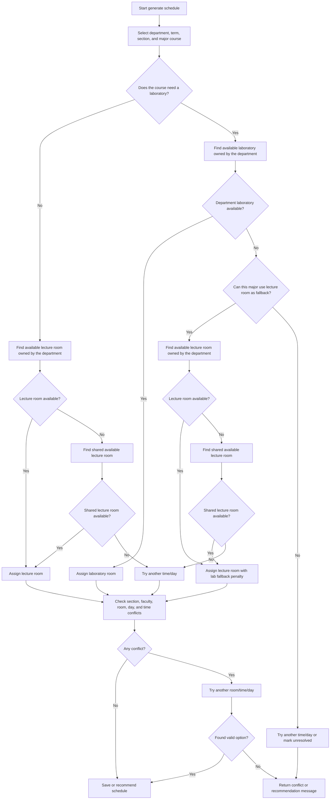

# Generate Schedule Room/Laboratory Workflow

This workflow explains how schedule generation should choose a room for a major course when a department may or may not have its own laboratory.

## Simple Rule Summary

- If the course does not need a lab, use a department lecture room first.
- If no department lecture room is available, use a shared lecture room.
- If the course needs a lab, use a department laboratory first.
- If the department has no available laboratory, a lecture room can be used only when the course allows fallback.
- A laboratory fallback to lecture should be treated as less ideal, not as the first choice.
- If no valid room/time/day combination exists, return a conflict or recommendation message instead of forcing the schedule.

