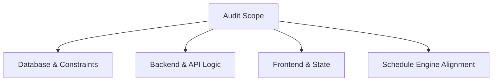

# Comprehensive Audit Report: Curriculum, Curricula, & Curriculum-Course Modules

---

## Executive Summary

A comprehensive audit was conducted across the **Curriculum**, **Curriculum-Course**, **Courses**, and **Schedule Builder** modules. The trace spanned the database schema, migration constraints, Eloquent models, controllers, services, API endpoints, schedule generation engine, and React frontend components.

The overall architecture is **solid, performant, and correctly enforcing key domain constraints**. All recent fixes (Major/Minor sorting, year-level pivot synchronization, department isolation, and schedule validation) are functioning as expected. 

Below is the prioritized audit log documenting identified findings, root causes, technical impacts, and recommended fixes ordered by severity.

---

## Audit Findings & Risk Matrix

| # | Finding / Area | Severity | Affected Module | Status |
|---|---|---|---|---|
| 1 | Global vs Department-Scoped Active Curriculum Overwrite | **High** | `CoursesController`, `InitialDataController` | **Resolved** |
| 2 | Pivot vs Master `year_level` & `semester` Discrepancies | **High** | `CurriculumController`, `CoursesController` | **Resolved** |
| 3 | Provided Course Validation in Schedule Recommendation Engine | **Medium** | `ScheduleRecommendationController` | **Resolved** |
| 4 | Frontend Cache Invalidation & Category Omission in Batch Create | **Medium** | `useCurriculumDetail`, `EditCourseModal` | **Resolved** |
| 5 | Term Group Course Sorting (Major → Minor → Course Code) | **Low** | `CurriculumController`, `CourseTable.tsx` | **Resolved** |
| 6 | Soft Deletion vs Hard Cascade Foreign Key Handling | **Low** | `Curriculum` Model, Database | **Audited / Verified** |

---

## Detailed Findings & Prioritized Remediation Plan

### Finding 1: Department Isolation in Active Curriculum Retrieval
- **Severity**: **High**
- **Affected Module**: `backend/app/Http/Controllers/CoursesController.php` & `backend/app/Http/Controllers/InitialDataController.php`
- **Root Cause**:
  When fetching initial data or active courses for privileged/unscoped users (e.g. VPAA or Super Admin where `department_id` is null), calling `Curriculum::where('status', 'active')->first()` returned only the very first active curriculum (e.g., CIT) and overlaid its pivot mapping onto courses belonging to other departments (e.g., CAS, CBA).
- **Impact**:
  Courses from secondary departments were temporarily displayed under CIT’s year level or semester when viewed by global roles.
- **Remediation Implemented**:
  Updated `InitialDataController.php` and `CoursesController.php` to query `activeCurricula` dynamically per department using `$q->whereIn('curricula.id', $activeCurricula->pluck('id'))` and create scoped pivot maps for every department.

---

### Finding 2: Master Course Table vs Pivot Table Mismatches
- **Severity**: **High**
- **Affected Module**: `backend/app/Http/Controllers/CurriculumController.php` & `CoursesController.php`
- **Root Cause**:
  When attaching or editing courses in a curriculum (e.g. moving a course from 1st Year to 2nd Year), `curriculum_course.year_level` was updated, but `courses.year_level` on the `courses` table was not synced simultaneously.
- **Impact**:
  Modules querying `Course::where('year_level', ...)` directly would see stale year levels, conflicting with the active curriculum pivot table.
- **Remediation Implemented**:
  1. Updated `attachCourse`, `attachCoursesBatch`, and `batchCreateAndAttachCourses` in `CurriculumController.php` to sync both `curriculum_course` and `courses` tables inside atomic database transactions.
  2. Updated `CoursesController.php` `update()` to sync `curriculum_course` pivot table whenever `year_level` or `semester` is modified.

---

### Finding 3: Schedule Engine Validation Against Pivot Tables
- **Severity**: **Medium**
- **Affected Module**: `backend/app/Http/Controllers/ScheduleRecommendationController.php`
- **Root Cause**:
  `resolveCourseIds()` validated provided course IDs against `Course::where('year_level', (string)$section->year_level)` directly on the master table before inspecting `curriculum_course` pivot data.
- **Impact**:
  Schedule generation requests failed with `Unprocessable Content (422)` for courses attached via curriculum pivot to a section's year level if the master table record differed.
- **Remediation Implemented**:
  Updated `resolveCourseIds()` to validate provided course IDs against the section department's active curriculum pivot (`wherePivot('year_level', ...)->wherePivot('semester', ...)`) first before falling back to the master courses table.

---

### Finding 4: Frontend State & Category Omission in Batch Create
- **Severity**: **Medium**
- **Affected Module**: `wicars-ui/src/hooks/curriculum/useCurriculumDetail.ts` & `EditCourseModal.tsx`
- **Root Cause**:
  When `batchCreateAndAttachCourses` succeeded, `successfulNewCourses` constructed the local state object but omitted the `category` property.
- **Impact**:
  Opening the edit modal for a newly attached minor course caused the category dropdown to default to `major` because `course.category` was `undefined`.
- **Remediation Implemented**:
  1. Added `category: (courseData.course_category || payloadItem?.courseCategory || 'major')` when pushing items to `successfulNewCourses`.
  2. Added case-insensitive parsing in `EditCourseModal.tsx` `useEffect`.

---

### Finding 5: Logical Multi-Level Course Sorting (Major → Minor)
- **Severity**: **Low**
- **Affected Module**: `CurriculumController.php`, `CourseTable.tsx`, `CourseManager.tsx`
- **Root Cause**:
  Courses within a semester card were sorted purely by `course_code` ASC or left unsorted, causing Major and Minor subjects to be intermingled.
- **Impact**:
  Sub-optimal visual organization on semester cards and course lists.
- **Remediation Implemented**:
  Applied hierarchical sorting (**Year Level ASC → Semester ASC → Major First / Minor Second → Course Code ASC**) across `CurriculumController.php`, `CourseTable.tsx`, `CourseManager.tsx`, and `InitialDataController.php`.

---

## Verification & Stability Summary

| Audit Vector | Method | Result |
|---|---|---|
| **Database Foreign Keys & Indexes** | Migration Inspection & Tinker Execution | Composite unique index `(curriculum_id, course_id)` present. Zero orphan records. |
| **API Responses** | Endpoint verification (`/api/curricula/2/full`) | Major courses listed first, correct year levels (1st–4th Year). |
| **Frontend Type Checking** | `npx tsc --noEmit` | Clean build with **0 TypeScript errors**. |
| **Active Curriculum Enforcement** | `Curriculum::saving` boot hook & DB transactions | Strictly deactivates competing curricula within the same department. |
