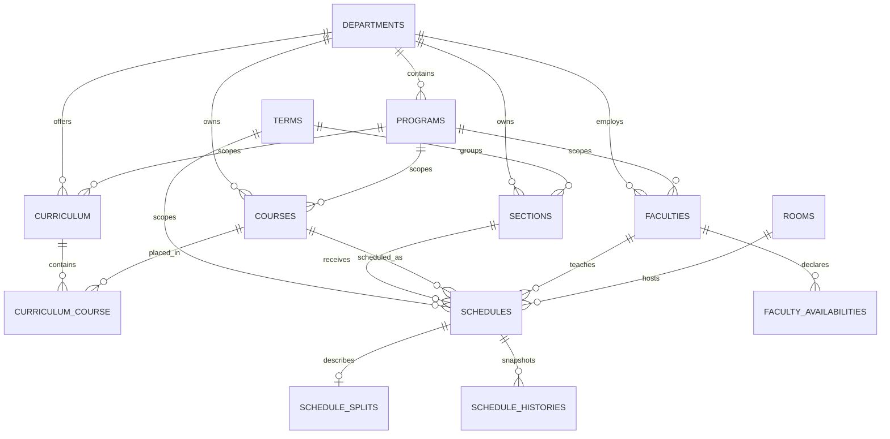

# WICARS Database Architecture

> [!warning] Source of truth
> Laravel migrations in `backend/database/migrations/` define the schema. Eloquent models define application relationships, casts, lifecycle hooks, and persistence behavior. SQL backups are recovery artifacts, not the canonical schema definition.

## Database Runtime

- Laravel configuration supports SQLite, MySQL, MariaDB, PostgreSQL, and SQL Server; current development uses MySQL.
- The checked-in example environment defaults to SQLite, so migrations and tests should remain portable unless a MySQL-specific behavior is intentional.
- MySQL uses `utf8mb4`, `utf8mb4_unicode_ci`, strict mode, and prefixed indexes.
- Queue records use the database queue connection; cache configuration is separate from domain persistence.
- Never commit credentials or document secrets from a local `.env` file.

## Schema Ownership

Every schema change must be expressed as a new Laravel migration. Do not edit an old migration that may already have run elsewhere, and do not treat a manual database change as complete until a migration represents it.

Before changing a table, inspect:

1. All migrations that created or later altered it.
2. Its Eloquent model, `$fillable`, `$casts`, relations, and lifecycle hooks.
3. Controllers, services, jobs, validation, and frontend consumers.
4. Foreign-key delete behavior and indexes.
5. SQLite and MySQL compatibility where tests or development use both.

## Domain Map



This covers the main scheduling relationships. Audit, notification, authentication, configuration, queue, cache, and permission tables are described separately below.

## Core Academic Tables

### `departments`

- Institutional scheduling and ownership boundary.
- `department_name` and `department_code` are unique.
- Uses soft deletes.
- Later migrations add department-specific scheduling profiles, overrides, resource limits, logos, and online/field scheduling options.
- Department deletion has mixed effects: owned operational records may cascade, while shared or historical references may become null.

### `programs`

- Belongs to a department.
- Unique by `department_id` plus `code`.
- Optional `cluster` supports grouping within a department.
- Department deletion cascades to programs.
- References from users, faculty, curriculum, and courses are nullable and normally use `nullOnDelete()`.
- Uses soft deletes for user-facing archive operations.

### `users`

- Application accounts with unique usernames and optional unique email addresses.
- Stores role, active status, Google-login fields, department scope, and optional program scope.
- May link one-to-one to a faculty profile through `faculties.user_id`.
- Authentication authorization is not defined by foreign keys alone; route middleware and application policies remain authoritative.
- Uses soft deletes. Archiving revokes access tokens but preserves the linked faculty profile and audit references.

### `faculties`

- Belongs to a department; department deletion cascades.
- May belong to a program and may link to one user account.
- Stores employment type, load limits and adjustments, administrative role, status, and profile image path.
- Has many `faculty_availabilities` rows.
- Uses soft deletes so archived instructors and their schedule foreign keys can be restored.

### `faculty_availabilities`

- Belongs to a faculty member and cascades when that faculty record is deleted.
- Stores `day_index` using `0-6` for Monday through Sunday plus a start/end time.
- Availability intervals are domain data; overlap and scheduling validity are enforced by application logic rather than a database exclusion constraint.

### `courses`

- Stores course identity, hours, units, major/minor classification, room requirement, status, and legacy default year/semester values.
- Ownership is `department_id` and may be null for shared minors.
- `teaching_department_id` is an optional teaching override and is not the same as ownership.
- `program_id` scopes an owned major course; `teaching_program_id` may further scope delegated teaching.
- Course codes are unique per owning department through the composite `course_code + department_id` constraint, not globally unique.
- Curriculum placement is authoritative for year level and semester in a particular curriculum; do not assume course defaults describe every placement.
- Uses soft deletes for user-facing archive operations.

See [[business_rules]] for course ownership and teaching-assignment rules.

### `course_categories` and `course_category_mapping`

- Categories provide additional classification such as GEC and laboratory behavior.
- The mapping table is many-to-many and prevents duplicate course/category pairs.
- Deleting either side cascades to its mappings.

### `curriculum`

- The current table name is singular because `curricula` was renamed by migration.
- The `Curriculum` model explicitly sets `protected $table = 'curriculum'`.
- Belongs optionally to a department and program.
- `code` is unique; status is `draft`, `active`, or `archived`.
- Model logic demotes another active curriculum for the same department and program scope when a curriculum becomes active.
- The database does not guarantee the one-active-curriculum rule with a unique constraint; writes must use the established application path.

### `curriculum_course`

- Many-to-many placement between `curriculum` and `courses`.
- Stores placement-specific numeric `year_level` and `semester` values.
- Prevents duplicate `curriculum_id + course_id` pairs.
- Indexed by `curriculum_id + year_level + semester` for term lookups.
- Both foreign keys cascade on delete.

### `terms`

- Stores academic year, semester, active state, and enabled state.
- The schema does not enforce only one active term. Use the existing term activation workflow.
- Uses soft deletes; the active term still cannot be archived.

### `sections`

- Belongs to a department and term; both foreign keys cascade on delete.
- Stores section name, year level, semester, and active/inactive status.
- Uses soft deletes for user-facing archive operations.

### `rooms`

- Globally unique `room_code` with building, room type, availability status, and optional department ownership.
- Department deletion sets `department_id` to null.
- Later migrations add concurrency and lecture-capability fields.
- Uses soft deletes so schedules are retained when a room is archived.

## Scheduling Tables

### `schedules`

- Central persisted timetable row.
- Belongs to term, section, course, and owning department.
- Faculty is nullable and becomes null when the faculty record is deleted.
- Room is nullable for supported online/TBA workflows, but an existing room deletion cascades to schedules that reference it.
- Stores day, start/end time, mode, hybrid state, preferred pattern, faculty-assignment completion, and the operational workflow status used to lock or unlock timetable editing.
- Current MySQL status values include `conditionally_approved` in addition to the original workflow statuses.
- `schedules.status` is an operational mirror, not the authoritative approval record. Reviewer identities, review timestamps, rejection reasons, overrides, withdrawal state, and revision lineage belong to `schedule_submissions`.
- Conflict freedom, time ordering, room suitability, teaching eligibility, and most approval transitions are application invariants, not database constraints.
- Uses soft deletes. The `Schedule` model records create, update, archive, restore, and permanent-delete snapshots in `schedule_histories` through Eloquent events.

Do not use bulk query-builder writes for schedules unless intentionally handling the history behavior that Eloquent events would otherwise provide. See [[schedule_history_workflow]].

### `schedule_submissions`

- One row represents one department-and-term submission or revision cycle.
- Stores the authoritative workflow status, revision number, parent revision, submitter, Dean and VPAA reviewers, review timestamps, withdrawal actor/time, rejection reason, and Room TBA override decision.
- The unique `(department_id, term_id, revision_number)` key prevents two cycles from claiming the same revision number.
- Approval queues must filter this table directly. They must not infer submission state from a mixture of timetable rows and notifications.

### `schedule_submission_sections`

- Links a submission cycle to the exact sections included in that cycle.
- `state = included` identifies the active cohort; `state = withdrawn` records sections removed for revision while other finalized or approved cohorts remain intact.
- The unique `(schedule_submission_id, section_id)` key prevents duplicate cohort membership.
- Mixed-state resubmissions create a new `schedule_submissions` row containing only revised sections. Finalized sections remain attached to their earlier cycle and never re-enter approval.

### `scheduling_audit_logs`

- Remains the immutable event trail for submission, approval, rejection, withdrawal, and related operational actions.
- `schedule_submission_id` links each workflow event to its normalized submission cycle; this avoids creating a second redundant approval-event table.

### `schedule_splits`

- Optional one-to-one extension of a schedule.
- `schedule_id` is unique and cascades on schedule deletion.
- Stores a nullable indexed split-group UUID, meeting type, and meeting index.
- Split attributes are exposed through `Schedule` accessors; callers should not assume they are physical columns on `schedules`.
- Uses soft deletes when removed through its user-facing endpoint.

### `schedule_recommendations`

- Stores ranked generated recommendations for a term, section, and department.
- Keeps JSON input and recommended schedule payloads.
- Tracks pending, accepted, and rejected state plus requesting and reviewing users.
- Core scope rows cascade; user references become null to preserve the record.

### `schedule_generation_runs`

- Tracks asynchronous generation requests by unique `run_id`.
- Scoped by requester, term, department, and year level.
- Stores status, JSON result, error message, and execution timestamps.
- Indexed for status and department/term/year-level history queries.

### Scheduling Configuration

- `schedule_settings` stores global opening time, closing time, and slot interval.
- `timeslot_override` is a historical singular table name for duration-specific starts.
- `department_forced_course_days` prevents duplicate department/course rules.
- `field_course_settings` was later scoped by department; inspect all migrations before relying on its original singleton design.
- Department scheduling overrides and resource-slot limits are columns on `departments`, not separate policy tables.

## History, Audit, And Notifications

### `schedule_histories`

- Append-oriented snapshots of schedule changes.
- Keeps numeric `schedule_id` without a foreign key so deletion history survives.
- Related term, section, course, department, and actor references are nullable and use `nullOnDelete()`.
- Indexed for department/term chronology and schedule lookup.
- `snapshot` is required JSON; `changes` is optional JSON.

### `scheduling_audit_logs`

- Records scheduling actions and optional JSON metadata.
- Related entities use nullable references so audit evidence survives deletion.
- Uses `created_at` only, not normal Eloquent update timestamps.
- Indexed for chronological, action, and department/term queries.

### `authentication_audit_logs`

- Records authentication and account-security events.
- Actor and subject references become null when users are deleted.
- Stores event, IP address, user agent, JSON metadata, and timestamps.
- Indexed for chronology, event filtering, and actor history.

### `system_notifications`

- Belongs to the recipient user and cascades when the recipient is deleted.
- Actor, department, and term references become null to retain the notification.
- Includes type, title, message, optional remarks, metadata, and read timestamp.
- Indexed for recipient timelines, unread checks, and workflow scope.

See [[vpaa_activity_log_workflow]] for the user-facing activity-log contract.

## Supporting Infrastructure Tables

Laravel and installed packages also create supporting tables for personal access tokens, roles and permissions, sessions and password-reset tokens, jobs and failed jobs, cache and cache locks. Change them only through the relevant Laravel or package migration conventions.

## Delete Behavior Principles

- User-facing deletion of users, departments, programs, rooms, faculty, courses, terms, sections, schedules, schedule splits, and timeslot overrides is an archive operation implemented with Eloquent soft deletes.
- Curricula retain their established business `status = archived` workflow and restore UI rather than using `deleted_at`.
- The VPAA Archive API and page list soft-deleted domain records and restore them. No ordinary application route permanently deletes archived domain records.
- Token revocation, Google unlinking, caches, sessions, and replacement/synchronization writes remain immediate deletes because they are security or transient implementation data, not archived domain records.
- Use cascade when a row has no meaning without its parent, such as curriculum placements, faculty availability, schedule split details, or a department's sections.
- Use `nullOnDelete()` when the record should survive but the related entity may be removed, such as audit actors, reviewers, faculty assignment, or shared ownership.
- `schedule_histories.schedule_id` deliberately has no foreign key so deleted schedules remain traceable.
- Never change delete behavior without checking workflow, audit, reporting, and restoration consequences.

## Index And Constraint Principles

- Add indexes for verified query patterns, especially scope plus chronology, status, foreign-key filtering, and curriculum placement.
- Prefer composite indexes matching leading filter and sort columns.
- Name long composite indexes explicitly because MySQL limits identifier length.
- Use unique constraints for true database invariants, not merely UI validation.
- Before adding a unique constraint, audit existing data and account for nullable-column behavior across MySQL and SQLite.
- Do not add speculative indexes; validate with query shape, tests, or query plans.

Existing important constraints include:

- Unique department name and code.
- Unique room code.
- Unique username, optional email, and optional Google ID.
- Unique program code within a department.
- Unique course code within an owning department.
- Unique curriculum code.
- Unique course placement within a curriculum.
- Unique course/category mapping.
- Unique schedule split per schedule.
- Unique generation run UUID.

## Migration Standards

- Create a new timestamped migration for every schema change.
- Implement a safe `down()` method when reversal is practical and data-safe.
- Use `Schema::hasTable()` or `Schema::hasColumn()` only when compatibility with divergent deployed histories is genuinely required.
- Preserve existing data during renames and transformations.
- Separate destructive cleanup from structural changes when rollback or deployment safety benefits from it.
- Use explicit foreign-table names for historical or non-standard model/table names.
- Test MySQL-specific enum or raw SQL changes separately; the conditional schedule status migration is an existing portability exception, not a default pattern.
- Add a data migration or backfill when introducing a field whose value can be derived safely from existing records.
- Never modify production data through seeders used for development reset unless explicitly intended.

## Safe Verification

Use a disposable or backed-up database for destructive checks.

From `backend/`:

```bash
php artisan migrate:status
php artisan test --filter=RelevantDatabaseOrFeatureTest
php artisan migrate:fresh --env=testing
```

Before a production migration:

1. Back up the database.
2. Review generated SQL or run against a production-like copy.
3. Confirm foreign-key and enum behavior on the target engine.
4. Run affected feature tests.
5. Verify application reads and writes after migration.
6. Confirm audit and history records remain accessible.

## Known Schema Exceptions

- The canonical curriculum table is singular: `curriculum`.
- The timeslot override table is singular: `timeslot_override`.
- Several models use plural class names: `Departments`, `Rooms`, `Sections`, and `Terms`.
- Some workflow invariants, including one active term and one active curriculum per scope, are enforced by application workflows rather than database constraints.
- Schedule status evolution contains MySQL-specific enum SQL; portability must be considered when adding statuses.

Do not correct these exceptions through isolated renames. Any normalization must be a coordinated migration across models, queries, APIs, tests, and frontend consumers.

## Related Documentation

- [[architecture]]
- [[business_rules]]
- [[coding_standards]]
- [[performance]]
- [[schedule_history_workflow]]
- [[vpaa_activity_log_workflow]]

## Verified Sources

- `backend/config/database.php`
- `backend/database/migrations/`
- `backend/app/Models/`
- `backend/app/Services/Scheduling/`
- `backend/routes/api.php`
- `backend/tests/Feature/`

Last verified against the repository on 2026-08-30.

## Migration and History Cleanup Status

- `schedule_history_versions` and `schedule_history_items` are now the preferred history read/write structures.
- The legacy `schedule_histories` table remains as a compatibility source for older clients and tests; it must not be dropped until those consumers are migrated.
- Legacy audit rows that cannot be matched to exactly one history version are marked `legacy_history` in activity-log responses rather than being guessed.
- Asynchronous generation previews are intentionally transient; `schedule_generation_runs.result` is the durable preview artifact. Recommendations are persisted when selected or applied.
- Data-destructive migrations and cleanup migrations require a backup and should be treated as forward-only in production.
