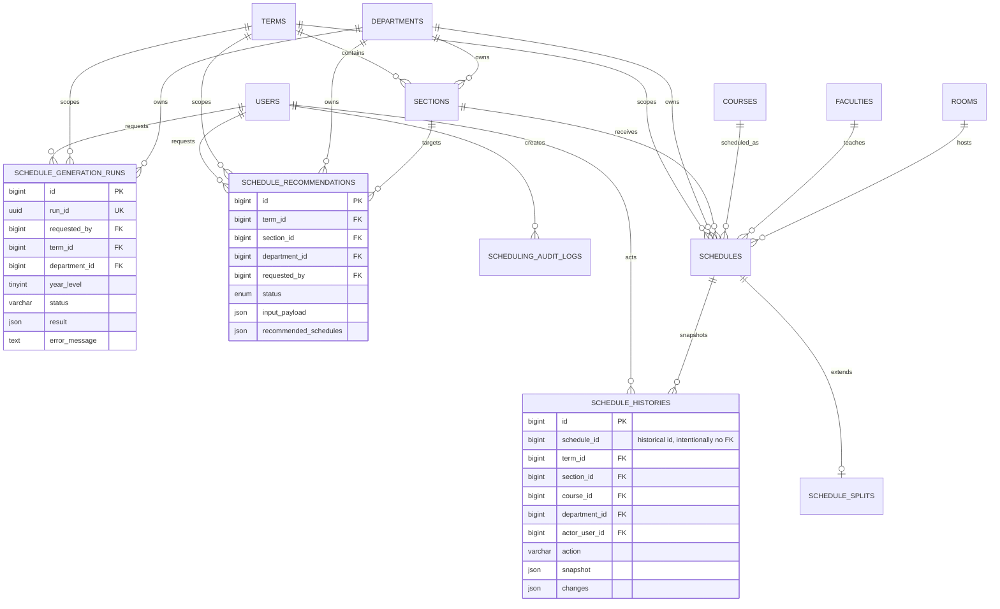
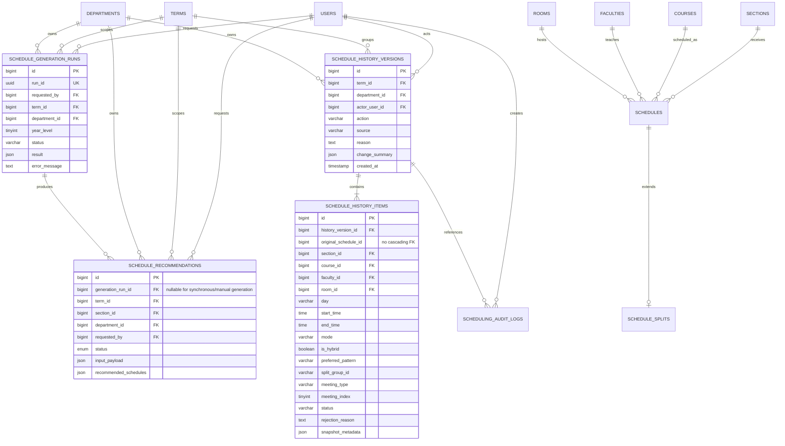

# Database Fix ERD and Integration Plan

This document translates the database review findings into an implementation-oriented ERD. It is a planning artifact only; it does not change the current database or migrations.

## Findings Represented

- Bulk schedule updates can bypass `Schedule` model events and therefore omit schedule-history rows.
- Recommendation acceptance/auto-application mass-deletes replaceable schedules without firing per-model delete events.
- Schedule submission updates schedules before writing audit/history records and is not fully atomic.
- Asynchronous generation stores its result in `schedule_generation_runs.result`; preview output is not necessarily persisted as `schedule_recommendations`.

## Current-State ERD

The current schema is structurally valid and all checked-in migrations are applied. The weak points are persistence paths rather than missing core tables.

## Recommended Target ERD

The target design keeps the existing live scheduling tables, but adds an immutable action-level history boundary. This allows one user operation to be represented once, with all affected schedule rows captured beneath it.

## Integration Rules

1. Begin one database transaction for each schedule action.
2. Lock the affected term/department scope and read the before-state.
3. Apply normal schedule changes, replacement, status transition, or assignment.
4. Create one `schedule_history_versions` row and one item per affected schedule.
5. Write the scheduling audit row with `history_version_id` in its metadata.
6. Commit all schedule, history, and audit writes together.
7. Invalidate caches and send notifications only after commit.

For recommendation acceptance, capture the schedules being replaced before deleting them. Create the accepted schedules, the history version, and the recommendation status update in the same transaction.

For asynchronous previews, retain `schedule_generation_runs` as the durable job record. Add the nullable `generation_run_id` link to recommendations only if the product requires every generated candidate to remain queryable after the preview response.

## Safe Migration Sequence

1. Add `schedule_history_versions` and `schedule_history_items` without changing existing tables.
2. Add nullable `generation_run_id` to `schedule_recommendations` if retention is required; backfill only where a reliable run-to-recommendation relationship exists.
3. Introduce a history-capture service and write-path transaction wrapper.
4. Migrate bulk status, instructor assignment, workflow, and recommendation replacement paths to that service.
5. Add feature tests for rollback, replacement history, and one-version-per-action behavior.
6. Run a production-like data audit before adding any stricter uniqueness or check constraints.
7. Keep the existing `schedule_histories` table during rollout for compatibility; deprecate it only after all readers and reports use the new version/item model.

## Important Constraint Decisions

- Do not add a foreign key from `schedule_history_items.original_schedule_id` to `schedules`; deleted schedule history must remain readable.
- Keep nullable foreign keys for historical references to users, departments, sections, courses, faculties, and rooms where deletion should not erase history.
- Do not add database checks for conflict detection or approval sequencing until existing data has been audited and all write paths use the same validation service.
- Do not remove `schedule_generation_runs.result` merely because recommendations become linkable; it remains useful for failed and diagnostic runs.
