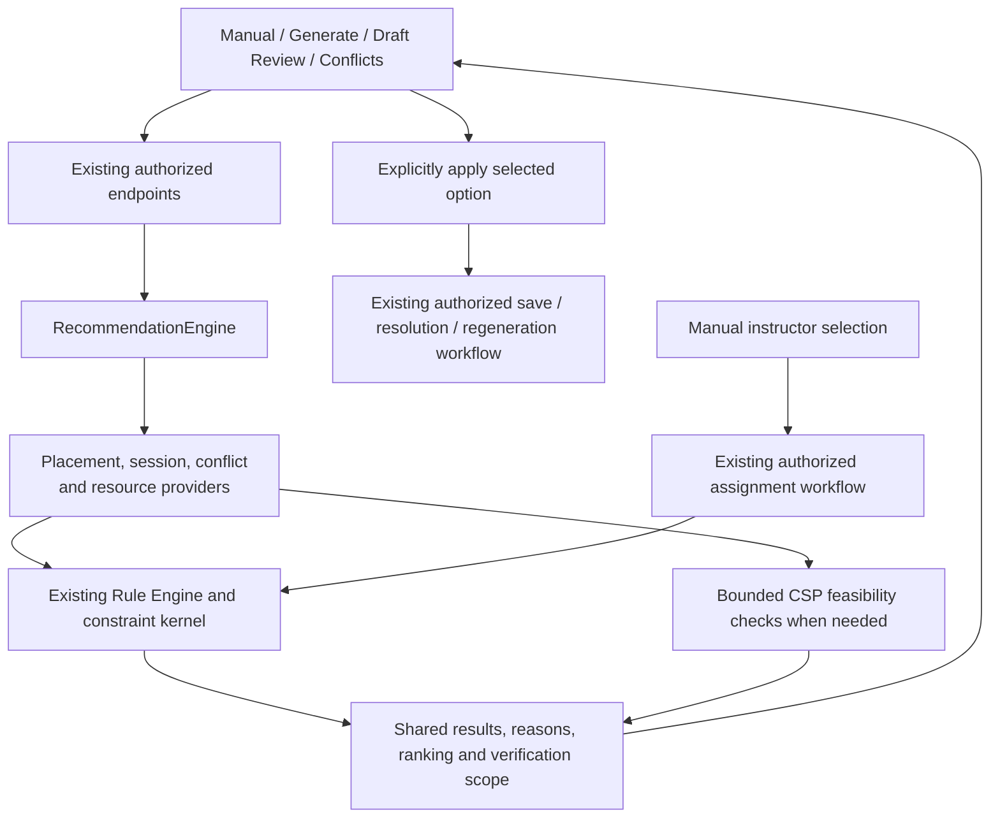

# Shared Recommendation Engine Integration Plan

Date: 2026-10-09 (Asia/Shanghai)

Status: Phases 0-7 complete, including verified review fixes and the O1/O2 improvements. Section 21 records the cutover and compatibility boundaries; section 22 records closure of the build/test blockers; section 23 resolves the final review's L1 room-filter regression with passing UI checks. No exception was substituted for the Phase 7 exit gate.

## 1. Objective and completion criteria

Introduce one backend recommendation entry point for Manual Scheduling, Generate Schedule, generated Draft Review, and placement-based Conflict Resolution. Make their session eligibility, terminology, explanations, verification status, and application semantics consistent, while preserving each workflow's authorization and scheduling scope. Instructor assignment remains a separate authorized workflow; instructor recommendations are retired in Phase 5 under the scope revision in section 18.

The result is one coordinated engine with specialized providers, not one large class or a replacement solver.

Completion means:

- Every active recommendation-producing path is registered behind the engine or documented as a compatibility adapter with a removal condition.
- Equivalent inputs and constraints produce equivalent eligible alternatives across Manual and Generate. Different scope, permissions, or constraints explicitly explain different results.
- Regular, Split, Integrated, delivery modes, field courses, and consecutive-day classes have a maintained behavior matrix and coverage.
- Concrete changes are validated as complete affected meeting groups, against the correct persisted and tentative schedules.
- A proposed adjustment is not presented as a verified timetable unless that timetable was actually found and validated.
- Applying a recommendation preserves the existing authorization, locking, validation, history, and audit boundaries.
- Recommendation generation itself does not write schedules, change settings, or send notifications.
- Existing endpoints and queued results remain compatible during migration, except the explicitly planned instructor recommendation retirement in Phase 5. Instructor assignment/save endpoints remain supported.
- No active recommendation path ranks or proposes replacement instructors after Phase 5; manual assignment still enforces overlap, availability, ownership, stage and unit-ceiling checks.
- Frontend components display and select recommendations; backend services own eligibility and authoritative application behavior.

Planning can reduce repeated case discovery, but cannot guarantee that future requirements never introduce new cases. Record exceptions in this document and the test matrix instead of creating separate rules in individual screens.

## 2. Baseline established from current code

The inspected application checkout is `C:/Users/toman/Web-Based-Intelligent-Conflict-Detection-and-Recommendation-System-for-Academic-Scheduling`. The chat's Laragon directory contains artifact files rather than this application checkout. Implement in the confirmed application checkout or a suitable isolated checkout, not in the artifact directory.

The application working tree already contains substantial unrelated changes. Record the starting state before implementation, preserve it, and inspect current files again when their contracts have changed. Do not reset or overwrite those changes.

| Path | Current producers and consumers | Migration responsibility |
|---|---|---|
| Manual placements | `ScheduleRecommendationController::availableSlots` -> `AvailableSlotFinder`; `DropModal`, `PlacementAlternatives`, `placementAlternativesModel` | Move authoritative ranking and meeting-group construction behind a placement provider; retain exhaustive slot browsing through an adapter |
| Generation configuration corrections | `ValidateGenerationConfiguration` -> `GenerationConfigurationRecommendation` -> `GenerateSchedulePlan` | Keep validation authoritative; adapt findings into shared recommendations, then move corrective-policy selection out of the validator where useful |
| Year-level generation failures | `YearLevelFeasibilityService`, `YearLevelRetryStrategyPlanner`, `YearLevelGenerationDiagnostics`, `YearLevelScheduleGenerationService` | Keep feasibility detection and orchestration; centralize suggestion selection and explanations |
| Draft review | `ScheduleRecommendationController::reviewDraft` -> `GenerationDraftReviewer` | Retain draft conflict detection; reuse shared group placement and session alternatives |
| Persisted conflicts | `ScheduleConflictController::recommendations` -> `ConflictRecommender`; `ResolveConflictModal` | Wrap conflict provider, preserve allowed actions, permission filtering, and resolver |
| Instructor alternatives (existing; planned retirement) | `InstructorAssignmentController::recommendations` -> `InstructorRecommender`; also reused by `ConflictRecommender` | Phase 5 removes ranked suggestions from both consumers and retires their provider/source; preserve manual assignment, teaching ownership, availability, group handling and load ceiling |
| Application | Frontend `yearLevelGenerationFailure` applies generation adjustments; backend generation service also interprets adjustments; manual and generated rows save through existing schedule routes | Introduce one authoritative adjustment interpreter and retain existing write services/controllers |
| Shared rendering | `RecommendedOptionList`, `RecommendationList`, `RecommendedAdjustmentPanel`, `recommendationGroups` | Extend these components and adapters rather than replace each screen's layout |

Verified baseline observations:

1. `AvailableSlotFinder` and `GenerationDraftReviewer` reuse the constraint kernel. Conflict recommendations use the Rule Engine and delegate faculty alternatives to `InstructorRecommender`.
2. Manual recommendation ranking and same-time Split pairing also occur in the frontend.
3. Year-level generation automatically retries only strategies with no configuration adjustments. Configuration changes remain user-selected recommendations. Preserve this behavior.
4. `GenerationDraftReviewer` calls one on-site plus one online meeting "Online Split". Year-level diagnostics call that arrangement "Hybrid Split" and use "Online Split" for two online meetings. Normalize displayed terminology without blindly renaming internal shape identifiers.
5. `YearLevelScheduleGenerationService::hasVacantHybridSplitSlot` checks for a vacant physical room interval. It does not prove the online partner or complete timetable fits. Treat this as preliminary evidence until a full group or timetable is checked.
6. The existing slot response, conflict action response, draft row response, and configuration adjustment response are different contracts.
7. Current generation application includes `/schedules/batch`; conflict application uses `ResolveScheduleConflict` with scheduling scope locks and a transaction. Some older documentation refers to commit or split services not found in the current source tree. Do not build around those names without confirming their current existence and callers.
8. `schedules/batch/validate-splits` is still registered. Its active consumer and intended retention must be established in Phase 0; do not remove it merely because it is absent from one screen.

## 3. Architecture and dependency boundaries



Responsibilities:

| Component | Owns | Does not own |
|---|---|---|
| Recommendation engine | Context dispatch, provider coordination, filtering, deduplication, consistent result metadata | Database writes or a new set of conflict rules |
| Providers | Applicable alternatives, candidate construction, evidence and domain-specific ranking | Bypassing authorization, changing user configuration silently |
| Rule Engine / constraint kernel | Hard validity checks, including meeting relationships and resource limits | Selecting product recommendations |
| CSP Solver | Search for a feasible timetable under supplied configuration | User consent or display terminology |
| Existing application workflows | Final authorization, fresh-state validation, transactions, locks, history and audit | Trusting a recommendation as permanent permission to write |
| Frontend | Display, filtering, selection, local preview and loading states | A second authoritative eligibility policy |

Engine location: `backend/app/Services/Scheduling/Recommendations/` (Phase 1 facade implemented; later policy migration remains planned).

Start with concrete classes: `RecommendationEngine`, context/result contracts, adapters, and a provider registry. Add provider interfaces where multiple implementations actually need a common boundary. Avoid a generic plugin framework, service-per-field design, new microservice, or new dependency package.

Existing `SchedulingPolicy`, requirement builders, snapshots, and validation contracts remain the sources for domain rules. A session policy coordinates them; it must not reimplement contact-hour or room eligibility formulas.

Avoid circular dependencies: generation may call the engine after a failed run, but the engine's feasibility probe must invoke a lower-level solver/validation port with recommendation production disabled. Never call the full generation controller or recursively request recommendations from a recommendation probe.

## 4. Shared context and result contracts

These describe the target application contracts. Phase 1 implements the compatibility wrapper documented in section 14; the richer normalized session, actor, change and application fields remain later-phase work. Do not add matching database columns automatically.

### Request context

Normalize one trusted context at the authorized boundary:

- Source: manual placement, generation configuration, generation failure, draft review, or persisted conflict. The existing instructor source is a Phase 5 retirement candidate, not a target recommendation source.
- Scope: selected course/group, section, or year level; semester and department; authorized section/course/schedule IDs.
- Actor capabilities and current approval/editability status, derived server-side.
- Course/session requirements: Regular, Split, Integrated, field or consecutive-day; per-meeting durations and delivery; selected configuration versus automatic settings.
- Existing hard constraints and preferences: Required Day, allowed days, fixed pattern, preferred room, permitted fallbacks, department operating hours and scheduling profile.
- Immutable scheduling snapshot and all relevant persisted resource bookings, including cross-department bookings where current rules require them.
- Tentative rows, kept rows, replaced rows, and linked partners. Ignored rows must be precisely the rows being replaced; do not ignore every row in the section by default.
- Blocker details or conflict case, when supplied by validation/search.
- Per-request budget: maximum results, candidate evaluations, probe time, and cancellation/deadline state.

Create the context once and pass it to providers. Do not trust client-supplied capabilities, ownership, verification flags, or claimed blocker causes. Preserve server-side tentative-row and scope checks.

### Recommendation result

| Field | Purpose |
|---|---|
| `contract_version` | Version adapters and handle queued results created before migration |
| `id`, `kind`, `provider`, `rank` | Stable identity, category, source, and ordering within comparable options |
| `scope` / target IDs | Precisely identify the affected course, group, section, or year level |
| `title`, `detected_cause`, `reasons` | Consistent human-readable explanation grounded in evidence |
| `changes` | Typed placement/group replacement, configuration adjustment, or manual resource/assignment guidance; no generated instructor candidate changes after Phase 5 |
| `before` / `after` summary | Show session, meeting count, delivery, duration, and affected targets before applying |
| `impact` | Small placement change, delivery change, session change, or broader scope/resource change |
| `verification` | Status, scope checked, snapshot/context reference, remaining checks, and incomplete-search reason |
| `application` | Place rows, update draft, regenerate, resolve placement conflict, or manual action; instructor choice uses the existing assignment workflow separately |
| `applicable` / reason | Whether the option can currently be applied, with an explicit reason when it cannot |

Return request-level metadata separately: search completeness, candidate truncation, checked targets, budget exhausted, and unresolved blockers. Do not misrepresent truncated search as proof that no alternative exists.

Reuse `GenerationConfigurationRecommendation` through an adapter initially. Preserve existing payloads until their consumers migrate. Do not force all recommendation types to carry a configuration adjustment or a schedule row when those representations do not fit.

### Verification states and visible wording

| State | Evidence required | Suitable display |
|---|---|---|
| Verified placement/group | All proposed and kept affected meetings pass current applicable rules against the supplied state | "Fits this course in the current schedule" |
| Verified timetable | A complete candidate was found and validated for the requested section/year-level scope | "Fits the complete timetable" |
| Eligible adjustment | Domain and permission checks pass, but no full timetable has been established | "Eligible alternative; generate again to check" |
| Resource guidance | Detected shortage supports advice; no machine-applicable scheduling fix is produced | "Requires a room or configuration change" |
| Incomplete search | Time, truncation, cancellation, or candidate limits prevented a conclusion | "Search incomplete; no verified alternative found yet" |

Eligibility is not feasibility. A verified result is valid for the checked snapshot and scope, not guaranteed to remain valid after another user edits schedules. Revalidate at application time.

## 5. Recommendation policy for session and delivery cases

Default policy: preserve the selected session and delivery requirements; evaluate less disruptive valid placements first; offer explicit configuration alternatives when placement cannot be completed. Maintain existing allocation tiers and department rules. This is a conditional policy, not Regular -> Split -> Integrated conversion.

Show grouped alternative choices when they solve different blockers. Rank within a group; retain current placement score formulas during migration. Instructor ranking is retired in Phase 5 rather than merged into placement ranking.

### Session matrix

| Selected configuration | Preserve first | Conditional alternatives | Required exclusions / evidence |
|---|---|---|---|
| Regular On-site | One full-duration physical placement, another compatible room/time/day within current hard limits | Automatic mode, Online, eligible On-site Split for fragmented time, eligible Hybrid Split for room/time relief | Forced On-site cannot silently become Online. On-site Split does not reduce total room demand. Regular-to-Split is an enhancement after baseline parity, not assumed existing behavior |
| Regular Online | One full-duration Online placement within online capacity and section/instructor rules | Eligible Online Split when shorter matching intervals fit; more permitted days | Online needs time and concurrent capacity even though it needs no physical room |
| Regular Automatic | Existing physical-first and permitted fallback behavior | Explicit eligible session/delivery alternatives when no placement fits | Automatic is a search policy, not a stored physical delivery mode |
| Split On-site | Two equal meetings on different days at matching start/end times, with compatible physical rooms | Alternate valid pair/pattern, allow Fri + Sat, Hybrid Split, Online (All), or Regular | Preserve complete physical search; candidate limits cannot justify an unproven delivery change |
| Split Online | Two Online meetings on different days at matching start/end times | Alternate pair/time or Regular Online if a full block fits | Do not repeat Online (All) when already selected; validate online capacity for both meetings |
| Hybrid Split | One On-site and one Online lecture meeting, each 90 minutes, different days, matching times | Alternate pair/time/physical room; eligible Online (All); Regular with explicit resulting delivery | Exactly current eligibility: three units, positive lecture hours, no lab hours. Do not offer the same Hybrid change again |
| Integrated On-site | Separate physical lecture and lab on distinct days, using component requirements and compatible rooms | Integrated Hybrid only when eligible and online lecture relieves the blocker; Single block when permitted and validated | Online lecture does not fix unavailable lab capacity. Do not impose a new same-time rule; use the authoritative current group rules |
| Integrated Hybrid | Online lecture and physical lab on distinct days, preserving each component duration | Alternate component placements; validated Single block; resource/day guidance | Do not suggest Fully Online lab. Disabling Integrated must show the resulting session, delivery and duration rather than claim a mode it did not actually set |
| Field course | Existing required Field delivery, resource capacity, day and duration rules | Alternative eligible field placement; additional field capacity or day guidance | Never offer Online/Hybrid/classroom alternatives contrary to current field requirements |
| Consecutive-day class | Complete valid run with current day count, room and time relationships | Another valid run or manual guidance to revise the requirement | Treat the run as one affected group. Do not reuse a two-meeting alternative that changes the required run |

For each row, apply course ownership, curriculum period, active status, department profile, operating hours, Sunday policy, room access/type/capacity, instructor availability/load, and approval state.

No new universal eligibility should be inferred from course name, code, department identity, or the fact that the UI can draw two meetings. Reuse the existing policy and enforce duration validity before search.

### Blocker-to-option matrix

| Proven or observed blocker | Relevant recommendation | Insufficient response |
|---|---|---|
| Physical lecture-room shortage | Other compatible rooms; eligible Online/Hybrid; resource guidance | On-site Split solely to reduce total room demand |
| Laboratory shortage | Other eligible laboratories; laboratory-capacity guidance; Room TBA only if already permitted | Fully Online laboratory or claiming online lecture solves the shortage |
| No full-duration interval | Eligible split intervals or another permitted day; duration guidance only within existing rules | Online solely to solve a section time conflict |
| No matching Split pair | Other pair/time; Hybrid/Online where resource constraints are the blocker; Regular if a full block fits | Returning one individually valid meeting as a complete fix |
| Allowed days exclude feasible days | Explicit add-day guidance/adjustment | Widening the allowed days silently |
| Required Day conflicts with selected session | Explain the incompatible configuration; explicit Required Day/settings guidance | Clearing a department-wide requirement as a local placement side effect |
| Fixed MW/TTh restriction | Alternate pattern or Auto days where the existing rule permits adjustment | Violating a fixed pattern while saying the configuration is unchanged |
| Online concurrent capacity exhausted | Another time/day; other eligible delivery if user accepts it; capacity guidance | Assuming Online is unlimited or recommending the same saturated interval |
| Instructor overlap or availability | Authorized complete-group relocation that passes current rules; otherwise guidance to use manual assignment, without ranked faculty suggestions | Automatic instructor substitution, moving only one linked meeting, or allowing an overlap through an override |
| Instructor unit ceiling | Guidance to correct the assignment through the existing authorized manual workflow | Claiming a time/room move fixes excess assigned units or accepting an instructor over the ceiling |
| Locked approval stage | Explain required workflow action; only show currently authorized alternatives | A recommendation bypassing editability or recall/revision requirements |
| Budget or search exhaustion without proof | Report incomplete search or scope-specific no-solution evidence; bounded retry/guidance | Saying every configuration is impossible |

### Ranking and explanation policy

1. Filter unauthorized and invalid options before user-visible ranking.
2. Separate verified placements from eligible configuration changes and manual guidance.
3. Preserve explicit hard settings until the user selects a change; obey existing physical/day/fallback tiers.
4. Prefer smaller affected scope and less disruption inside equivalent feasible alternatives.
5. Reuse existing placement quality signals: time shift, day preference, room retention and timetable quality. Instructor availability/load remain validity checks; faculty recommendation scores/history ranking are retired in Phase 5.
6. Use stable tie breakers and deduplicate by normalized affected targets plus resulting configuration/rows, not just title.
7. Explain the actual blocker and the precise effect. Include all changed courses/meetings when a capacity-relief option affects multiple targets.

Examples:

- "Hybrid Split: a mixed pair fits this course and needs only one physical meeting. The complete year-level timetable still needs generation."
- "Regular Online: one full-length Online meeting fits; replaces the two selected Online meetings."
- "Provide laboratory capacity: the lecture can be placed, but no permitted physical lab placement was found. Changing the lecture to Online will not address this shortage."

## 6. Applying recommendations

Generation and application are separate operations.

1. Display the before/after change and every affected target.
2. Require explicit selection for delivery, session, day-limit, duration, or department-setting changes. Existing user actions serve this purpose; avoid a new confirmation modal for every normal placement.
3. Rebuild trusted context and recheck action-specific authorization and schedule status.
4. Validate changes against current state. If stale, return a useful refresh/recommend-again outcome; do not silently substitute another option.
5. Use existing application workflows:
   - Manual: stage the complete meeting group in the dialog; persist through the existing manual save/batch workflow.
   - Draft review: replace exactly the proposed draft rows; review the revised whole draft before save.
   - Generation: apply normalized configuration adjustments and rerun the existing synchronous/queued generation path. Do not commit an inferred timetable.
   - Persisted conflict: use `ResolveScheduleConflict` and its transaction, scope lock, group handling, history and audit.
   - Instructor assignment (separate manual workflow): use existing authorized group assignment, overlap/availability and ceiling checks. Do not generate or automatically select replacement faculty.
   - Resource guidance: point to the current settings/resource workflow; do not make automatic administrative changes.
6. Refresh schedule/conflict/recommendation state after success and invalidate recommendations derived from changed inputs.

Create one backend adjustment interpreter for generation and session changes. Existing frontend `applyAdjustments` can remain as an optimistic preview adapter while migrating, with parity fixtures against the server; it must not become the authority for eligibility or accepted changes.

For "Apply all", reject or explicitly resolve conflicting adjustments to the same target. Verify the combined result, not just each option separately. Never assume five individually valid recommendations can be applied together safely.

No new recommendation persistence table is required for the first migration. Reuse current run results, draft state and audit/history records. Add durable preview tokens or schema changes only when the current apply contracts demonstrably need them, with a separate reviewed persistence design.

## 7. API, frontend and operational compatibility

Preserve current routes initially:

- `POST schedule-recommendations/available-slots`
- `POST schedule-recommendations/draft-review`
- `POST schedule-recommendations/year-level-preview`
- Queued generation, run status and cancellation routes
- `GET conflicts/{conflict}/recommendations`
- Existing conflict resolution route
- `GET instructor-assignments/{schedule}/recommendations` (existing route; deliberately retired in Phase 5 after UI callers migrate)
- Existing instructor assignment and schedule save/batch routes

The engine is an internal service; one shared engine does not require one public endpoint. Keep each endpoint's scope-specific validation, authorization and response adapter.

Instructor recommendation retirement is an explicit product change. Remove active UI calls and generated `reassign_instructor` options first. If external clients cannot be ruled out, retain a guarded legacy route reporting retirement explicitly (HTTP 410), without calling a recommender; remove the route only when caller/retirement evidence permits it. Keep ordinary instructor selection, permitted manual conflict reassignment, assignment endpoints, history and audit. Retirement must not reintroduce overrides or weaken assignment validation.

Preserve slot browsing counts, truncation flags, result limits, empty/error behavior, queued progress, provisional diagnostics and cancellation. If new result metadata is added, make it additive until the frontend consumes it.

Use current shared UI components. Standard labels: Regular, Split On-site, Hybrid Split, Online (All), Integrated On-site, Integrated Hybrid, and Single block. Map internal identifiers explicitly; changing a label must not change row interpretation.

Separate UI filters from recommendation policy. Best Match, weekdays/weekend views, and room filters may select from backend-ranked results, but they must not invent eligibility or imply the absence of hidden/truncated results proves infeasibility.

Support old queued result shapes while the backend and UI deploy at different times. Version and adapt results at the boundary; retain cancellation and 150/180-second run/worker boundaries unless a separate measured change is justified.

Performance rules:

- Reuse one authorized snapshot and shared tentative-state context per request where feasible.
- Do not add a complete CSP run for every candidate or drag event. Use cheap eligibility and row/group validation first; probe only shortlisted adjustments under an explicit shared deadline.
- Respect existing budgets initially: slot enumeration up to 2,000; draft review up to five options and 40 targets with options; conflict placement validation budget of 60, at most two valid entries per bucket. The existing instructor recommendation budget of 25 applies only until that path is retired in Phase 5. Reassess through measurements rather than multiplying limits when combining providers.
- Pass cancellation/deadlines through providers and solver probes. Return partial evidence honestly.
- Keep providers stateless across requests; no shared mutable snapshot in a container singleton or queue worker.
- Request-local caching is safe when keyed by full context. Cross-request caching requires snapshot/configuration/actor-capability fingerprints and invalidation evidence; defer it initially.
- Track provider time, candidate/validation counts, completeness and verifier scope without logging full faculty/schedule payloads unnecessarily.

## 8. Ordered implementation phases and exit gates

Do not combine architectural migration and new recommendation behaviors into one large change. Each phase has a specific completion gate.

### Phase 0 - Freeze the migration baseline and case ownership

- Reconfirm active routes, frontend callers, queue result shapes, application paths and current tests.
- Map each existing recommendation/adjustment ID to producer, consumer, meaning, scope and write workflow.
- Inventory field/consecutive-day and legacy validation consumers, including `validate-splits`.
- Capture representative fixtures for all current session/delivery combinations and permission contexts.
- Record baseline targeted test results and performance for manual, generation, draft, conflict and instructor paths using a dedicated test database.
- Resolve code/documentation conflicts about current write/commit services. Document actual behavior; do not migrate based on historical names.

Exit: every active path has an owner and adapter plan; unknowns are resolved or explicitly gated; baseline failures are recorded separately from migration regressions.

### Phase 1 - Shared contracts and engine facade, preserving behavior

- Add immutable context/result contracts, engine/provider registry, and endpoint adapters.
- Wrap existing producers without changing their algorithms or ranking.
- Normalize verification metadata conservatively; existing unproven suggestions remain eligible adjustments/guidance.
- Keep existing API shapes and frontend behavior.

Exit: all active producers can be reached through the engine; existing contract and authorization tests pass; no behavior delta beyond documented metadata.

### Phase 2 - Session normalization and policy

- Create shared session/group interpretation from existing row/configuration fields and requirement builders.
- Preserve meaningful differences among balanced Split, Hybrid Split, lecture/lab Integrated and consecutive-day groups.
- Normalize Hybrid/Online labels through adapters without altering old IDs accidentally.
- Extract session alternative selection behind the shared policy, initially retaining existing eligibility and alternatives.
- Replace the partial Hybrid-slot signal with correctly scoped evidence when displaying a verified option.

Exit: supported configurations map deterministically; group and duration rules match save validation; misleading label/evidence cases have regressions.

### Phase 3 - Unify Manual and Draft placement recommendations

- Reuse `AvailableSlotFinder` as candidate discovery.
- Move complete group pairing and authoritative ranking into the placement provider.
- Keep manual exhaustive browsing, selected-day/room filters, tentative draft occupancy, and same-time pair controls.
- Validate kept/replaced meetings together; return complete affected group changes.
- Reuse the same session policy for draft alternative shapes.

Exit: identical course/group contexts produce the same eligible alternatives and verification scope; selecting a recommendation stages exactly the reviewed group; no partial-group false success.

### Phase 4 - Integrate generation diagnostics and adjustment handling

- Keep preflight and bottleneck detection; adapt findings to the engine.
- Route configuration corrections, capacity-relief options and retry-strategy suggestions through shared policy/result construction.
- Introduce the authoritative adjustment interpreter and parity-check frontend preview application.
- Preserve no-adjustment automatic retries, explicit configuration selection, queued/provisional results, incomplete-search reporting and cancellation.
- Add bounded feasibility probes only where evidence justifies the cost; otherwise label adjustments as requiring regeneration.

Exit: sync and queued results agree semantically; apply-and-regenerate uses the shown adjustment; user settings are never changed by an unselected recommendation.

### Phase 5 - Integrate conflict placement and retire instructor recommendations

Scope revised by the user on 2026-10-08. Section 18 supersedes earlier instructor-provider/ranking directions; it records the historical plan-only revision. Implementation and passing exit-gate evidence are in section 19.

1. Inventory instructor recommendation callers and dependencies: assignment-page suggestions, `fetchInstructorRecommendations`, the route/controller method, engine source/provider registration, `InstructorRecommender`, and `ConflictRecommender::instructorOptions`. Separate suggestions from manual selection and hard validation. Check any auto-assignment consumer before deleting a dependency; unrelated assignment workflows must not be silently removed.
2. Remove ranked faculty suggestions and their request/loading/application state from the assignment UI. Remove generated `reassign_instructor` candidates from conflict recommendations. Keep manual pickers, selecting/clearing instructors, teaching department/program scope and supported bulk/linked-group assignment. Retain permitted manual conflict reassignment where the existing workflow uses it; it is not a generated recommendation.
3. Integrate remaining conflict placement options through the engine and shared complete-group placement/session policy. Preserve permitted actions, fresh scan, per-action authorization and public ranking. Movement retains the assigned instructor and checks all affected partners against current persisted/tentative rows. If no authorized placement fix exists, return honest empty/guidance behavior pointing to the manual workflow, without faculty candidates or a global infeasibility claim.
4. Preserve current capability checks, approval stages, teaching ownership, availability, overlap refusal, unit ceilings, scope locks, transactions, whole-group changes, history and audit. Instructor-only changes retain their current validation scope rather than failing on unrelated placement drift. Overrides remain removed: assigning an already-overlapping instructor must fail on every supported write route.
5. After callers migrate, retire the dedicated instructor engine source/provider/registration and API helper. Retire the endpoint under section 7's compatibility decision. Delete instructor-recommendation-only files/helpers only after call-site searches and tests verify manual/replacement behavior; shared assignment, faculty/load/history and validation services remain. Other duplicate cleanup stays in Phase 7.
6. Update contract/authorization/UI fixtures for intentional retirement. Preserve negative assignment tests; replace tests expecting ranked free-instructor suggestions with retirement/manual-selection expectations. Run isolated backend conflict/assignment suites, affected UI checks and build; distinguish baseline failures. Document removed callers, compatibility handling, deletion evidence and next-phase handoff.

Exit: no active engine/UI/conflict path generates or consumes ranked instructor recommendations; the dedicated endpoint is retired explicitly or removed with evidence. Remaining conflict options are authorized, validated as complete affected groups and consistent with resolver behavior. Manual assignment/reassignment still work atomically with current scope, ceiling, availability, overlap, history and audit checks; overlapping assignment is refused and no override path exists. Relevant retirement/contract/authorization/save tests pass. Phase 5 stays unchecked until these gates pass.

### Phase 6 - Add improved recommendations as explicit enhancements

- Add Regular -> eligible Split for fragmented time, Regular Online -> Online Split where valid, and eligible Integrated On-site -> Integrated Hybrid where it addresses the blocker.
- Offer these consistently to Manual, Draft Review and Generate through the shared session policy.
- Respect course durations, lab/field exclusions, allowed days, selected hard delivery constraints and online limits.
- Implement combined-adjustment conflict handling and verification before enabling any new Apply all behavior.

Exit: each new option has eligibility, blocker relevance, complete-group feasibility, application and negative-case tests. Behavioral changes are documented separately from the facade migration.

### Phase 7 - Cut over and remove duplicated decision logic

- User authorization (2026-10-07): remove obsolete files when deletion is necessary and improves this integration. Routine removals within that scope do not need another confirmation. This is not authorization to discard unrelated working-tree changes or data. Record deletion candidates, migrated callers, replacement behavior and verification evidence before removing them.
- Move frontend authoritative ranking/pairing/eligibility to shared results while keeping useful display filters and previews.
- Remove old recommendation construction only after call-site searches and equivalent tests show it is superseded.
- Keep necessary compatibility adapters until old queued/run/API consumers no longer need them.
- Update `architecture`, `business_rules`, `decisions`, and this completion checklist to match implemented behavior.

Exit: every active producer and consumer uses the shared contracts/policy; no unowned legacy decision path; full relevant suites and build pass; rollback and compatibility notes are recorded.

## 9. Verification matrix

Use shared fixtures across sources. Equivalent contexts must agree on eligibility and hard validity; different scheduling scope may legitimately produce a different feasibility result.

| Test family | Required cases |
|---|---|
| Regular | Physical full block; no room but Online fits; fragmented intervals; forced On-site; automatic physical-first; Online capacity exhausted |
| Split | MW/TTh/Fri-Sat and other permitted pairs; matching versus mismatching time/end; only one meeting fits; valid physical pair late in discovery; Regular fits; all three deliveries |
| Hybrid Split | Eligible three-unit lecture course; ineligible units; lab/field exclusions; physical-first/online-first day orders; online partner blocked; already Hybrid; complete-group duration |
| Integrated | On-site and Hybrid; each component blocked independently; distinct days; component custom duration; missing lab; Single block valid/invalid; actual resulting mode after disabling Integrated |
| Special classes | Required Day; Sunday policy; Field resource capacity; consecutive-day run; department profile and room-access restrictions |
| Draft/current state | Unsaved rows; kept meetings; exact replacements; another target section's occupancy; stale option; relevant cross-department room booking |
| Faculty assignment and recommendation retirement | Manual select/clear and linked/bulk assignment; overlap rejected on every route even with old override flags; availability, ceiling and group projected units; department/program eligibility; instructor-only placement drift; no ranked faculty UI requests or generated conflict reassignment candidates; retired endpoint behavior; preserve teaching-history data |
| Authorization | Supported roles; cross-department teaching scope; locked schedule; forbidden section; unauthorized action filtered; invalid IDs and tentative scope |
| Application | Exact selected change; whole-group replacement/movement; transaction rollback; history/audit; configuration retry; no writes during recommendation generation; conflicting Apply all changes |
| Search | Timeout, cancelled job, truncated slots, no solution, provisional diagnostics, partial draft, no double CSP invocation or recursive engine call |
| Contracts/UI | Old and new result adapters; label meaning; verification scope; loading/empty/error; disabled stale actions; generation preview matches applied adjustment; screen preserves existing layout |
| Parity | Manual vs Draft vs Generate with identical context; conflict placement vs resolver validity for the same complete group; manual instructor validation across assignment routes; frontend adjustment preview vs server normalization |

Reuse current test foundations:

- Backend: `AvailableSlotFinderTest`, `GenerationDraftReviewTest`, `ManualRecommendationDaySpreadTest`, `YearLevelScheduleGenerationTest`, `YearLevelGenerationFailureDiagnosticsTest`, `YearLevelQueuedGenerationTest`, `YearLevelSplitSessionRecommendationTest`, `ConflictDetectionParityTest`, `ScheduleConflictResolutionTest`, `FacultyUnitCeilingTest`, `InstructorAssignmentIgnoresPlacementDriftTest`, and consecutive-day tests.
- Frontend: `DropModal.test.tsx`, `PlacementAlternatives.test.tsx`, `placementAlternativesModel.test.ts`, `YearLevelGenerateScheduleWorkflow.test.tsx`, `recommendationGroups.test.ts`, `yearLevelGenerationFailure.test.ts`, `RecommendedAdjustmentPanel.test.tsx`, and `conflicts.test.ts`.

Add focused parity/contract tests that assert meaningful domain outcomes, rather than testing only that the engine calls a provider. Do not regenerate expected fixtures from the implementation under test.

During implementation, run PHP syntax/style and the smallest relevant backend test subset first, then affected frontend Vitest tests and `npm run build`. Broaden to relevant backend/frontend suites at phase boundaries and final cutover. Confirm the configured test database is isolated before running database-resetting tests. Run performance checks again only when candidate/search work changes or measured regressions need investigation.

## 10. Migration risks and recovery

| Risk | Prevention | Recovery |
|---|---|---|
| Large rewrite changes valid scheduling behavior | Facade first; migrate one provider at a time; distinguish parity from enhancements | Restore endpoint delegation to the previous provider while preserving contracts |
| Double counting or ignoring draft/group rows | Shared normalized affected/kept/replaced context and fixtures | Disable the affected new provider path and retain current validation |
| Changed labels alter shape interpretation | Map internal IDs separately from displayed labels | Retain old ID adapters; correct display mapping |
| Partial evidence becomes a fit guarantee | Explicit verification scope and complete-group/timetable checks | Downgrade to eligible adjustment or guidance until verified |
| Applying unexpected session/delivery changes | Before/after summary; authoritative interpreter; explicit user selection | Reject incompatible payloads and regenerate from current configuration |
| Performance and queue deadline regression | Shared snapshot, bounded probes, existing limits, cancellation | Turn off optional probes; return eligible adjustments with honest status |
| API/queued result version mismatch | Additive adapters and versioned result normalization | Continue accepting existing result shape until old consumers drain |
| Existing unrelated edits contaminate migration | Baseline inventory and focused diffs | Revert only migration-owned changes; preserve the user's work |

A feature switch is optional, not mandatory. Use it only if independent provider cutover cannot be safely controlled through existing adapters/dependency wiring. Any switch must be temporary, documented, tested in both settings, and removed after successful cutover.

## 11. Decisions established by this plan

- One coordinated backend Recommendation Engine with specialized providers.
- Shared policy does not require identical recommendations across different scope or permissions.
- Existing Rule Engine, constraint kernel, CSP ports, snapshots, and save workflows are reused.
- Session/delivery changes remain explicit user actions; no silent conversion.
- Verification distinguishes course/group validity from complete timetable feasibility.
- Existing endpoints and result shapes remain compatible through adapters, except the explicitly authorized instructor recommendation retirement in Phase 5; assignment/save endpoints remain supported.
- User scope revision (2026-10-08): retire standalone and conflict-generated instructor recommendations. Preserve manual selection/reassignment, assignment validation and conflict refusal; do not restore overrides.
- New useful alternatives are added after parity, not concealed inside refactoring.
- New database schema, remote AI/LLM service, dependency framework, and broad UI redesign are outside this integration's initial scope.
- No numeric score is treated as universal across placement and resource guidance; faculty recommendation ranking is retired in Phase 5.

Phase 0 decisions that must be resolved before dependent implementation:

1. Exact mapping of current Integrated On-site/Hybrid group rules and internal shape fields, including any documentation disagreement.
2. Active callers and retention requirement of `validate-splits` and any legacy preview/application handler.
3. Which generated results are currently persisted or retained across queue runs and which response adapters need a transition window.
4. Baseline test failures and acceptable existing latency/query budgets per workflow.
5. Actual authorized application payload for each provider, particularly group replacements and department-wide Required Day changes.

These are targeted discovery gates, not a reason to redesign each case during every phase. Once resolved, record their contracts and test cases here.

## 12. Implementation checklist

- [x] Phase 0 baseline, active caller map, and decision gates complete. Evidence and explicitly gated exceptions: section 13.
- [x] Phase 1 facade, contracts, providers and compatibility adapters complete. Evidence and retained compatibility boundaries: section 14.
- [x] Phase 2 session/group normalization, terminology and evidence complete. Evidence, review and remaining placement gates: section 15.
- [x] Phase 3 Manual/Draft shared placement and group validation complete. Evidence, review and retained limits: section 16.
- [x] Phase 4 generation diagnostics, adjustment interpreter and queue compatibility complete.
- [x] Phase 5 conflict placement integration, instructor recommendation retirement and write-path parity complete. Revised scope: section 18; implementation and verification: section 19.
- [x] Phase 6 proposed session alternatives implemented and verified explicitly; review L1/L2 fixed and reverified. Evidence, individual-application gate and next-phase handoff: section 20.
- [x] Phase 7 duplicate decision logic removed; final verification and documentation complete. Cutover evidence: section 21; full-suite/build gate passed and O1/O2 resolved: section 22.

Maintain this checklist with concise phase evidence and unresolved exceptions. Implementation is complete only when the required paths and case matrix pass, not simply when a class named `RecommendationEngine` exists.

## 13. Phase 0 evidence and next-phase handoff

### Scope and starting evidence

Discovery performed on 2026-10-07 (Asia/Shanghai), at HEAD `a109a72ab625e27a731cca457ba90c5c88b68f70`. The starting `git status --short` had 148 entries, including staged deletions/renames, unstaged backend/UI changes, and eight untracked files (including this plan). All phase checkboxes were unchecked; there was no prior completion evidence for this integration. The earlier scheduling-core phase documents describe a different migration and are not completion evidence for this plan.

Only this plan was edited in Phase 0. No application files, fixtures, schema, routes, or obsolete files were changed or removed. Existing test fixture builders are the captured reproducible baseline below; no production data was copied. Final review used the plan diff and Git status to check phase scope (still 148 entries). Because this plan was already untracked, its phase diff was reviewed with `git diff --no-index` against reconstructed pre-phase content. The phase whitespace check passes with `core.whitespace=cr-at-eol`; a raw whole-tree check with CRLF handling disabled reports existing line-ending whitespace and is not a phase regression. Nothing was committed, pushed, or deployed.

### Verified path ownership and adapter inventory

Paths below are relative to `backend/app/` or `wicars-ui/src/`. Each adapter is a Phase 1 responsibility; the producer remains responsible for its existing algorithm and limits.

| Entry point / producer | Active consumer and current response | Scope and application boundary | Adapter ownership / retention |
|---|---|---|---|
| `ScheduleRecommendationController::availableSlots` -> `Manual/AvailableSlotFinder::find` | `DropModal` calls `POST schedule-recommendations/available-slots`; `PlacementAlternatives` and `placementAlternativesModel` rank/filter. Response: `slots`, per-room `slot_count`, `total`, `truncated`. No stable recommendation ID. | Section/program/department guard, authorized snapshot; tentative rows, ignored IDs, meeting type, excluded/start days, consecutive-day inputs. Stage chosen meetings, then `useScheduler` saves through `POST schedules/batch` (or existing row update). | Placement adapter preserves exhaustive discovery and counts. Frontend pairing/ranking remains until Phase 3/7 parity. |
| `Generation/ValidateGenerationConfiguration` -> `Domain/GenerationConfigurationRecommendation`; `GenerateSchedulePlan` serializes findings | Typed validation/plan consumers and backend tests; search found no production caller of `GenerateSchedulePlan` in `app/`. This is a retained internal producer, not evidence of an active section preview endpoint. | Snapshot/configuration validation and confirmation; corrective adjustments do not write schedules. | Configuration adapter must expose this internal producer without fabricating a public route. Retain immutable domain contracts. |
| `YearLevelFeasibilityService`, `YearLevelRetryStrategyPlanner`, `YearLevelGenerationDiagnostics`, `YearLevelScheduleGenerationService::preview` | Controller sync preview; UI `useGenerationRun` uses queued preview/poll/cancel/active-run recovery. Failure UI parses `recommendations`, constraints, attempts and bottleneck; shared groups/panel render them. Success/draft contains rows and generation diagnostics. | Active semester, selected active year-level sections, curriculum freshness and department/program guards. UI explicitly applies adjustments to config/defaults and regenerates. Generated rows save through `useScheduler` -> `schedules/batch`. | Generation adapters preserve preflight, provisional/final failure and partial-draft results. No-adjustment strategies alone auto-retry. Selection remains explicit. |
| `Generation/GenerationDraftReviewer::review` | `GenerateSchedule/draftReview.ts` -> `POST schedule-recommendations/draft-review`; workflow review UI. Response: `issues`, `checked_rows`; issue `key`, option `id`, `rank`, `tier`, `score`, `label`, `summary`, `reasons`, complete `rows`. | Controller rejects rows outside target sections; snapshot includes other target sections' kept occupancy. UI replaces rows by section/course key, reviews again, saves via existing batch. | Draft adapter preserves option rows and selection semantics; shared placement migration is Phase 3. |
| `ScheduleConflictController::recommendations` -> `Schedule/ConflictRecommender` | `lib/conflicts.ts` -> `GET conflicts/{conflict}/recommendations`; `ResolveConflictModal`. Ranked action options contain an exact `payload`. | Conflict is freshly located; per-action authorization filters results. `POST conflicts/{conflict}/resolve` -> `ResolveScheduleConflict` uses scheduling scope locks, transaction, group validation, history and audit. | Conflict adapter retains allowed-action filtering and resolver payloads; instructor delegation already reuses `InstructorRecommender`. |
| `InstructorAssignmentController::recommendations` -> `Schedule/InstructorRecommender` | `lib/conflicts.ts`, instructor assignment UI/picker; `GET instructor-assignments/{schedule}/recommendations`. Faculty identity is `faculty_id`; reasons, score, projected units, teaching history. | Teaching department/program faculty pool and linked meetings; assign with existing controller `update` (`faculty_id`, nullable), timetable row update or batch faculty route. Assignment stage/ceiling checks remain in write paths. | Instructor adapter preserves specialist ranking, availability, group load accounting and instructor-only validation scope. |
| `ScheduleController::validateSplits` | Registered `POST schedules/batch/validate-splits`; repository search found only `ScheduleBatchDepartmentAuthorizationTest::test_split_validation_delete_ids_use_persisted_schedule_department_for_authorization`, no UI caller. | `schedule.create` capability; operations/delete IDs validated and ownership checked; legacy slot/day/room adjustment preview is distinct from batch persistence. | Retain as a compatibility path in Phase 1, owned by placement/legacy validation adapter. External clients cannot be ruled out from repository evidence. Removal is gated on caller migration/retirement and equivalent validation/adjustment tests in Phase 7. |

Routes remain under existing authentication and capability middleware. Recommendation routes use `schedule.generate`; save, update and instructor actions have their own capabilities. Do not widen permissions because the engine is shared. Supported secretary/program-head contexts and negative dean/VPAA/cross-department cases are captured in authorization fixtures below.

### Current identity and adjustment catalogue

IDs describe local selection identity, not persisted engine records or immutable preview tokens. Preserve them at response adapters, including IDs containing section/course numbers or rank. Do not use generated UUIDs/ranks as proof an option is fresh.

| Producer / ID family | Meaning and scope | Consumer / write workflow |
|---|---|---|
| Validator: `remove-reference-{field}-{courseId}`, `remove-course-{courseId}` | Invalid configuration references / unavailable curriculum course; course within configured section | Typed configuration findings; `remove_configuration_reference` / `remove_course`. No current generation failure UI interpreter for these; preserve as internal findings, gate enabling UI application on Phase 4 support. |
| Validator: `{disable_lecture_lab_split\|disable_minor_split}-{courseId}`, `delivery-mode-{courseId}-{mode}` | Invalid shape or delivery correction for configured course | Configuration adapter; existing split/mode adjustment consumers where supported, followed by regeneration. |
| Validator: `lecture-room-{courseId}`, `laboratory-room-{courseId}` | Missing usable resource guidance | No automatic writes; current resource/settings workflow. |
| Validator: `clear-forced-day-{day}-{courseIds}` | Required Day correction, potentially affecting department settings | `clear_forced_day` is not supported by current failure UI apply interpreter. Guidance only until explicit authorized settings application is designed; never silently turn it into section config. |
| Diagnostics: `feasibility-{code}-{index}`, `room-capacity-{online\|hybrid_split}` | Blocking finding / aggregate physical-room demand relief across targeted sections | Failure UI; target adjustments copied from feasibility findings. Slot arithmetic alone is not a complete timetable proof. |
| Diagnostics: `strategy-{key}` | Retry suggestion; keys: `alternate_ordering`, `alternate_pattern`, `clear_bottleneck_pattern`, `clear_section_patterns`, `clear_all_patterns`, `clear_bottleneck_split`, `clear_bottleneck_balanced_split`, `allow_friday_saturday_split`, `disable_section_hybrid`, `clear_section_forced_modes` | Failure UI; change listed section/course configs and regenerate. `alternate_ordering` has no adjustments and may retry automatically. |
| Diagnostics: `recommend-hybrid-split-{sectionId}-{courseId}`, `recommend-online-split-{sectionId}-{courseId}`, `recommend-regular-meeting-{sectionId}-{courseId}` | Hybrid/fully-online/one-meeting alternatives to split blocker | Explicit `enable_hybrid_split`, `set_delivery_mode`, `disable_minor_split`; regeneration, not direct placement. |
| Diagnostics: `add-preferred-day-{day}`, `search-generic`, `advisory-resources` | Add year-level day / incomplete search guidance / resources guidance | `add_preferred_day` updates defaults across section configs; guidance has no adjustments. Never auto-change settings. |
| Draft: issue `{sectionId}:{courseId}`, option `{sectionId}:{courseId}:{rank}` | Replace the affected class's reviewed draft rows (including kept group meetings) | `applyDraftOptions` replaces by section/course key, then whole draft review and existing batch save. |
| Conflict: case `{rule}:{lowScheduleId}:{highScheduleId}`; action options use rank and payload | `move_schedule`, `change_room`, `change_delivery_mode`, `reassign_instructor` | Section overlap: move; room overlap: room/mode/move; faculty: instructor/move; subject-section-time: move/mode. Submit exact action payload to existing resolver. |
| Instructor: `faculty_id`; manual: slot day/time/mode/room | Candidate faculty / concrete placement, no shared stable ID | Existing assignment controller or manual staging/save; no new persistence. |

Existing adjustment vocabulary also includes `set_pattern`, `clear_pattern`, `disable_lecture_lab_split`, `disable_minor_split`, `enable_friday_saturday_split`, `disable_section_hybrid`, `set_delivery_mode`, `add_preferred_day`, `set_hybrid_split`, `disable_hybrid_split`, and `split_session_single_meeting_fallback`. The last is generated fallback metadata, not an applicable UI adjustment. Frontend `applyAdjustments` supports Hybrid enable/set/disable; backend private `applyAdjustment` does not support all of these operations. Frontend pattern setting accepts MW/TTh while server normalization and pre-existing pattern checks differ. Phase 1 must wrap these differences unchanged; Phase 4 owns authoritative interpretation and parity, including no-op, scope and conflicting-target behavior.

### Reproducible session and permission fixtures

These are existing factory-based test cases, not newly invented database values. Use their inputs/expected outcomes as Phase 1 compatibility fixtures; later phases add cross-source parity assertions rather than deriving expectations from the new engine.

| Fixture / captured case | Input and expected baseline |
|---|---|
| `AvailableSlotFinderTest`, `ManualRecommendationDaySpreadTest` | Open room/weekday enumeration; Sunday only when enabled; booked intervals excluded; lecture Online alongside rooms; standalone lab has no Online; Integrated lecture may be Online; field discovery; start-day ordering and linked partner exclusion. |
| `YearLevelScheduleGenerationTest` | Independent per-section modes/split flags, lecture/lab Integrated groups, balanced Minor/GEC fixed pattern, physical-room reallocation, all year levels, tentative staging rollback. |
| `HybridShapesAndPreferredRoomTest` | Three-unit lecture Hybrid: two 1.5-hour lecture meetings, one on-site/one Online, same interval, alternating physical-first order. Online Split: two Online meetings, same interval. MW/TTh and opt-in Fri/Sat; unusable/lab-only rooms never masquerade as valid Minor placement. |
| Same fixture, Integrated cases; `ScheduleRequirementBuilderTest`, `CustomLabDurationTest` | Selected major with lecture+lab; explicit on-site gives physical lecture+lab; without explicit on-site it stays Hybrid. Separate lecture/lab duration overrides on half-hour grid, lab always physical, preferred lab room enforced. Unselected courses remain a single block. |
| `GenerationDraftReviewTest` | Option rows for an unplaced or clashing class; selecting a fix clears both sides; mixed on-site/Online `online_split` option saves; all-Online only when no room remains; foreign section rejected; other target section's kept room not offered. |
| `ConsecutiveDaysPolicyTest`, three `ConsecutiveDays*` feature suites | Complete linked run, equal interval/mode, explicit ticked days may be nonadjacent, otherwise calendar-consecutive nonwrapping run. Missing/duplicate days and incompatible Required Day refused; manual movement and year-level save preserve group. |
| `ConflictDetectionParityTest`, `ScheduleBatchDepartmentAuthorizationTest` | Physical room/section/faculty conflicts agree; field and Online currently shared without a limit in parity fixture; department-configured field capacity separately enforced by batch test. Do not introduce a new Online cap from the proposed matrix. |
| `ScheduleConflictResolutionTest` | Recommended action resolves; locked/foreign rows rejected; stale case returns conflict response; transaction rollback, history/audit, teaching scope and faculty alternatives. |
| `FacultyUnitCeilingTest`, `InstructorAssignmentIgnoresPlacementDriftTest` | Ceiling boundary, group/batch projected units and exclusion above ceiling; instructor-only assignment tolerates unrelated Required Day/closed-room drift but still refuses faculty overlap. |
| `CrossDepartmentInstructorAssignmentTest`, `InstructorAssignmentStageGuardTest`, `RoleOperationAuthorizationTest`, `ScheduleBatchDepartmentAuthorizationTest` | Teaching college vs owning college, program-head faculty scope, linked-group rollback; approved assignment vs finalized lock, clearing instructor; secretary capabilities, forbidden dean/VPAA writes, foreign section/persisted-row ownership. |
| UI `DropModal`, `PlacementAlternatives`, `placementAlternativesModel`, generation workflow/failure/groups/panel and conflicts tests | Mixed/all-Online group staging, Integrated components/custom lengths, tentative updates, day/room display filters, missing generate capability, queue polling/save, provisional recommendations disabled and explicit apply-and-regenerate. |

### Documentation discrepancies and queue compatibility decisions

1. `docs/architecture.md` and older audits mention `GenerateSectionSchedulePlans`, `CommitSchedulePlan`, recommendation select/accept and `SplitScheduleService`. Current `app/` search and route registration do not contain those production paths. `GenerateSchedulePlan` exists as an internal service without a current application caller. Treat those architecture adoption statements as historical for this checkout; use the actual controller/batch/resolver paths above. Broader architecture correction is deferred to Phase 7, without silently adding old endpoints.
2. `docs/business_rules.md` says only Integrated Hybrid has independent component times. `MeetingGroupRule` exempts lecture/lab Integrated shapes from the same-time rule; both Integrated On-site and Hybrid retain component lengths/times. The requirement builder selects physical lecture only for explicit `isIntegratedOnSite`; otherwise Online lecture plus physical lab. Phase 2 must preserve this implementation and reconcile wording with group/save parity tests. Balanced Split/Hybrid Split and consecutive runs retain equal start/end times.
3. Draft internal `online_split` means mixed physical/Online Hybrid Split; `split` may mean physical or all-Online balanced meetings. Do not globally rename IDs or infer delivery from `split` alone. Phase 2 owns display normalization.
4. `hasVacantHybridSplitSlot` proves only an available physical interval. Resource-shortfall relief is arithmetic evidence. Phase 1 metadata must classify these conservatively as adjustments/guidance requiring regeneration, never verified complete timetables. Complete-group proof is gated on Phase 2/3; optional bounded timetable probing belongs to Phase 4.
5. `ScheduleGenerationRun.result` is persisted JSON (model array cast), updated with provisional reports while running and final success/failure payloads by `GenerateYearLevelSchedulePreview`. Run status, result, error and timestamps survive reload through poll/active-run recovery. Queue job stores section IDs/configs/rule overrides; requester/semester scope is checked again at execution. Cancellation uses status guards, preventing worker finalization overwriting a cancelled run. There is no new recommendation table or current durable preview token.
6. Old stored run results can outlive deployment; no drain/version evidence exists. Retain old payload parsing/default status/resolved values and additive fields through facade migration. Phase 7 removal requires run/client compatibility evidence. Preserve 150-second synchronous request, 180-second job/orphan limits, one job try, throttles, and cancellation.
7. `validate-splits` has no repository UI consumer but remains a public compatibility contract. Phase 0 resolves retention by keeping it; unknown external callers are explicitly gated, not assumed absent. No deletion candidate has passed migrated-caller/replacement evidence yet.

### Baseline verification and performance

PHP 8.2.12 has PDO SQLite available. Before database-resetting tests, confirmed `backend/phpunit.xml` selects SQLite `:memory:` with empty `DB_URL`, and `backend/bootstrap/cache/config.php` is absent. Both test invocations explicitly set `APP_ENV=testing`, `DB_CONNECTION=sqlite`, `DB_DATABASE=:memory:`, `DB_URL=''` in the process. No development database was reset.

From `backend`, run `php artisan test --filter='AvailableSlotFinderTest|ManualRecommendationDaySpreadTest|GenerationDraftReviewTest|YearLevelScheduleGenerationTest|YearLevelGenerationFailureDiagnosticsTest|YearLevelQueuedGenerationTest|YearLevelSplitSessionRecommendationTest|ConflictDetectionParityTest|ScheduleConflictResolutionTest|FacultyUnitCeilingTest|InstructorAssignmentIgnoresPlacementDriftTest|ConsecutiveDays'`: **147 passed, 980 assertions, 88.52s**. Supplemental filter `ScheduleRequirementBuilderTest|GenerationConfigurationValidationResultTest|HybridShapesAndPreferredRoomTest|CustomLabDurationTest|CrossDepartmentInstructorAssignmentTest|InstructorAssignmentStageGuardTest|ScheduleBatchDepartmentAuthorizationTest|ScheduleBatchQueryCountTest|RoleOperationAuthorizationTest`: **90 passed, 450 assertions, 16.69s**. No backend failures in these subsets; this does not claim the entire suite passes.

From `wicars-ui`, `npm test -- --run` with the seven existing test paths named in the fixture table (DropModal, PlacementAlternatives, placementAlternativesModel, YearLevelGenerateScheduleWorkflow, recommendationGroups, yearLevelGenerationFailure, lib/conflicts): **109 passed, 7 files, 62.36s**. Separate `GenerateSchedule/RecommendedAdjustmentPanel.test.tsx`: **9 passed, 3.98s**. An initial path under `components/scheduling` was incorrect; rerun used the actual panel location. There is no `GenerateSchedule/draftReview.test.ts`; draft behavior baseline comes from backend review tests and workflow tests. No added tests in this discovery-only phase.

`npm run build` **fails before Vite** on existing TypeScript errors: `SecretaryDashboardPage.tsx:66` lacks `accent` in a tone map; `Reports.tsx` has string/number mismatches, outdated Room/Course/Section property names and missing `Award`. These files were already modified at entry; no Phase 0 source edits caused these failures. They remain a separate baseline repair, not a migration regression or an authorization to change unrelated UI. PHP syntax/style checks on changed application files are not applicable (none changed); tests loaded the inspected services successfully.

Observed test timings (fixture/setup costs included; local baseline, not production SLAs): Manual slot tests mostly 0.13-0.47s after initialization (first open-week 8.29s, endpoint 7.30s); draft review 0.14-0.37s; generation fixtures 0.20-13.29s; diagnostics 0.16-1.36s; queued lifecycle 0.16-0.77s; conflict recommendations 0.49-1.31s; instructor fixtures 0.13-0.22s. Concurrent frontend execution adds local contention. These measurements do not isolate provider latency or establish production query budgets.

Retain code budgets: 2,000 enumerated slots; five draft options/40 targets with options; 60 conflict validations/two per bucket; 25 instructor validations; 60-second year-level search budget with 18 seconds reserved for draft and 20-second provisional threshold. `ScheduleBatchQueryCountTest` passed growth checks (four vs eight operations, under 18 queries/operation for larger batch, at most two semester hydration loads). No provider-specific query ceiling is established; gate optional probes, cross-request caches and budget increases on measured provider counts/timings in later phases. No complete CSP run per candidate is authorized by this baseline.

### Exit gate and Phase 1 handoff

**Phase 0 exit gate passes:** every discovered active path and retained internal/legacy producer has an owner and adapter plan; current save contracts, group semantics and queued retention are recorded; reproducible session/permission fixtures and baseline outcomes exist. Unknown external legacy clients, finer performance measurements, and unsupported application operations have explicit dependent-phase gates above. Existing build failures are recorded separately. Phase 0 completion does not mark any integration behavior implemented.

**Phase 1 was ready for facade-only work at the Phase 0 exit.** Reuse current immutable domain contracts, snapshot repository, rule engine/kernel, requirement builders and write services. Make every inventoried producer reachable, including retained internal validation and legacy split validation; wrap current output without changing ranking, IDs, payloads, permissions or frontend behavior. Keep controller guards and queue execution checks; avoid recursive calls between facade and wrapped producers. Reuse shared fixture expectations and run both backend subsets plus affected UI contracts. Keep the recorded build failures separate until their unrelated source changes are repaired. Do not claim unsupported adjustment application, full timetable evidence, normalized labels or new eligibility as part of Phase 1. This records the original handoff; section 14 records its implementation.

## 14. Phase 1 evidence and Phase 2 handoff

### Scope and implemented boundary

Implemented on 2026-10-07 in the application checkout identified in section 2, at unchanged HEAD `a109a72ab625e27a731cca457ba90c5c88b68f70`. Phase 0 completion evidence and the 148-entry dirty Git status were inspected before editing. The user explicitly clarified the pasted discovery-only instruction: **implement Phase 1's engine, contracts and adapters as planned**. No later phase was implemented.

Added twelve application files under `backend/app/Services/Scheduling/Recommendations/`: the engine, source enum, context, option and result contracts, provider interface, and six compatibility providers. `AppServiceProvider` registers all nine sources using lazy factories. Resolving the engine does not instantiate unrelated producers or start candidate searches. The binding is transient; results are not cached across requests. Existing providers own their algorithms, limits and dependency lifetimes.

The immutable contracts implement the existing `SchedulingContract` serialization convention:

- `RecommendationContext` contains the source, trusted existing named arguments, known scope identifiers, an optional snapshot fingerprint and caller evidence metadata. Serialization excludes inputs containing snapshots/models and draft rows; it exposes source, scope, fingerprint and metadata. Controller guards and service validation remain authoritative. Source-specific arguments are intentionally preserved rather than normalized into new session/application policy in this phase.
- `RecommendationResult` holds the exact `legacyPayload`, normalized options and request metadata. Its internal serialization uses `schema_version: 1`, consistent with current domain contracts, and serializes context/options/metadata. Existing API and queued responses use `legacyPayload`, preserving missing versus null values, array order, IDs, ranks and nested structures.
- `RecommendationOption` wraps the original option with verification scope. Existing placement, draft, conflict, instructor and legacy options are conservatively `legacy_checks_only`. Generation options are `requires_regeneration` only when every adjustment type has an existing apply-and-regenerate path; empty, unsupported, unknown or mixed unsupported adjustments are `guidance`. All normalized options explicitly have `complete_timetable_verified: false` and require application validation. Type recognition is conservative evidence classification, not proof of eligibility, valid values, authorization or applicability for the current configuration.
- Metadata retains manual totals/truncation, draft checked-row counts and caller-supplied generation search-incomplete signals, independent of legacy diagnostic arguments. Provisional reports explicitly mark the internal search incomplete without changing legacy producer inputs. No public verification fields or queued-result schema were added. The registry rejects an unregistered source; the engine rejects a provider returning another request's context.

### Producer and consumer migration

| Source(s) | Compatibility provider and integrated caller | Preserved responsibility |
|---|---|---|
| Manual placement | `PlacementRecommendationProvider` wraps `AvailableSlotFinder`; `ScheduleRecommendationController::availableSlots` calls the engine | Authorized snapshot, all existing discovery arguments, slot/room counts and order; frontend pairing and ranking remain until Phase 3 |
| Draft review | `DraftRecommendationProvider` wraps `GenerationDraftReviewer`; `ScheduleRecommendationController::reviewDraft` calls the engine | Draft scope and row validation, complete legacy issue/options structure and IDs; flattening occurs only in internal normalized options |
| Configuration findings | `GenerationRecommendationProvider` adapts `GenerationConfigurationValidationResult::recommendations`; internal `GenerateSchedulePlan` calls the engine | Existing typed validator findings, warning confirmation, solver/candidate validation and plan state behavior |
| Feasibility, final/provisional search diagnostics, successful preferred-day advice | Same generation provider wraps `YearLevelGenerationDiagnostics`; `YearLevelScheduleGenerationService` calls the engine | Explicit diagnostics dependency injection, original arguments/defaults, messages, retry planner, search deadlines, cancellation, provisional/final payloads and queue persistence |
| Persisted conflict | `ConflictRecommendationProvider` wraps `ConflictRecommender`; `ScheduleConflictController::recommendations` calls the engine | Fresh scan, action-specific permission filtering, requested limit and final public rank assignment stay in the controller; resolver unchanged |
| Instructor assignment | `InstructorRecommendationProvider` wraps `InstructorRecommender`; `InstructorAssignmentController::recommendations` calls the engine | Teaching department/program faculty pool, linked meetings, score/reasons and limits; assignment stages/ceiling/save validation unchanged |
| Legacy split preview | `LegacySplitRecommendationProvider` adapts the computed output of `ScheduleController::validateSplits` through a private response helper | Existing 200/422 response shapes and computations, authorization and shared batch helpers remain; this is an explicit output compatibility adapter |

The legacy split computation remains in its controller because its helpers also serve batch saving. It is now represented in the engine's registry and response contract; it has not been extracted into a replacement placement algorithm. Its removal/extraction condition remains Phase 7's migrated-caller and equivalent validation/adjustment evidence gate, including unknown external clients.

`ConflictRecommender` continues its existing direct use of `AvailableSlotFinder` and `InstructorRecommender` internally. Both are reachable through their own engine adapters as well. This preserves specialist candidate behavior without recursive engine dispatch. Extraction of shared decision policy and permission-aware normalized options belongs to later phases; there is no new generic public engine endpoint.

Changed seven existing application files: the four recommendation/scheduling controllers above, `AppServiceProvider`, `GenerateSchedulePlan`, and `YearLevelScheduleGenerationService`. Added four test files listed below and updated this plan. No frontend, routes, database schema, save workflows, notification workflows or obsolete files were changed or deleted in this phase. Existing staged renames/deletions remain unrelated work.

### Verification and review

Database-resetting runs used PHP 8.2.12 with PDO SQLite, verified no `bootstrap/cache/config.php`, and explicitly set `APP_ENV=testing`, `DB_CONNECTION=sqlite`, `DB_DATABASE=:memory:` and empty `DB_URL`. No development database was reset.

| Check | Result |
|---|---|
| PHP syntax for all 23 added/changed application/test files | Passed |
| Initial new contract/provider/registration tests | 12 passed, 45 assertions, 2.45s |
| Final combined new contract/provider/registration/legacy tests | 14 passed, 67 assertions, 1.93s |
| Phase 0 main backend filter, unchanged | 147 passed, 980 assertions, 27.41s |
| Expanded supplemental backend filter below | 157 passed, 797 assertions, 52.63s |
| Legacy preview plus repeated container registration check | 4 passed, 30 assertions, 1.90s; adds two new legacy endpoint cases |
| Eight affected UI test files, unchanged from Phase 0's combined selections | 118 passed, 8 files, 40.04s |
| Pint for all new application/test files and `AppServiceProvider` | Passed; modified conflict and instructor controllers also pass the selected-file check |
| Pint for other four touched existing files | Existing findings remain; the same fixer categories reproduce on temporary copies of those files from HEAD |
| `git diff --check` for touched tracked application files, plus phase file review | Passed |
| `npm run build` | Fails with the same Phase 0 errors in `SecretaryDashboardPage.tsx:66` and `Reports.tsx`; those UI files are unchanged in Phase 1 |

The expanded supplemental command from `backend` is:

```powershell
php artisan test --filter='ScheduleRequirementBuilderTest|GenerationConfigurationValidationResultTest|HybridShapesAndPreferredRoomTest|CustomLabDurationTest|CrossDepartmentInstructorAssignmentTest|InstructorAssignmentStageGuardTest|ScheduleBatchDepartmentAuthorizationTest|ScheduleBatchQueryCountTest|RoleOperationAuthorizationTest|DeliveryFallbackAndFieldStatusTest|EngineParityMatrixTest|PhysicalRoomExhaustionTest|ProgramRoomShareTest|RoomRequestTest|RecommendationEngineContractTest|GenerationRecommendationCompatibilityTest|RecommendationEngineRegistrationTest'
```

New focused evidence:

- `RecommendationEngineContractTest`: trusted-input serialization boundary; exact payload identity/order/null/empty values; conservative placement metadata; request isolation; missing provider and mismatched-context refusal.
- `GenerationRecommendationCompatibilityTest`: real Split alternatives retain baseline order/IDs and exact diagnostics output; preliminary Hybrid interval evidence does not become a timetable claim; guidance differs from configuration adjustments; validator findings and successful preferred-day advice retain exact payloads; explicitly injected diagnostics are honored.
- `RecommendationEngineRegistrationTest`: all enum sources registered, unrelated placement provider remains lazy, legacy output unchanged, transient engine binding and real search guidance dispatch.
- `LegacySplitRecommendationCompatibilityTest`: actual authenticated legacy endpoint preserves exact successful operation and conflict status/violation structure, without schedule/history/audit writes. An initial test incorrectly assumed an extended one-unit block must be rejected; the legacy path accepts it. The test was corrected to the established inactive-course rejection rule; production behavior was not changed to satisfy the mistaken expectation.

Together the non-overlapping backend selections cover 306 tests, including 14 new tests. Endpoint, authorization, batch validation, queue lifecycle, solver fallback, room access, instructor ceiling and query-growth fixtures remain green. Timings include fixture/setup costs and local contention; they do not establish a production performance improvement. The facade adds no candidate evaluations or CSP invocations, and no budgets were increased.

Self-review checked the seven application diffs, new contracts/providers/tests, callers and constructor usage. Registry mapping is exhaustive, year-level diagnostics injection and optional constructor compatibility are retained, and feasibility context scope falls back to the captured target sections. Conflict filtering and final rank assignment still occur after provider output; raw internal results are not authorization to apply. The whole-tree Git diff includes prior faculty ceiling/UI work and must not be treated as this phase's diff. SHA-256 comparison against entry-state dirty/untracked files confirms only the three intended already-dirty controllers and this plan changed; all other entry-state files were preserved. Four previously clean application files and sixteen new application/test files account for the remaining phase source changes. No commit, push or deployment was performed. This is a documented implementation self-review, not an Opus review.

### Opus sign-off and implementer follow-up (2026-10-07)

The independent [Phase 1 review](recommendation_engine_phase1_review.md) returned **PASS**, with no Critical/High/Medium findings; it recorded **999 backend tests, 5089 assertions** before this follow-up. Its original findings and verification remain preserved. The implementer confirmed and resolved the two Low findings before starting Phase 2:

- **L1 resolved:** generation verification now requires all adjustment types to belong to the existing frontend apply-and-regenerate vocabulary. `clear_forced_day`, `remove_course`, `remove_configuration_reference`, `split_session_single_meeting_fallback`, unknown types and options mixing supported/unsupported types stay `guidance`. Their original payloads remain unchanged. The small type allowlist classifies metadata only; Phase 4 must replace it with the authoritative interpreter's support evidence rather than maintain parallel eligibility/application rules.
- **L2 resolved:** trusted `RecommendationContext.metadata` carries caller evidence separately from producer inputs. The interim caller sets `search_incomplete: true`; final diagnostics metadata reflects the caller's existing final-search flag. The generation provider reads context metadata, never changes producer arguments to correct evidence, and preserves provisional/final public responses.

Regression evidence: updated the existing configuration-finding expectation; added two unit cases covering unsupported/unknown/mixed adjustments and independent provisional metadata; extended the actual provisional-generation feature test to observe engine results, verify incomplete metadata, preserve omitted legacy `searchIncomplete`, and check the report's exact legacy recommendations. **47 targeted tests passed, 289 assertions, 4.70s. Full isolated backend suite passed: 1001 tests, 5111 assertions, 119.60s.** PHP syntax passed for all seven changed PHP files; Pint passed for the new recommendation files and changed unit tests; scoped whitespace checks passed. Frontend checks were not repeated: no frontend/public payload changes were made, and the previously recorded UI build failures remain separate.

Informational decisions: retain invariant comments permitted by the coding standard. `legacy_checks_only` deliberately makes no verified-placement claim; `guidance` covers manual/resource/gated advice; `requires_regeneration` recognizes an existing application family without claiming eligibility or feasibility. Provisional search uses request metadata to express incompleteness. Section 4's richer verification states remain Phase 2/3/4 targets. Dispatch now has explicit evidence for the year-level generation path; additional endpoint dispatch fixtures remain optional for their provider migrations.

This follow-up changed only four application files (`RecommendationContext`, `RecommendationResult`, `GenerationRecommendationProvider`, `YearLevelScheduleGenerationService`), three existing test files and the plan/review documents. Unrelated entry-state edits remain preserved; HEAD is unchanged. This records implementer verification of the fixes, not a second Opus review. No Phase 2 implementation, deletion, commit, push or deployment occurred.

### Current exit gate and handoff

**Phase 1 exit gate passes:** all inventoried producers are reachable through the engine or the explicitly retained legacy output adapter; existing API/authorization contracts pass; payloads, algorithms, rankings, labels and write boundaries are preserved. Verification metadata is internal and conservative. Existing UI build and style findings are recorded separately and are not a Phase 1 regression. The overall integration and full-tree build are not complete.

**Phase 2 is ready.** Start with shared session/group interpretation and terminology from current row/configuration fields, requirement builders and group validation. Reuse these adapters; keep legacy payloads/IDs stable while adding normalized interpretation. Cover Regular, physical/fully-online balanced Split, mixed Hybrid Split, both Integrated deliveries, field and consecutive-day shapes. Reconcile the documented Integrated timing discrepancy and the draft `online_split` display discrepancy. Replace partial Hybrid interval evidence only when complete-group checks substantiate the checked scope; do not claim complete timetable feasibility from a resource signal.

Remaining gates at the Phase 1 exit were unchanged: Phase 3 owns shared Manual/Draft group pairing and ranking; Phase 4 owns authoritative adjustment interpretation, unsupported operations and queue-compatible application semantics; Phase 5 owns deeper conflict/instructor normalization; Phase 6 owns proposed new alternatives; Phase 7 owns duplicate removal and architecture cleanup. Preserve controller capability guards, precise tentative/ignored-row semantics, existing solver budgets and save workflows in every phase. Section 15 records the subsequent Phase 2 work.

## 15. Phase 2 evidence, review and Phase 3 handoff

### Entry gate and scope

Implemented on 2026-10-07 (Asia/Shanghai), at unchanged HEAD `a109a72ab625e27a731cca457ba90c5c88b68f70`. Inspected Dashboard, AGENTS.md, sections 13-14, the Phase 1 review and its implementer response before edits. The entry status had **159 entries**, including the prior engine implementation and unrelated faculty/UI changes. Saved entry-state SHA-256 hashes for 3,069 tracked/untracked files and copies of affected files outside the checkout for phase-only diff review.

Confirmed Phase 1 L1/L2 fixes before proceeding: unsupported/mixed adjustment types remain guidance and provisional search metadata is independent of legacy diagnostic arguments. **22 baseline tests passed, 207 assertions, 3.44s.** No outstanding confirmed Phase 1 defects remained. Existing report/dashboard build failures and pre-existing style findings remain separate from this phase; informational review suggestions do not require a new approval or broad rewrite.

### Shared interpretation and reused policy

Added three files in `Recommendations/`: immutable `SessionDescription`, pure `SessionInterpreter`, and `SessionAlternativePolicy`. These are internal contracts and interpretation names, not database fields, new persisted enum values or public application commands.

- Row interpretation uses existing mode, meeting type, Hybrid flag, preferred pattern and time fields. Configuration interpretation uses the existing split-course lists, delivery map, built requirement component lengths/modes and section-specific consecutive rules from the authorized snapshot. It does not query another snapshot or rewrite course configuration.
- Descriptions distinguish Regular, balanced Split, Hybrid Split, lecture/lab Integrated, Field, consecutive runs and otherwise linked meetings. They expose expected meeting count, existing same-time/distinct-day relationships and supplied durations/modes. They contain **no feasibility or validity claim**; incomplete requirements/rows still require authoritative validation. Odd total durations are kept unresolved rather than shortened when deriving equal halves.
- Integrated retains component lengths and separate times for linked/Hybrid groups in both deliveries. Explicit balanced-pattern markers retain their save rule even on component rows. Two-day consecutive markers are interpreted as runs, never balanced Split. Snapshot section-specific rules override a generic shape in configuration interpretation.
- Draft alternative eligibility and fully-Online duration selection moved out of `GenerationDraftReviewer` into the shared policy. Generation diagnostics use that policy for their current Hybrid and Online split conditions. Course eligibility and fallback predicates remain in `SchedulingPolicy`; validation remains in the finder, kernel and existing saves. Source-specific sequencing is preserved: draft fully-Online fallback occurs only after configured/Hybrid search produces nothing; generation's existing physical-interval prerequisite remains preliminary evidence. No new Regular-to-Split or Integrated-to-Hybrid enhancement was added.
- Draft providers include internal `metadata.sessions` keyed by option ID; generation providers include current configured sessions keyed by section/course. Year-level and typed-plan callers pass their already-captured snapshot as trusted context input, stripped before diagnostic invocation and excluded from context serialization. Public API/queue payloads do not acquire these internal session descriptors.

Current supported interpretation matrix:

| Context | Normalized interpretation / preserved constraints |
|---|---|
| Single physical/Online meeting | Regular; actual delivery and supplied length retained |
| Balanced physical pair | Split On-site; equal interval and distinct days, old `split` shape |
| Balanced Online pair | Online (All); equal interval and distinct days, same old `split` shape |
| Mixed lecture pair | Hybrid Split; current three-unit eligibility, two 90-minute meetings, old `online_split` shape |
| Selected lecture/lab, explicit course On-site | Integrated On-site; built lecture/lab lengths and physical delivery |
| Selected lecture/lab without explicit On-site | Integrated Hybrid; Online lecture, physical lab, independent component lengths |
| Field requirement/delivery | Field; resource and duration validation retained, not an Online fallback assertion |
| Consecutive rule/marker | Complete expected run count and same interval/mode relationship; section-specific rule preserved |
| Partial/malformed groups or unsupported equal-half total | Descriptive metadata only; no verified group, no shortened total or invented partner |

### Terminology and evidence changes

Draft's mixed pair now displays **Hybrid Split**, replacing its misleading Online Split label; two Online meetings display **Online (All)**. Generation's all-Online split and regular alternative titles use **Online (All)** and **Regular**. The existing shared UI generation adapter uses **Hybrid Split** and **Split On-site**; action targets/IDs/payloads remain unchanged. The legacy draft `online_split` shape, diagnostic `recommend-online-split-*` IDs and `set_delivery_mode` adjustments retain their meaning and application workflow. No frontend eligibility/pairing/ranking migration occurred.

Generation Hybrid advice now says that only a physical interval was found and that the matching Online meeting and complete timetable still require generation. Aggregate resource relief describes an **estimated room-time shortfall**, not proof that all sections can be scheduled. Internal generation metadata records `evidence_scope: configuration_or_resource_signal` and `complete_group_verified: false`; existing option status remains `requires_regeneration` or guidance, and complete-timetable verification remains false. This satisfies Phase 2's evidence gate by removing the false implication, without adding CSP probes or promoting a preliminary suggestion to verified placement. Full group/timetable evidence is still a Phase 3/4 responsibility.

Reconciled `docs/business_rules.md` with current implementation: both Integrated deliveries can retain separate component times, and component-duration limits are per operating day rather than an aggregate unit-derived ceiling. Confirmed against `ClassDurationRule`, kernel `SectionLoadConstraints`, requirement builders, `MeetingGroupRule`, and `HybridShapesAndPreferredRoomTest::test_integrated_lengths_are_used_exactly_past_the_unit_total`. No duration or save validator was changed to match the documentation.

### Checks, fixes and diff review

All database-resetting checks explicitly set `APP_ENV=testing`, `DB_CONNECTION=sqlite`, `DB_DATABASE=:memory:`, and empty `DB_URL`. PDO SQLite is available and no cached config exists. Development data was not reset.

| Check | Result |
|---|---|
| Pre-change Phase 1 review-fix regression subset | 22 passed, 207 assertions |
| Initial interpretation/policy/draft compatibility subset | 34 passed, 281 assertions |
| Expanded requirement/Hybrid/duration/consecutive/queue/diagnostic/atomic-batch/engine subset | 101 passed, 638 assertions, 15.38s |
| Final interpretation/evidence/draft regression subset | 21 passed, 220 assertions, 18.63s |
| Full isolated backend suite | **1,015 passed, 5,201 assertions, 139.92s** (14 new tests over the Phase 1 follow-up) |
| UI recommendation groups, adjustment panel, generation workflow, DropModal | **60 passed in four files** |
| PHP syntax on the 12 phase application/test files | Passed |
| Pint on three new application files, two new unit files and two changed providers | Passed after focused formatting |
| Pint on other touched existing files | Existing categories reproduced on entry-state copies; no broad formatting rewrite |
| Phase-only diff / whitespace check (`core.whitespace=cr-at-eol`) | Passed; existing unrelated diffs excluded |
| `npm run build` | Still fails in existing `SecretaryDashboardPage.tsx:66` and `Reports.tsx`; no new phase TypeScript error |

Added `SessionInterpretationTest` and `SessionRecommendationEvidenceTest`, plus two negative endpoint cases in the existing `GenerationDraftReviewTest`. Coverage includes all three Split deliveries, Integrated component/time rules, Field and consecutive interpretation, partial/mismatched groups, ineligible Hybrid units/lab, off-grid equal halves, preliminary Hybrid/resource evidence, section-specific snapshot rules and exact legacy IDs/order/adjustments. The actual draft endpoint refuses a mixed pair when Monday has physical room time but no distinct day has Online class time. Existing mixed/all-Online option tests still save successfully through the real batch workflow.

Confirmed and fixed a pre-existing test predicate: `! $option['label'] === ...` had skipped ordinary Split assertions. It now uses `!==` and checks the expected same-time/uniform-mode outcomes. Initial new tests also exposed two test assumptions: the shared save group helper needs its settings array for balanced checks, and draft's per-day discovery cannot promise a complete consecutive run. Corrected those tests to the real contracts rather than changing production validation to satisfy them. Review retained old shape IDs for malformed mixed flags, honored explicit balanced-pattern save markers, and prevented odd-total shortening in metadata.

Self-review compared the affected files against saved **entry-state** copies rather than HEAD, since prior phase and unrelated changes are uncommitted. Changes are confined to six existing backend application files (draft reviewer, diagnostics, two providers, typed-plan service and year-level context helper), three new recommendation files, one existing feature test, two new unit tests, the UI label adapter and its two tests, and this plan/business-rules documentation. No authorization, routes, schema, save workflows, ranking formulas, retry strategy or search budget changed. Snapshot hashing confirms unrelated entry-state files remain unchanged. No files were deleted; removed private draft policy logic has migrated callers and passing replacement tests. No commit, push or deployment occurred. This is an implementation self-review, not a new independent Phase 2 review.

### Independent review and verified fixes (2026-10-07)

The independent [Phase 2 review](recommendation_engine_phase2_review.md) returned **NEEDS FIXES**: H1 was a High regression and invalidated the initial exit-gate claim. Its original findings and verification are preserved. Inspected that review, prior-phase evidence, AGENTS.md and Git status before this follow-up; entry status had **169 entries** at unchanged HEAD `a109a72ab625e27a731cca457ba90c5c88b68f70`. Saved entry-state file copies and hashes outside the checkout to separate these corrections from prior and unrelated work.

- **H1 fixed:** draft review computes one consecutive-run decision from a saved section/course rule **or any consecutive marker on the issue's kept/replaced rows**, using `SchedulingPolicy::consecutiveDayCount`. Both alternative guards and configured same-time matching use that decision. Request-local generation rules therefore do not have to be persisted for draft review to preserve the run.
- Added a **marker-only endpoint regression**, with an empty `department_course_rules` table. Before the fix, it reproduced a 10:00 replacement against the kept 08:00 interval. After the fix, partial-run discovery returns no option in that fixture and neither Hybrid Split nor Online (All) reshapes appear. A second scenario makes the room unavailable so both meetings require replacement: every returned complete-run option retains the marker and matching intervals, passes `MeetingGroupRule::groupMismatches`, and the selected option saves through the existing batch endpoint. The original saved-rule test remains passing.
- **L1 fixed:** the guide glossary uses **Online (All)**; its meaning text is unchanged.
- **L2 fixed:** year-level unplaced Hybrid Split projection calls `SessionAlternativePolicy::hybridSplitMeetings()`; the meeting types, lengths, delivery modes, order and legacy shape are identical to the removed inline construction.
- **I1 retained deliberately:** row descriptions may express fractional slots for off-grid input; configuration descriptions use built integer slot counts. Descriptions are internal, descriptive metadata, not validity evidence. Rounding them down would hide the supplied duration. Authoritative validation remains required.

Verification again explicitly used `APP_ENV=testing`, `DB_CONNECTION=sqlite`, `DB_DATABASE=:memory:` and empty `DB_URL`; no cached configuration exists. Development data was not reset.

| Follow-up check | Result |
|---|---|
| Marker-only regression before the application fix | Failed as expected: replacement 10:00 versus kept 08:00 |
| Draft review, interpretation, evidence and year-level diagnostics subset | **32 passed, 423 assertions, 5.25s** |
| Full isolated backend suite | **1,016 passed, 5,249 assertions, 151.59s** |
| UI guide, recommendation groups, adjustment panel, generation workflow and DropModal | **62 passed in five files** |
| PHP syntax on the three affected PHP files | Passed |
| Pint on `GenerationDraftReviewer` | Passed |
| Pint on year-level service and feature test | Same existing fixer categories reproduced on saved entry-state copies; no broad rewrite |
| Follow-up diff and whitespace review | Passed against entry-state copies; unrelated file hashes unchanged |
| `npm run build` | Existing errors remain confined to `SecretaryDashboardPage.tsx:66` and `Reports.tsx`; no affected-file error |

These corrections touch only two existing application files, one existing feature test, the guide glossary and the plan/review documents. No routes, authorization, schema, save workflow, ranking or search budget changed. No files were removed. This is implementer verification of the review fixes, not a second independent review. No Phase 3 implementation, commit, push or deployment occurred.

### Exit gate and Phase 3 handoff

**Phase 2 exit gate passes after the review fixes:** supported row/configuration shapes have deterministic shared interpretation, current eligibility/alternatives are reused through policy, group/duration descriptions match the exercised save rules, and misleading label/evidence cases have regressions. H1 now has marker-only endpoint and real-save evidence; no confirmed Phase 2 finding remains unresolved. The phase introduces no new scheduling alternative or universal permission rule.

**Phase 3 is ready, but unstarted.** Reuse this interpreter/policy and the existing finder for authoritative Manual/Draft group construction, validation and ranking. Preserve kept/replaced rows, tentative occupancy, exhaustive slot counts/truncation and display filters. Validate the full affected group before any `verified_group` status; descriptions and per-row discovery are not verification. Current per-day discovery can still return empty results when replacing only part of a consecutive run; the tested whole-run replacement works without proving general run discovery. Keep those limits honest until Phase 3 migrates complete-group candidate discovery/validation. **Unplaced entries carry no consecutive marker**, and request-local consecutive rules are absent from draft review's snapshot; recognizing those unplaced runs remains an explicit Phase 3 gap. Two-day runs must never be reshaped as balanced/Hybrid pairs. Odd balanced totals remain unresolved and need eligibility/negative tests when group construction migrates.

Phase 4 still owns authoritative adjustment application and bounded timetable probes; Phase 5 owns deeper conflict/instructor normalization; Phase 6 owns new alternatives; Phase 7 owns obsolete-file removal and final architecture cleanup. Existing UI build and legacy style limitations are documented baseline work, not phase regressions. At the Phase 2 exit, Phases 3-7 remained unchecked. Section 16 records the subsequent Phase 3 implementation.


## 16. Phase 3 evidence, review and Phase 4 handoff

### Entry gate and scope

Implemented on 2026-10-07 (Asia/Shanghai), at unchanged HEAD `a109a72ab625e27a731cca457ba90c5c88b68f70`. Read AGENTS.md, Dashboard, the previous phase evidence, the independent [Phase 2 review](recommendation_engine_phase2_review.md) and its implementer response before changing code. Entry Git status had **170 entries**. Saved SHA-256 hashes for **3,075** tracked/untracked files and affected entry-state copies outside the checkout. The worktree includes prior phases and unrelated faculty/UI changes; those were preserved.

Confirmed Phase 2 H1/L1/L2 fixes first: marker-only consecutive guards, Online (All) glossary and shared Hybrid meeting projection are present. The isolated interpretation/evidence/draft baseline passed: **22 tests, 268 assertions, 21.28s**. I1 remains descriptive metadata rather than rounded validity evidence. No outstanding confirmed previous-phase finding blocked Phase 3.

This phase changes placement construction and consumption only. It does not introduce a new session alternative, adjustment interpreter, CSP probe, persistence schema, permission, route or save workflow. Existing discovery and save services remain authoritative at their existing boundaries.

### Placement ownership and compatible API

- `PlacementRecommendationProvider::groupOptions` now owns the draft's existing candidate pairing, seed diversity, option IDs, scoring formulas and ordering. `GenerationDraftReviewer` retains conflict detection and its authorized snapshot capture, then delegates option construction. Explicit service callers can obtain the same session-alternative catalog for Manual contexts; identical context coverage compares group geometry, alternative labels, rank and score. The initial manual endpoint also built that catalog; the review follow-up below removes its unused construction from modal refreshes.
- Added `PlacementGroupValidator`, using the existing constraint kernel and its `MeetingGroupRule` adapter. It checks the complete kept/replacement group, identity, room/faculty presence, group count, marker consistency, row constraints and group relationships against other persisted/tentative occupancy. Candidate discovery receives existing faculty/group/Hybrid/pattern facts through an optional finder row template. Kept affected meetings are removed from discovery occupancy and restored for full-group validation.
- Manual's optional `placement` request supplies complete rows and the selected meeting, plus a request-local consecutive descriptor where needed. The controller validates allowed row fields, derives section/course/semester/department/group identity from the authorized target, requires the selected duration to match, takes the selected meeting type from its row, and rejects contradictory run settings or ignored IDs belonging to another course/section. The existing tentative contract and capability/department guard remain intact.
- Old callers without `placement` retain the original `slots`, `rooms`, `total` and `truncated` response and unverified compatibility status. Group-aware callers receive additive `placements` (each with all `group_rows`), `placement_rooms`, `placement_total`, `placement_truncated`, `best_matches`, `same_time_starts` and an empty compatibility `recommendations` list. Their raw fields/counts reuse the single group-aware discovery result. Complete-group counts cover retained candidates; `placement_total` is **null when discovery is truncated**, so it cannot imply exhaustive group feasibility.
- Persisted rows displayed as tentative occupancy are counted once. Manual sends the exact numeric IDs of the affected existing class as replacements; the shared validator removes those persisted rows, while other classes continue to block their intervals. A rescheduling endpoint/save test updates the reviewed group without duplicating it or changing the other class.
- Internal Manual placement and Draft catalog options use `verified_group` with scope `affected_course_group`. They **never claim a complete timetable was verified**. Public payloads retain their current adapters; this status does not authorize writes. Current-state validation still runs in the real batch save workflow.

### Preserved relationships and UI application

Consecutive discovery now searches complete runs through the finder, including repairs that retain an unaffected meeting. A marker alone is sufficient; the kept day, start/end, mode and room must match the complete result. Shifted runs reuse each existing meeting once and return unique meeting indices; conflicting expected run counts remain unresolved. Unplaced generation entries carry the section/course rule from the already captured generation snapshot, and the UI forwards that optional descriptor to draft review. Manual and unplaced requests preserve provided ticked-day descriptors, including nonadjacent days; these remain request-local; recommendation generation never persists a rule. Two-day runs cannot become balanced/Hybrid alternatives.

Balanced/Hybrid pairs retain equal supplied lengths, the same start **and end**, distinct days and existing delivery relationships. Mismatched lengths are rejected rather than overwritten. Integrated retains its selected component's independent length, its partner's time/room and the appropriate linked day pattern/Hybrid flag. An incomplete configured Split and an off-grid equal-half total cannot become a single verified meeting: the unplaced producer retains the original total and reports the unresolved grid requirement instead of floor-rounding two halves. Row-based draft construction likewise refuses to shorten off-grid supplied lengths. Existing explicitly labelled alternative shapes still use the shared eligibility policy. Finder enumeration remains capped at 2,000 candidates, the draft catalog at 12 diverse seeds/five options per issue, and the reviewer at 40 targets with options. No complete CSP run or cross-request cache was added.

`ManualPlacementRanker` preserves the manual selected-day Best Match sequence: quality penalties, time distance, required room fit, selected room, delivery and stable time/room tie breaks, capped at five. It includes the existing laboratory-fallback warning penalty. Room availability evidence comes from valid server candidates, so an unusable room cannot penalize Online delivery merely because its interval is vacant. Draft's existing tier/score/seed sequence is retained in the shared catalog. The exhaustive browse list and specialized manual controls remain separate presentations of valid candidates; a selected-component or fixed-room/day constraint can narrow that list without changing shared catalog eligibility.

`DropModal` sends all affected meeting facts, refreshes on relevant changes, cancels stale requests and clears old actionable candidates while loading. It consumes server Best Match order and same-time pair results; it no longer computes authoritative ranking or intersects independently discovered meetings. Selection stages all reviewed days/times/lengths/modes/rooms/patterns. Consecutive runs use the existing run configuration to stage every reviewed day. Existing `PlacementAlternatives` day/room filters, counts, pair controls and empty/error/loading behavior are reused. The pair-specific empty message is retained even when no complete pair exists.

Moved the existing edit-order helper from `useScheduler` into `courseSlotPlan` and reused it in the modal, preserving the instructor associated with each component. Its logic is unchanged; the save handler itself is unchanged. Draft's existing whole-class replacement adapter now has coverage proving all reviewed rows replace that class and unrelated classes survive. Frontend quality notes remain local display feedback; the old exported rank helper has no production caller and is retained for Phase 7 cleanup.

### Verification and diff review

All database-resetting checks explicitly use `APP_ENV=testing`, `DB_CONNECTION=sqlite`, `DB_DATABASE=:memory:` and empty `DB_URL`. No cached configuration exists; development data was not reset.

| Check | Result |
|---|---|
| Previous-phase entry regression subset | 22 passed, 268 assertions |
| Finder/draft/engine compatibility subset after extraction | 23 passed, 329 assertions |
| Expanded group/finder/draft subset during migration | 31 passed, 669 assertions |
| Final focused group/ranking/draft subset | 25 passed, 670 assertions, 3.79s |
| Full isolated backend suite | **1,031 passed, 5,730 assertions, 144.80s** (15 additional backend cases over the entry baseline) |
| Affected UI: modal, alternatives/model, draft adapter, workflow, adjustment panel and slot plan | **75 passed in seven files, 27.84s** |
| Final modal review-fixture check | **23 passed, 12.86s** |
| PHP syntax on eleven phase application/test files | Passed |
| Pint on six affected focused application files and two new tests | Passed |
| Pint on controller, year-level service and existing draft test | Existing categories reproduced on saved entry-state copies; two new test import/style findings corrected |
| Entry-state diff / whitespace and unrelated-file hash comparison | Passed; no unrelated changes or removed files |
| `npm run build` | Existing errors remain confined to `SecretaryDashboardPage.tsx:66` and `Reports.tsx`; no affected-file TypeScript error |

Added eleven feature cases and two ranking unit cases, plus two additional producer fixtures in the existing draft feature test and two UI draft-adapter tests. Coverage includes blocked partners despite a free primary interval, actual complete-group batch saves, persisted replacements, shared Manual/Draft catalog parity, Integrated component preservation, incomplete/mismatched groups, scope/field validation, marker-only partial run repair, fixed request-local run days and the full generation-to-unplaced-to-review path without saved rules. Modal tests prove server order wins even when a later option is closer, changed delivery triggers new group validation, and both reviewed meetings are staged.

During self-review, corrected a proposed same-time shift that would have overwritten an unequal partner's length, the unplaced odd-total shortening, missing affected persisted IDs in manual discovery, contradictory run metadata, repeated run meeting facts/indices during a day shift, conflicting expected run counts and a missing laboratory-fallback ranking penalty. Initial UI failures were legacy response mocks that lacked the new group-aware fields; updated the fixtures to the server contract and verified the real eligibility separately in backend endpoint/save tests. A rescheduling test initially assumed SQLite added seconds to directly inserted times; corrected that assertion to compare the unchanged original value. These failures are resolved. The dashboard/report build failures and remaining legacy formatting findings are existing limitations, not phase regressions.

Self-review compared changed files against entry-state copies, including reconstructed before-images verified by their saved hashes for files not copied initially. The phase changes six existing backend application files, one existing backend test, seven existing UI files, two documentation files, and adds two recommendation classes, two backend test files and one UI test file. Removed draft private construction methods have migrated callers and passing replacement coverage; no files were deleted. Unrelated entry-state hashes remain unchanged. This is an implementation self-review, not an independent Phase 3 review. No commit, push or deployment occurred.

### Exit gate, retained limits and Phase 4 handoff

The initial implementation passed the functional gate: equivalent Manual/Draft group contexts share eligible catalog alternatives, rank/score semantics and affected-group verification scope; manual selection stages the reviewed group; negative fixtures prevent a free individual interval or malformed Split/run from becoming partial-group success. Real saves exercise the existing validator/transaction boundary. Phase 2's remaining unplaced and partial-run placement gaps are addressed. The subsequent independent review withheld Phase 4 readiness for M1; its fixes and final gate assessment follow below.

Retained limits are explicit: raw legacy slot callers remain per-row discovery; candidate/seed truncation or an empty result is not proof of global infeasibility; no combined multi-option timetable is verified; recommendations must be refreshed/revalidated after state changes. Manual's selected-component/fixed pair controls and Draft's preferred-day inputs can produce narrower presentations than the shared catalog. No new session alternatives or automatic configuration changes were added. Existing UI build/style failures remain separate baseline work.

**Phase 4 handoff (unstarted).** Reuse the shared session policy and verified placement provider while migrating generation diagnostic adjustment construction and the authoritative adjustment interpreter. Preserve existing adjustment IDs and explicit selection, no-adjustment automatic retries, provisional/queued legacy payloads, cancellation and 150/180-second boundaries. Generation suggestions still require regeneration; a verified affected group cannot promote them to a verified year-level timetable. Add bounded probes only where evidence and the shared deadline justify them. Keep unknown/unsupported adjustments as guidance and parity-check frontend preview application against server interpretation. Phases 5-7 remain untouched, including deeper conflict/instructor parity, proposed new alternatives and obsolete-file removal. Stop after Phase 3.

### Independent Phase 3 review follow-up (2026-10-07)

Read the independent [Phase 3 review](recommendation_engine_phase3_review.md), section 16 evidence, AGENTS.md, Dashboard and performance/architecture guidance before changing code. The review's **NEEDS FIXES** verdict superseded the initial readiness claim. Entry status had **178 entries** (directory-grouped untracked output), unchanged HEAD `a109a72`, and **3,081** file hashes captured outside the checkout, alongside affected entry copies and the staged diff. The entry placement/ranking/draft subset passed **25 tests, 670 assertions, 4.36s**. This follow-up addresses Phase 3 only; Phase 4 was not started.

- **M1:** branch group-aware requests before legacy discovery. Run the existing finder once on the authorized, normalized group context, then reuse its raw fields/counts/truncation. Do not call `groupOptions` from manual refreshes. Retain `recommendations: []` as a compatibility field; Draft Review and explicit provider callers still use the unchanged catalog algorithm, IDs, ranks and scores. Normalized Manual options now describe the actual complete validated placements rather than an unused alternative catalog.
- Prepare fixed persisted/tentative occupancy and the invariant session count once per Manual request. Each candidate still receives identity/count/marker checks, every row's full kernel checks against its partners and other occupancy, and the complete meeting-group check. The existing `passes` API remains available to Draft callers. This preparation is request-local; it adds no cross-request cache, skipped rule, CSP search or database write.
- **L1:** parse the serialized payload inside the request effect, making `requestKey` its explicit runtime dependency. Equivalent row objects keep the request; changed meeting data still refreshes it. Debounce, cancellation, stale-response protection and modal application remain unchanged.
- Update catalog parity tests to request the catalog explicitly, preserving their alternative geometry/label/rank/score checks. Add single-meeting normalized verification/count coverage and a UI equivalent-payload regression. Extend the real rescheduling case with displayed persisted rows, ignored replaced rows and an unsaved partner-day booking; that booking still blocks the complete group.

### Measured Manual latency after M1

Scratch probes remained outside the checkout. Both before and after use the same HTTP endpoint fixture, isolated SQLite `:memory:`, testing environment, uncached configuration, 15 lecture rooms, a 90-minute meeting, On-site/Online modes, and either no bookings or 300 persisted rows (two affected IDs ignored). The pair is Monday/Wednesday. Fixture setup is excluded; request authorization, snapshot capture, discovery, validation, ranking and serialization are included. Each request has one warm-up and **15 measured samples**; the table uses medians. Before measurements load the saved entry provider/validator in a separate process, without replacing checkout files. No tests/builds ran concurrently with these final measurements. These are representative local fixtures, not the independent review's identical 654-candidate probe or a production SLA.

| Bookings / shape | Entry group request | Fixed group request (range) | Legacy control after fix | Fixed / legacy | Improvement |
|---|---|---|---|---|---|
| 0 / single | 187.20 ms | **72.87 ms** (63.76-79.16) | 37.47 ms | 1.94x | 61.1% |
| 0 / pair | 163.76 ms | **41.86 ms** (38.54-46.51) | 37.66 ms | 1.11x | 74.4% |
| 300 / single | 1,224.09 ms | **571.19 ms** (538.90-677.03) | 384.86 ms | 1.48x | 53.3% |
| 300 / pair | 1,166.89 ms | **380.81 ms** (356.18-454.57) | 413.80 ms | 0.92x | 67.4% |

Candidate counts are unchanged before/after: 864 raw slots with 864 single placements or nine pair placements in the empty fixture; 504 raw slots with 504 single placements or five pair placements in the loaded fixture. Neither fixture is truncated. The duplicate enumeration and unused catalog are gone; complete-group checks remain. Pairs and loaded fixtures meet the review's suggested **under 1.5x** comparison. **The empty-week single fixture does not meet that suggested ratio:** it retains about 35 ms additional median work while checking all 864 placements as complete groups. This is an explicit remaining performance limitation, not a claim that every suggested timing target passed. The requested waste removal and measurements are complete; the small absolute residual cost is retained to preserve exhaustive browsing and validation. Do not add new probes/catalog construction to each modal refresh in Phase 4.

### Follow-up checks, unresolved issues and final handoff

Every database check explicitly used `APP_ENV=testing`, `DB_CONNECTION=sqlite`, `DB_DATABASE=:memory:` and empty `DB_URL`; no cached configuration exists. Development data was not reset.

| Follow-up check | Result |
|---|---|
| Full isolated backend suite | **1,032 passed, 6,314 assertions, 160.24s** |
| Final group/ranker/draft/interpreter/finder subset, after extending tentative occupancy coverage | **46 passed, 1,449 assertions, 5.82s** |
| Affected UI: modal, alternatives/model, draft adapter, workflow, adjustment panel and slot plan | **76 passed in seven files, 37.08s** |
| PHP syntax and focused Pint on provider, validator and group feature test | Passed |
| ESLint on `DropModal`, compared with entry evidence | L1 warning removed; only the same three existing `set-state-in-effect` errors remain |
| `npm run build` | Same 34 existing errors in `SecretaryDashboardPage.tsx:66` and `Reports.tsx`; no affected-file TypeScript error |
| Entry diff, whitespace, file hashes, staged diff and HEAD | Reviewed; unrelated files and index preserved; no files removed |

The full suite ran against the final application code. The subsequent test-only extension adds the unsaved partner-day assertion and passed in the final focused subset; its first assertion incorrectly compared `HH:MM:SS` with `HH:MM` at an interval boundary. Normalizing the assertion to minute precision fixed that test error; no application change was needed. No confirmed correctness, compatibility or authorization regression remains. **I1 remains optional:** a request-local rule with `meeting_days` count differing from `day_count` can yield no options; it does not crash or persist a rule. Existing UI build/lint and controller/legacy service formatting findings remain separate baseline work. The empty-week single timing ratio above is the retained performance exception.

Only three existing application files, two existing tests, architecture documentation, this plan and an appended implementer response in the original review were changed by the follow-up. Earlier phases and unrelated dirty work remain intact. This is implementer verification, not a replacement independent review or a change to its original verdict.

**Phase 3 exit gate passes after the review fixes. Phase 4 is ready and unstarted**, with the explicitly measured single-meeting performance limit above. Identical explicit catalog contexts retain alternative/rank parity, Manual options retain affected-group verification, selection stages the reviewed group, real saves and negative fixtures still pass, and the reviewed redundant interactive work is removed. Preserve these checks and latency evidence when adding generation diagnostics/interpreters; call the catalog only where consumed and retain fresh-state save validation. Phases 4-7 remain untouched. No commit, push or deployment occurred; stop after Phase 3.


## 17. Phase 4 evidence, verification and Phase 5 handoff

### Entry gate and scope

Implemented on 2026-10-08 (Asia/Shanghai), at unchanged HEAD
`a109a72ab625e27a731cca457ba90c5c88b68f70`. Read AGENTS.md, Dashboard,
Phase 3 evidence, its independent review and the recorded M1/L1 follow-up before
editing. The reviewed duplicate discovery/catalog work and effect warning are
already fixed. The empty-week single-meeting timing exception and optional I1
remain explicit retained limits, not new findings. The entry Git status had
**178 entries**, including earlier phases and unrelated faculty/UI work. Captured
**3,081** entry file hashes, affected before-images and the staged diff outside
the checkout. The isolated entry placement/draft/generation subset passed
**69 tests, 1,534 assertions, 9.75s**. Implemented Phase 4 only.

### Shared policy and authoritative interpretation

- Extracted configuration recommendation construction, capacity-relief options,
  search suggestions and preferred-day advice into `GenerationRecommendationPolicy`.
  Existing diagnostics retain bottleneck detection and compatibility methods;
  the validator retains its validation rules. Their engine provider/result
  adapters, recommendation IDs, order and adjustment payloads remain in use.
  Generic incomplete-search advice now explicitly says the search stopped before
  all candidates were checked and cannot prove infeasibility.
- Added the pure `GenerationAdjustmentInterpreter` for all eleven existing Apply
  operations. `RecommendationResult` uses its support/value decision instead of
  a second allowlist. Unknown operations, course/reference removal, Required Day
  changes and single-meeting fallback reports remain guidance. Supported advice
  requires regeneration; it is never a verified year-level timetable.
- Both existing year-level endpoints share trusted configuration preparation.
  An optional `selected_adjustments` list (maximum 1,000) applies to the original
  authorized configuration. The whole batch checks supported values, section and
  course scope, duplicate operations and conflicting semantic writes before
  changing local configuration. Existing selection eligibility, required-day,
  duration/component/room checks, preflight, seeds and requirement builders then
  process the adjusted settings. Stale eligibility and wholly unchanged selections
  return a refresh error before queue dispatch or schedule writes.
- The UI retains its preview and explicit choice, sends the original configuration
  with exactly the selected operations, and avoids double application. Conflicting
  selections are rejected rather than silently discarding one. Global preferred-day
  and Friday/Saturday operations must include every configured section, matching
  the UI's year-level defaults. Fixed fixtures cover all operations, composition,
  duplicates, no-ops, scope/value errors and conflicts in PHP and TypeScript.
- Applied operation metadata is server-created in the existing queued configuration
  payload under `_selected_adjustments`, and returned in completed/draft results.
  No job constructor/property, route, permission, database schema, cancellation,
  provisional-report, 150/180-second boundary or save workflow changed. Old jobs
  without the key still work; no-selection queue responses and the legacy missing
  configuration response remain unchanged. Sync keeps its existing whole-year
  scope; Queue keeps its existing optional section subset. Semantic parity is
  tested for equivalent scopes, not by changing those established boundaries.

No new alternatives or CSP feasibility probes were added. The existing detection
and shared session policy supply conservative evidence; no measured benefit
justifies another solver pass or interactive catalog. The existing Manual latency
exception in section 16 is preserved. Removed private construction/application
bodies have migrated callers and replacement tests; **no files were removed**.

### Cost and compatibility evidence

Scratch probes ran outside the checkout, without concurrent tests/builds. Each
provider fixture had 20 warm-ups and 15 samples of 100 calls, including normalized
result construction/serialization. Entry runs loaded the saved diagnostics and
result classes in a separate process. Both before/after normalized payload hashes
match, including IDs, order, adjustments, sessions and verification metadata.
These are local pure-provider measurements, not endpoint or production timings.

| Representative fixture | Entry median | Phase 4 median | Result |
|---|---|---|---|
| Search advice, 24 sections / 240 courses | 0.809 ms | 0.754 ms | Five options; identical payload hash |
| Capacity relief, 24 adjustment targets | 0.020 ms | 0.022 ms | Three options; identical payload hash |
| Interpreter, 264 operations / 24 sections | New path | 1.093 ms | All 264 applied; no solver/database access |

Only an explicit selected request performs the additional eligibility pass;
unselected generation does not repeat discovery or add a probe.

### Checks and self-review

Every database check used `APP_ENV=testing`, `DB_CONNECTION=sqlite`,
`DB_DATABASE=:memory:`, empty `DB_URL`, array cache/session stores and uncached
configuration. Development data was not reset.

| Check | Result |
|---|---|
| Final full isolated backend suite | **1,070 passed, 6,524 assertions, 150.22s** |
| Final generation endpoint matrix and real Hybrid regeneration | **17 passed, 288 assertions, 5.00s** |
| Final affected UI: preview/parity, groups, workflow, adjustment panel, queue hook | **94 passed in six files, 18.57s** |
| Broader unchanged setup UI suite | 18 passed; one existing copy assertion expects "Tick at least two days" while the unchanged component says "Pick at least two days." |
| PHP syntax on nine application/test files | Passed |
| Pint on two new classes, shared result, validator, diagnostics and new unit test | Passed |
| Controller, year-level service and existing feature-test Pint | Remaining categories reproduced on saved entry copies; no broad formatting rewrite |
| Affected ESLint / entry comparison | Helpers and new parity test pass; workflow retains the same 10 `set-state-in-effect` and three `refs` errors, with no new warnings |
| UI build | Same 34 existing errors in `SecretaryDashboardPage.tsx` and `Reports.tsx`; no affected-file TypeScript error |
| Phase diff, whitespace, entry hashes, staged diff and HEAD | Passed; unrelated changes and index preserved; no removed files |

Added **31 unit cases and seven feature cases**, plus **30 UI parity/scope cases**.
The endpoint tests consume the actual shown fixed-pattern adjustment, execute and
poll its queued job, and compare schedules/recommendations/applied metadata with
Sync. Real CSP fixtures regenerate Regular -> Hybrid, Split -> Hybrid and
Hybrid -> On-site Split. Negative requests cover foreign section/course targets,
unsupported mixed selections, invalid values, contradictory patterns/shapes,
no-ops, stale laboratory eligibility and department authorization; invalid batches
create no generation run or schedule. Existing suites retain provisional reports,
cancellation, search limits, no-adjustment retries and old requests/jobs.

Self-review corrected numeric delivery-map key preservation, matching custom
pattern validation for repeated days, and the legacy queue error adapter.
The shared fixtures first hit a jsdom URL-loading assumption; using the repository
fixture path fixed the test loader. New endpoint assertions initially compared
unrefreshed model defaults and exhausted request throttling while running the
rejection matrix; refreshed snapshots and disabling only throttle middleware in
that matrix fixed the tests. Four older UI assertions expected the former
first-selection-wins/no-op behavior or an already-mutated payload; updated them
for atomic selection and server interpretation. These issues are resolved.

The setup copy assertion, dashboard/report build errors and legacy lint/style
findings are existing failures, not regressions: their affected components/tests
match entry hashes, and lint/style categories were compared with saved entry
copies. No unrelated work was repaired or overwritten. This is implementation
self-review, not an independent Phase 4 review.

### Exit gate, retained limits and next phase

The initial Phase 4 implementation passed the fixtures exercised below. The
subsequent independent review withheld Phase 5 readiness for M1 and L1; its
follow-up and final gate assessment appear at the end of this section.
Equivalent Sync/Queue
scopes use the same adjusted configuration and return equivalent schedule/option
semantics. The shown fixed-pattern selection regenerates exactly that pattern;
real Hybrid cases, negative scope/eligibility fixtures and shared preview cases
pass. No unselected suggestion changes persisted settings or enters an automatic
retry. Generation suggestions remain configuration evidence requiring regeneration;
no combined timetable or globally infeasible search result is claimed. Optional
Phase 3 I1 and its measured empty-week single-meeting latency exception remain.

Reviewed the phase diff against saved entry copies and confirmed all **3,081**
entry paths still exist. Only the intended **15 existing files** changed: five
backend application files, one backend feature test, three UI application files,
three UI tests and three documentation files. Added two recommendation classes,
one backend unit test, one shared JSON fixture and one UI test. Unrelated entry
hashes, the exact staged diff and HEAD are unchanged. The final full suite ran
after the last application/test change. No commit, push or deployment occurred.

**Phase 5 handoff (revised 2026-10-08):** integrate conflict placement policy and
write-path parity, and retire instructor recommendations under section 18.
Preserve teaching department/program scope, per-action permissions, approval-stage
restrictions, linked group movement, manual instructor selection and ceiling,
availability and overlap checks. Instructor-only changes retain their current
validation scope; no override is reintroduced. Reuse the kernel, authorization,
transaction/history/save boundaries and generation compatibility tests.
Instructor-recommendation-only removals belong to Phase 5 after caller migration
and verification; other duplicate cleanup remains Phase 7. New session alternatives
and combined timetable probes remain Phase 6 work. Phase 5 is unstarted; this
revision changes documentation only.

### Independent Phase 4 review follow-up (2026-10-08)

Read the [independent Phase 4 review](recommendation_engine_phase4_review.md),
section 17 evidence, the revised Phase 5 handoff, AGENTS.md, Dashboard and the
relevant architecture/business rules before editing. Its **NEEDS FIXES** verdict
superseded the initial readiness claim. Entry status had **186 entries**, unchanged
HEAD `a109a72`, and **3,087** entry paths hashed outside the checkout with affected
before-images and the staged diff. The original review and the whole plan-only
section 18 are preserved. This follow-up fixes Phase 4 only.

- **M1:** the workflow builds preview input from `targetSections`, which are the
  sections sent to the run. The existing preview interpreter checks its scope and
  year-level coverage against that input. Merge the previewed target configs back
  into the full local state so unselected section choices are retained. Continue
  sending the original target configuration and the exact selected operations to
  Queue. Both the server interpreter and the frontend helper's coverage/conflict
  checks stay unchanged.
- Add four workflow regressions: Add a Preferred Day and Allow Friday/Saturday,
  each applied individually and through Apply all with an existing course delivery
  adjustment. A run targeting one of two stored sections must enqueue the retry
  with the same `section_ids`, original target `section_configs` and selected
  adjustments. Assertions also cover updated local defaults, the selected course
  preview and the unchanged unselected configuration.
- **L1:** restore both UTF-8 em dashes in the limited-room bottleneck cause. Add
  an exact public diagnostics assertion for the displayed cause, including both
  characters. Only the message changes; bottleneck classification stays intact.
- **I1:** restore ordinary quote marks around the existing Tick/Pick test wording
  in section 17. Architecture now explicitly records the run-scoped preview and
  merge into full local state. No Phase 5 implementation or removals were made.

Before application changes, the four new workflow cases all failed because no
retry was queued. The new text assertion also failed on the corrupted characters;
the other **24 backend cases** passed. After the fixes, the
focused diagnostics/endpoint subset passed **25 tests, 330 assertions, 6.98s**.
An initial workflow assertion compared the whole request while optional rule
metadata finished loading between requests. It now permits that metadata while
still comparing original target configs, scope and exact selected operations;
no unrelated request-loading behavior changed.

All database checks use testing environment, SQLite `:memory:`, empty `DB_URL`,
array cache/session stores and uncached configuration. Development data was not
reset.

| Follow-up check | Result |
|---|---|
| Full isolated backend suite | **1,071 passed, 6,526 assertions, 172.17s** |
| Focused diagnostics and generation endpoints | **25 passed, 330 assertions, 6.98s** |
| Generate Schedule folder and queue hook | **191 passed, one existing failure (192 tests, 18 files), 40.18s** |
| Workflow within that UI suite | **23 passed**, including all four selected-run regressions |
| PHP syntax and Pint on diagnostics and its unit test | Passed |
| Workflow/test ESLint, compared with entry copy | Test clean; same 10 `set-state-in-effect` and three `refs` errors; no new issues |
| UI build | Same 34 errors confined to the unchanged dashboard/report files; no affected-file TypeScript error |
| Phase diff, entry hashes, staged diff, HEAD and plan-only section 18 | Passed; only six intended files changed, no added/removed files, unrelated work preserved |

The unchanged SetupCoursesStep assertion still expects "Tick at least two days"
while ConfigureClassSidebar says "Pick at least two days." Existing build/lint
failures and the prior Phase 3 timing/I1 limits remain separate baseline work.
The original independent review verdict is retained; this is implementer
verification of its findings, not a replacement independent review.

**Phase 4 exit gate passes after M1/L1 fixes. Phase 5 is ready and unstarted**
under section 18's revised scope. Selected-section advice and Apply all now use
the run's scope, preserve other configs and enqueue exactly the shown operations
with the original target settings. The server's existing scope/coverage and
eligibility checks remain intact. Readable UTF-8 failure text has a regression
assertion. No confirmed Phase 4 regression remains.

Compared all **3,087** entry paths with their saved hashes. Only two application
files, two test files, architecture documentation and this plan changed. No files
were added or removed. The original review, server/frontend interpreters, exact
staged diff, HEAD and every byte of section 18 are preserved. Earlier phases and
unrelated faculty/UI work remain intact. The full backend suite ran against final
application/test code. Stop after these Phase 4 fixes; no commit, push or deployment.

## 18. Phase 5 scope revision — plan only (2026-10-08)

The user requested removal of instructor recommendations from Phase 5, then
explicitly instructed: **do not change code yet; change only the plan**.
Phase 5 remains unstarted and unchecked. Phases 0-4 retain their completion evidence;
sections 13-17 describe historical behavior, including the instructor adapter still
present in current code. This decision supersedes older forward-looking Phase 5
instructions to preserve instructor ranking or conflict/standalone faculty-option
parity.

The target removes two paths: ranked free-instructor suggestions on the assignment
page, and generated replacement-instructor options in conflict recommendations.
Existing recommendation code/routes/providers remain until separately authorized
implementation. Preserve manual assignment, clearing assignments, permitted manual
conflict reassignment, ordinary faculty selection and supported bulk/linked saves.
Faculty records, teaching history, load accounting and hard validation are not
recommendation-only deletion candidates.

Removing an override does **not** permit assigning an instructor to overlapping
classes. Current `InstructorConflictBlockTest` fixtures show that bulk assignment,
the single-class picker and assignment-page route reject clashes even when the
old `override_conflicts` flag is supplied. Preserve these checks. The same instructor
may still teach compatible non-overlapping classes and valid linked meetings under
existing rules. Recommendation retirement is separate from this validation rule.

This revision updates the target diagram, API retirement exception, blocker policy,
Phase 5 steps/exit gate, verification matrix, decisions, checklist and handoff.
Only this plan is edited; no application, test, route, schema or other documentation
file is changed or deleted. Verification is document consistency, the plan diff
and Git/file-hash scope inspection; no runtime tests or build are needed for this
documentation-only revision. Before Phase 5 implementation, inspect the latest
preceding-phase review and resolve confirmed outstanding findings. No commit,
push or deployment is authorized.


## 19. Phase 5 implementation - conflict placement and instructor retirement (2026-10-08)

### Entry and preceding review gate

Read AGENTS.md, Dashboard, the relevant architecture/business rules/coding
standards, Phase 4 evidence and its independent review before editing. Section
17's follow-up resolves M1 (selected-run preview coverage) and L1 (UTF-8 failure
text), with the four workflow regressions and exact diagnostics assertion in
place. Rechecked **69 backend tests, 319 assertions, 9.75s** and the workflow's
**23 UI tests, 12.60s** before Phase 5 edits. No confirmed preceding-phase finding
remains open. The original review and historical section 18 remain unchanged.

Entry HEAD was `a109a72`, with **186 Git status entries** and **3,087 entry paths**.
Saved hashes, before-images, Git status, staged diff and logs outside the checkout
at `C:/Users/toman/AppData/Local/Temp/wicars-phase5-fkxtn8ju`. Phase diffs compare
against those before-images, not HEAD, so earlier phases and unrelated staged or
unstaged faculty/UI changes are not attributed to this phase. Section 18 is the
revised scope; the current user request authorizes its implementation.

### Changes and compatibility

- Removed the assignment-page suggestion effect, request/loading/result state,
  FacultyModal's ranked list and application state, and
  `fetchInstructorRecommendations`/its recommendation-only type. Manual pickers,
  eligibility filters, conflict warnings, assignment/clear handlers, loading,
  errors and disabled controls stay in their existing components and workflows.
- Removed generated `reassign_instructor` candidates from `ConflictRecommender`.
  Existing conflict placement action scores, order, per-bucket limit of two and
  total validation budget of 60 remain. Discovery carries the assigned faculty
  and group facts; it ignores precisely the affected persisted group and checks
  proposed/kept rows together with `PlacementGroupValidator` and
  `SessionInterpreter`. No session reshape, timetable solver or new alternative
  is added. The existing Consecutive Days exclusion remains.
- Extracted the existing linked-meeting projection from `SameTimePartnerMover`
  into its read-only `project` method, shared by recommendation previews and
  writes. Group discovery also reuses that service. Projected moves retain each
  instructor, include all partners, and refuse moving locked partners. The
  snapshot group checks include kept meetings even for room/delivery-only options.
  The existing target `RuleEngine` check remains for resolver compatibility.
- Options add `group_rows` and `affected_schedule_ids`; internal verification is
  `verified_group` in `affected_meeting_group` scope, with application validation
  still required and no complete-timetable claim. The resolver continues using
  its scope lock, transaction, fresh checks and scan, history and audit. A partner
  booking added after preview rolls back the entire change. Instructor-only
  writes retain their existing validation scope.
- Retired the dedicated instructor engine source and provider registration.
  External clients cannot be ruled out, so the existing URL is retained as a
  guarded compatibility endpoint: authentication, `schedule.assign_instructor`
  and teaching department/program checks precede HTTP **410**, code
  `instructor_recommendations_retired`, explanatory text and `options: []`.
  It does not load candidates or invoke the recommendation engine. Assignment,
  clear, conflict resolution and save routes remain supported.
- The frontend conflict API adapter discards instructor candidates from an older
  server during rollout while preserving placement order. Manual
  `reassign_instructor` payloads and resolution/history labels remain supported.
  Empty placement results point to Schedule Builder/Instructor Assignment without
  claiming that no possible fix exists.
- Updated architecture, business rules and decisions after focused verification.
  The old decision's standing-override description is explicitly historical;
  current assignment routes still refuse overlaps, including old override flags.

### Caller migration and deletion evidence

| Retired item | Migrated callers / replacement evidence |
|---|---|
| `InstructorRecommender.php` | Standalone controller now returns guarded 410; conflict `instructorOptions` removed. Teaching-history fixture now verifies manual assignment and retained archived history. No remaining application/test reference before deletion. |
| `Providers/InstructorRecommendationProvider.php` | Instructor engine source/import/registration removed. Registry tests explicitly exclude `instructor_assignment`; remaining providers stay lazy. No remaining external caller before deletion. |
| Frontend helper/type and ranked UI block | Assignment-page effect/state and FacultyModal props/list removed first. Manual picker selection/save/clear tests pass; old conflict response filtering has a compatibility test. Shared `RecommendedOptionList` remains for other callers. |

Before deleting the two files, caller searches returned only the retired files'
self-reference/dependency, and the **133-test backend subset** had passed with
manual/replacement behavior. Its cases include conflict resolution, assignment
scope/stages/placement drift, ceilings, history, linked pairs and consecutive
movement. `AutoAssignModal` is a manually built bulk-assignment list using
existing faculty data and batch saves, with no dependency on the retired ranker;
it and its tests are retained. Faculty records, teaching history/archive,
availability, load accounting and assignment validators are retained. Other
cleanup remains Phase 7.

### Verification and measured cost

All database checks used `APP_ENV=testing`, SQLite `:memory:`, empty `DB_URL`, array
cache/session stores, and no cached configuration. Development data was not reset.

New/updated regressions cover explicit 410 and auth/capability/teaching/program
scope, manual selection/clearing and ceiling refusal after retirement, preserved
teaching history, faculty-retaining conflict options, linked preview-to-save
parity, blocked/locked/kept partners, stale-preview atomic rollback, view-only
empty results, UI manual controls and older-server candidate filtering. Existing
negative overlap and override-refusal tests remain. Early implementation checks
caught associative bucket flattening and two fixture assumptions (role defaults
and history ordering); these were corrected before the passing subset.

| Check | Result |
|---|---|
| Focused backend conflict/assignment/registry/group suites | **133 passed, 660 assertions, 12.63s** |
| Full isolated backend suite, after removals | **1,076 passed, 6,612 assertions, 158.92s** |
| Initial affected UI subset | **103 passed, 7 files, 9.68s** |
| Broader final UI: all scheduler modals, worklist, faculty eligibility, conflict API/hooks | **167 passed, 14 files, 22.98s** |
| Prior Phase 4 workflow baseline | **23 passed**, including all four selected-run regressions |
| Affected PHP syntax | **11 files passed** |
| Pint, 11 affected PHP files | Ten pass. `SameTimePartnerMover` retains the same five pre-existing fixer categories, verified on its entry copy; no new category. |
| ESLint, seven affected UI/test files | Five clean; the existing one `set-state-in-effect` error in each of InstructorAssignment and ResolveConflictModal matches entry-file lint via stdin. No new finding. |
| UI build | Same **34** errors: Reports (33), SecretaryDashboardPage (1). Those files match entry hashes; no Phase 5 TypeScript error. |
| Diff/caller/hash/staged/HEAD review | Passed: 20 existing files changed, two new UI tests, two retired files removed; entry hashes, staged diff and HEAD checked; unrelated work preserved. |

Because candidate/group work changed, measured the same conflict HTTP fixtures
before and after in separate processes, loading entry service before-images for
the old implementation without replacing checkout files. SQLite in memory, three
lecture rooms, one warm-up and **11 measured requests** per fixture; fixture setup
excluded, authorization/scan/discovery/validation/response included. No test/build
work ran concurrently with timing. These are local medians, not a production SLA.
The loaded fixture has 300 persisted rows on other days/resources.

| Conflict fixture | Before | Phase 5 | Returned options before / after |
|---|---:|---:|---:|
| Single assigned meeting | 96.90 ms | 142.38 ms | 4 / 4 |
| Linked Hybrid Split | 169.29 ms | 103.16 ms | 2 / 4 |
| Linked Hybrid Split + 300 bookings | 279.52 ms | 225.83 ms | 2 / 4 |

Single-meeting validation adds about **45 ms (1.47x)** while carrying instructor
facts through discovery and verifying the complete group. Linked cases become
faster and now include two valid target-group moves that the old paired-time
rejection omitted. Candidate budgets and discovery count were not increased.
No unused catalog or solver probe is added.

### Remaining limits, exit gate and Phase 6 handoff

**Phase 5 exit gate passes. Phase 6 is ready and unstarted.** No active UI,
engine or conflict provider generates or consumes ranked instructor candidates.
The dedicated route reports retirement explicitly after its existing guards.
Remaining conflict options are authorized, check complete affected groups and
save consistently through the existing resolver. Manual assignment/reassignment,
clearing and bulk/linked saves retain scope/stage, availability, overlap, ceiling,
transaction, history and audit checks. The full isolated backend suite passes,
including negative assignment and save tests; affected UI checks pass. No
confirmed Phase 5 correctness or authorization issue remains. The single-meeting
latency increase is measured above and retained for the shared checks.

Reviewed the application/test/documentation diff against entry copies, repeated
caller searches after deletion, and compared every entry hash. Exactly 20
existing files changed, two UI test files were added and the two documented
recommendation-only files were removed. No unrelated entry file changed. The
original Phase 4 review, every byte of section 18, HEAD and the staged diff are
preserved. The full backend suite ran against the final application/test code;
subsequent edits only record documentation and scope evidence.

Baseline limitations remain separate: the unrelated 34-error UI build, the two
entry lint errors above, existing SameTimePartnerMover style findings, the known
Generate Schedule Tick/Pick copy-test failure, and Phase 3's recorded manual
single-meeting timing exception/request-local day-count I1. This phase does not
change those files or claim they are fixed. Conflict search remains bounded and
still excludes Consecutive Days runs; empty results are guidance, not proof of
infeasibility. The retained instructor URL is intentionally a 410 tombstone until
external-client retirement evidence supports removal.

Phase 6 may add only its explicit session alternatives and combined-adjustment
verification. Preserve the instructor retirement/410 guard and rollout filtering,
manual assignment refusal and scope, exact linked-group projection, fresh save
validation, budgets and measured interactive costs. Use the shared session policy
and existing application workflows; do not restore faculty ranking or overrides.
Phase 7 owns other duplicate cleanup. No Phase 6 work, commit, push or deployment
is part of this phase.


### Independent Phase 5 review follow-up (2026-10-08)

Read the [independent Phase 5 review](recommendation_engine_phase5_review.md),
AGENTS.md, Dashboard and the prior phase evidence before editing. Its verdict is
**PASS**, with L1 requiring a test-only correction before Phase 6. The implementer
handled that handoff here; the original review is preserved. Entry HEAD remains
`a109a72`, with **191 Git status entries** and **3,088 entry paths** hashed outside
the checkout at `C:/Users/toman/AppData/Local/Temp/wicars-phase5-review-fix-tnhm132d`.

**L1 fixed:** `ScheduleConflictResolutionTest` now uses a 07:00-08:30 pair for the
room-only and locked-partner scenarios, with an overlapping 07:00-08:00 blocker
that retains its course's one-hour duration. Other fixtures retain their original
times. The kept-partner test first asserts that the target has a `change_room`
option, then adds the partner clash and asserts that same-time alternatives are
absent. The locked-partner test first establishes an option that moves the
partner, then locks it, requires a nonempty target option list and checks that
every remaining option leaves the partner's day/start/end unchanged and affects
only the target. Its real-save loop now runs. The instructor-booking test proves
10:00 is offered before the booking and rejects that actual on-grid start after
the booking; the impossible 09:30 assertion is removed.

Verified the corrected coverage using three independent scratch mutations,
loaded in separate test processes from outside the checkout:

| Deliberately disabled behavior | Corrected test result |
|---|---|
| Complete-group check for room-only candidates | Fails because the target incorrectly retains a room option after its partner clashes |
| Locked-partner guard in the shared projection | Fails because the returned affected IDs incorrectly include the locked partner |
| Complete-group candidate validation | Fails on the now-meaningful 10:00 exclusion after the partner's instructor is booked |

All three mutations were detected at the intended assertions. No application
file was modified to run them. The 410 guard, rollout filter, shared projection
and kept-row validation remain byte-for-byte unchanged.

| Follow-up check | Result |
|---|---|
| Entry `ScheduleConflictResolutionTest` baseline | **36 passed, 211 assertions, 5.01s** |
| Corrected `ScheduleConflictResolutionTest` | **36 passed, 228 assertions, 7.20s** |
| PHP syntax and Pint on the changed test file | Passed |
| Scratch guard-removal checks | All three fail as expected at the intended assertion |
| Full isolated backend suite | **1,076 passed, 6,629 assertions, 121.16s** |
| Entry hashes, diff, HEAD and staged state | Passed: all 3,088 entry paths checked; only the test file and this plan changed, with no added/deleted files. Application code, original review, unrelated work, HEAD and staged diff are preserved. |

All database checks used testing environment, SQLite `:memory:`, empty `DB_URL`,
array cache/session stores and uncached configuration. Development data was not
touched. UI/build/timing checks were not repeated for this test-only change.
The independent review additionally ran the full UI suite: **938 passed and
three existing failures**. In addition to the known SetupCoursesStep Tick/Pick
assertion, two unchanged `Departments.test.tsx` cases could not find "Department
code" and "CIT · Dean". Those review-reported baseline failures are now recorded;
this follow-up does not claim they are fixed.

**I1 remains as designed:** complete-group preview validation can hide a room
change when a kept partner has an unrelated existing clash, even though the
resolver accepts the target-only change. Phase 6 must preserve this definition
unless the user explicitly chooses different kept-row semantics. **I2 remains
optional:** empty suggestions currently mention Instructor Assignment for all
conflict types. Neither informational item changes behavior in this follow-up.

**Phase 5 remains complete after its PASS review, and L1 is resolved. Phase 6 is
ready and unstarted.** The corrected positive/negative controls pass, all three
scratch guard-removal checks fail at the intended assertions, and the full
isolated backend suite passes. Review of the final diff confirms this is a
test/documentation-only follow-up. No commit, push or deployment was performed.


## 20. Phase 6 explicit session enhancements and exit evidence

### Entry gate and scope (2026-10-08 to 2026-10-09, Asia/Shanghai)

Read AGENTS.md, Dashboard-linked architecture/business rules/coding standards,
Phase 5 evidence and its independent review before implementation. Phase 5's
PASS review and verified L1 test-only follow-up leave no confirmed blocking
finding. The improved 07:00 positive controls and mutation evidence remain
unchanged. I1 kept-partner conflict semantics and optional I2 empty-state copy
are preserved; no new product decision was inferred.

Entry HEAD was `a109a72ab625e27a731cca457ba90c5c88b68f70`, with 191 status
entries, including unrelated staged renames/deletions and prior uncommitted
phases. Saved all 3,088 entry file hashes and before-images, Git status, HEAD and
binary staged diff outside the checkout at
`C:/Users/toman/AppData/Local/Temp/wicars-phase6-nucluc9y`. That directory also
holds phase-only diffs, check logs and read-only timing/bootstrap probes. No
application file was removed, committed, pushed or deployed.

### Explicit behavioral additions (separate from facade migration)

- `SessionAlternativePolicy::enhancement` defines Regular lecture-only to
  on-site Split, Regular Online to Online (All), and eligible major Integrated
  On-site to Integrated Hybrid. Regular durations are retained and divided
  evenly on the half-hour grid within the course ceiling. Integrated component
  durations stay independent. Field, laboratory-only, consecutive, already-split,
  odd-half and invalid-duration cases are excluded.
- `PlacementRecommendationProvider::sessionEnhancements` checks the original
  selected shape first, then checks a complete replacement group through the
  existing finder/kernel/group validator. No full placement found is bounded
  search evidence, not proof of impossibility. New Split options retain delivery;
  Integrated Hybrid explicitly describes changing the lecture to online. Required
  Days, permitted days, fixed patterns, faculty/section/room occupancy and online
  same-course concurrency still apply. Lab capacity must remain available.
- Manual Placement adds an explicit **Check session alternatives** action. Normal
  refreshes retain one discovery pass and an empty catalog. The opt-in request
  uses the same guarded endpoint and server-derived group identity. Exact ignored
  persisted IDs are also removed from tentative occupancy. The component has
  loading, empty, error/retry and disabled states, aborts stale requests, and stages
  a selected complete group in the existing modal before the existing save action.
- Draft Review consumes the same new alternatives and keeps its existing
  replacement, whole-draft review and save flow. New options retain matching
  times for Split; Integrated lecture/lab times need not match.
- Generate consumes the same group probe. Final search recommendations account
  for unplaced courses and the partial draft. Capacity preflight considers only
  Integrated Hybrid; an on-site Split does not reduce aggregate room demand.
  Probes inspect at most four eligible targets, with a two-second soft deadline
  clipped to the remaining run budget. Checks precede discovery calls and seeds;
  an in-flight finder call may finish after the deadline. Expired probes produce
  no new option. Existing paired-day settings and anchored rows remain respected.
- `enable_balanced_split` and `set_integrated_hybrid` are explicit, additive
  operations through the existing sync/queue preparation and requirement rebuild.
  They never run as automatic retries. A group witness is not a verified complete
  timetable: these options retain `requires_regeneration` semantics. New Apply all
  behavior is deliberately **not enabled**: the UI requires individual application
  and both preview/server interpreters reject batches mixing an enhancement with
  another adjustment. Legacy semantic conflict checks remain. Combined timetable
  probing must precede any later relaxation of this gate.
- The guide, business rules and architecture document the new behavior. No routes,
  permissions, schema, assignment writes, history/audit boundaries or conflict
  kept-row semantics changed. Phase 7 duplicate removal has not begun.

### Verification and review

All backend/database work used `APP_ENV=testing`, SQLite `:memory:`, empty
`DB_URL`, array cache/session stores, low-cost test hashing and uncached config.
No development database was migrated, reset or written.

| Check | Result |
|---|---|
| Entry focused backend baseline | 91 passed, 1,554 assertions, 7.84s |
| Final focused policy/group/application/compatibility tests | 90 passed, 1,623 assertions, 100.53s |
| Final full isolated backend suite | **1,089 passed, 6,764 assertions, 485.64s** |
| Affected UI: Generate Schedule, manual modal and queue hook | **222 passed, one existing Tick/Pick failure (223 total), 137.54s**; all new tests pass |
| Final explicit staging assertions | 3 passed, 24 unrelated modal cases skipped, 13.60s; checks include delivery modes, equal Split times and independent Integrated times |
| Build | Only the existing 34 TypeScript errors: Reports.tsx (33), SecretaryDashboardPage.tsx (1); no Phase 6 file errors |
| ESLint | Only the existing three DropModal set-state-in-effect errors; no new rule findings |
| PHP syntax / Pint | All nine touched PHP files pass syntax; six pass Pint. Controller, YearLevel service and diagnostics-test fixer categories match entry after correcting an added line-ending issue. |
| Phase-only diff / entry hashes / HEAD / index | Passed: all 3,088 entry paths checked; exactly 20 existing files changed, two UI files added, none removed. No added trailing whitespace. Unrelated content, all review files, HEAD and the binary staged diff remain unchanged. |

The new positive controls require nonempty results before inspecting candidate
rows. They cover both Regular deliveries in Manual, Draft Review and Generate,
complete batch saves, exact ignored persisted rows also present in the timetable,
partial-draft occupancy, allowed-day refusal, marker-only runs, same-course
online contention, Integrated lab capacity, field/lab exclusions, duration limits,
expired budgets, and unchanged settings outside the target. Sync and queued runs
exercise all three new shapes. Shared JSON fixtures exercise identical PHP and
TypeScript adjustment semantics, including rejection of combined selections.
UI tests cover explicit staging, stale request cancellation, empty/error/retry
states and keeping enhancement selections out of Apply all.

Diff review found and fixed the new manual probe's duplicate tentative occupancy
for ignored persisted rows. It also added remaining-budget checks, partial-draft
occupancy and generation pair restrictions before the final backend suite. The
first backend run, concurrent with UI checks, had one interim-report timing
failure (1,087 passed); the focused rerun, final serial full suite and entry-code
isolated timing test all pass. No timing assertion was weakened. This is recorded
as a transient timing failure, not asserted to be an established baseline defect
or a confirmed code regression.

Known unrelated failures remain the SetupCoursesStep Tick/Pick assertion, the
review-reported two Departments tests (outside this affected UI run), the 34 build
errors, and existing lint/large-file formatting findings. The final ESLint
comparison against the entry files has exactly the same three DropModal rule
findings, with only line offsets changed. The full UI suite was not rerun; this
phase does not claim the two unrelated Departments failures are fixed.

Matched HTTP timing probes used in-memory SQLite, 15 lecture rooms, one warm-up
and five measured requests per case, with no other checks running concurrently.
The entry provider was loaded in a separate process from the saved snapshot;
checkout files were never swapped. These local medians are not a production SLA.

| Normal manual refresh | Entry median | Phase 6 median | Ratio |
|---|---:|---:|---:|
| Single meeting, empty week | 358.29 ms | 423.45 ms | 1.18x |
| Linked pair, empty week | 170.53 ms | 172.13 ms | 1.01x |
| Single meeting, 300 bookings | 2,295.02 ms | 2,349.35 ms | 1.02x |
| Linked pair, 300 bookings | 1,584.40 ms | 1,556.82 ms | 0.98x |

Counts remain identical: 864 single placements / nine pair placements in the
empty case; 504 / five with 300 bookings. The explicit new Online Split probe
with 307 bookings returned one complete group at **196.00 ms** median. Default
refreshes still construct no session catalog. The higher absolute timings than
prior-day evidence are kept visible; the matched entry/current measurements are
the basis of this phase's comparison. Soft deadlines and bounded candidate
sampling mean a missing enhancement is not proof that none could exist.

### Phase 6 exit gate and Phase 7 handoff

**Phase 6 is complete; its exit gate passes.** Each new shape has eligibility,
blocker relevance, complete-group feasibility, application and negative-case
coverage. The full isolated backend suite passes, all new/affected UI behavior
passes except the unchanged baseline wording test, and type/lint/style comparison
finds no new remaining issue. No new combined Apply all behavior is enabled.
No confirmed correctness, authorization or compatibility regression remains.

The final phase-only scope is 20 modified existing files and two new UI files:
`SessionAlternatives.tsx` and its test. Production edits are limited to the shared
policy/providers/interpreter, manual request validation, year-level probe context,
manual/Generate UI controls and guide. Tests and the plan/architecture/business
rules account for the rest. No obsolete file removal was needed.

**Phase 7 is ready and unstarted.** Review this phase against the saved entry
snapshot and `phase6-final.diff`, then follow Phase 7's caller-migration and
replacement-verification gates before deleting duplicate logic. Reuse the shared
probe and existing save/regeneration boundaries. Preserve normal modal refresh
cost, truthful group-versus-timetable evidence, local run rules, allowed-day/pair
constraints, and Phase 5 kept-row semantics. Keep enhancements individual until
combined timetable verification is implemented; do not convert that limitation
into automatic retries. The unrelated UI/build/style failures, the first run's
transient timing failure, soft probe limits and earlier Phase 3 limitations remain
explicit context, not permission for unrelated cleanup.

Stopped after Phase 6. No commit, push or deployment was performed.

### Phase 6 review fixes (2026-10-09)

The independent `recommendation_engine_phase6_review.md` verdict was **NEEDS
FIXES**: L1 duplicated Online (All) in Draft Review and L2 repeated the original
shape search even when configured placements fit. These were confirmed Phase 6
regressions. This follow-up supersedes the original exit claim above: both
confirmed findings are now fixed and reverified. The review file itself remains
unchanged; this records implementation verification, not a new independent verdict.

Read AGENTS.md, Dashboard-linked guidance, section 20 and the review before
editing. Captured Git status, HEAD, staged diff, entry hashes and before-images
outside the checkout at
`C:/Users/toman/AppData/Local/Temp/wicars-phase6-fixes-_mdnmvc_`.

- **L1:** `groupOptions` keeps the explicit online balanced-split enhancement and
  skips the legacy Online (All) fallback when that enhancement is available.
  Without an enhancement the legacy fallback remains available. The new HTTP
  Draft Review regression uses a two-unit Regular Online class with only
  Monday/Wednesday 07:00-08:00 free. It failed before the fix with two options;
  after the fix it requires exactly one Online (All), the enhancement metadata,
  and the expected complete pair of online meetings.
- **L2:** reuse a verified configured placement as evidence that the original
  shape fits and skip the enhancement probe. The placement must fit inside the
  preferred days and retain each current meeting's selected delivery. Existing
  configured options can relax both, so merely testing for a nonempty list would
  incorrectly hide valid enhancements. New controls cover Regular on-site,
  Regular Online and Integrated configured fits, plus an enhancement that must
  remain available when configured placements fall outside preferred days.
  Existing Integrated fallback-delivery and fragmented-time controls still pass.
- No Manual/Generate probe contract, validator, permission, save workflow,
  database schema or UI code changed. Review suggestions O1/O2 are optional and
  remain deferred; no Phase 7 cleanup was started.

All database checks used uncached `APP_ENV=testing`, SQLite `:memory:`, empty
`DB_URL`, and array cache/session stores. Development data was untouched.

| Follow-up check | Result |
|---|---|
| Regression/enhancement controls | 6 passed, 77 assertions |
| Placement, Draft Review, session interpretation and legacy Split compatibility | 43 passed, 1,428 assertions, 4.93s |
| Full isolated backend suite | **1,092 passed, 6,780 assertions, 119.28s** |
| PHP syntax / Pint | Both changed PHP files pass |

The matched Draft Review timing probe uses ten configured-fit issues, 15 rooms
and 318 persisted bookings. Each variant runs in a separate process with an
in-memory database, one warm-up and three measured reviews. The final comparison
ran serially without other checks; providers load from saved before-images,
without swapping checkout files. The reviewer's scratch fixture was unavailable,
so this reconstructs the stated workload rather than claiming identical data.

| Provider | Median | Samples (ms) |
|---|---:|---|
| Saved pre-Phase-6 entry | 1,419.63 ms | 1,419.63 / 1,435.59 / 1,411.67 |
| Reviewed Phase 6, before fixes | 1,836.24 ms | 2,098.19 / 1,836.24 / 1,827.35 |
| Fixed Phase 6 | 1,452.24 ms | 1,452.24 / 1,470.10 / 1,413.36 |

The fixed median is 2.3% above pre-Phase-6 entry, within the observed sample
variation, and 20.9% below the reviewed implementation. All variants return five
options for each issue and zero enhancement options. These are local comparison
measurements, not a production latency guarantee. Raw logs and the timing probe
are retained with the follow-up snapshot.

UI tests/build/ESLint were not rerun for this backend-only follow-up. The review's
254 passing affected UI tests, existing Tick/Pick failure, 34 unrelated TypeScript
errors and existing DropModal lint findings remain the applicable UI evidence;
this follow-up does not claim to fix them.

Final diff and entry-hash audit pass: only the shared placement provider,
`PlacementRecommendationGroupTest.php` and this plan changed during the follow-up.
No files were added or removed. Unrelated working-tree content, the review file,
HEAD and the staged diff remain unchanged; no added trailing whitespace was found.

**Phase 6's exit gate passes after resolving L1/L2. Phase 7 is ready and remains
unstarted.** The next reviewer should use both the original phase snapshot and
this follow-up's `fixes.diff`, retaining the preferred-day and selected-delivery
controls when simplifying duplicate logic. All earlier individual-application,
bounded-search, authorization and save-workflow limits still apply. No confirmed
Phase 6 finding remains unresolved. Optional O1/O2 and unrelated baseline failures
are deferred, not silently treated as fixed. No commit, push or deployment was
performed.


## 21. Phase 7 cutover implementation and final verification gate

### Entry and scope (2026-10-09)

Read AGENTS.md, the Dashboard, relevant architecture/business rules/decisions,
Phase 6 evidence, its NEEDS FIXES review and the verified L1/L2 follow-up before
implementation. The duplicate Online (All) and redundant Draft Review search
fixes are present; their regression controls and the relevant compatibility
baseline pass again. No confirmed Phase 6 finding remains outstanding. Optional
O1 pair derivation and O2 Required Day guidance remain deferred, not new Phase 7
product changes. Phase 5 kept-partner semantics and individual enhancement
application remain unchanged.

Entry HEAD is `a109a72ab625e27a731cca457ba90c5c88b68f70`. Saved Git status,
binary staged diff, HEAD and all 3,091 tracked/unignored entry files with hashes
and before-images at `C:/Users/toman/AppData/Local/Temp/wicars-phase7-igj32ods`.
The checkout contains earlier phases and unrelated staged/unstaged work; phase
comparison uses those before-images rather than HEAD. No commit, push or deploy.

### Cutover and removal evidence

- Public year-level generation opts into additive `selection` metadata version 1
  through the existing engine/provider. `GenerationRecommendationPolicy` owns
  priority, tried-alone status and supported/active applicability. The priority
  preserves the prior UI ordering: untried before failed attempts, then impact,
  with stable ties. A skipped-for-time attempt is not a failed attempt.
- The UI uses recognized server metadata. Target grouping, headings, day/room
  filters, action descriptions and optimistic configuration previews remain display
  responsibilities. The UI still refuses unsupported local operations; accepted
  changes require the existing guarded server interpreter and fresh validation.
  No save, authorization, route, schema or automatic retry behavior changed.
- Existing IDs, adjustments, list order and payload fields remain intact. Internal
  provider callers that do not opt in retain exact legacy payloads. Shared fixed
  PHP/TypeScript fixtures pin priority, applicability, invalid values, mixed
  unsupported operations, resolved advice and tried/skipped attempts. UI tests
  also deliberately contradict local impact to prove server priority wins.
- Architecture, business rules and decisions now describe the actual ownership,
  additive contract and compatibility conditions. No candidate search changed;
  the new metadata pass is linear in attempts/options and performs no queries.
  A new placement benchmark was therefore unnecessary under section 9.

| Cleanup candidate | Callers and replacement evidence before removal | Disposition |
|---|---|---|
| Frontend `rankBestMatches`, `BestMatchCriteria`, ranking-only constants/import | Repository search found no production caller; only its five old unit cases. `DropModal` already consumes backend `best_matches`, `placements` and `same_time_starts`. Entry backend rank/group tests and all 43 targeted UI tests passed, including server-order and exact-group staging controls. | Removed only the unused helper/type/constants/import and its five obsolete tests. Backend ranking tests retain same-day, chosen-room, fallback, gap and result-limit behavior; added the missing chosen-room-unavailable control. |
| `placementAlternativesModel.ts` / its test file | `PlacementAlternatives`, `DropModal`, `MeetingCard` and session alternatives still use slot types, room keys, labels or day grouping. | Retained files and useful display helpers/tests; no whole-file deletion. |
| Generation UI priority/attempt calculation | Current results now carry backend metadata. Persisted `ScheduleGenerationRun.result` and older API responses can lack it. | Explicit `legacyPriority`/attempt adapters only for absent or unknown metadata versions. Shared fixtures cover new and old results; queue polling retains both. |
| Legacy Split controller/provider/helpers | `validate-splits` has no repository UI caller, but external retirement is unproven. Anchor ordering and candidate validation/search helpers also serve batch persistence. Existing legacy compatibility and authorization suites pass. | Retained guarded endpoint and engine adapter; no unsafe deletion or replacement of save behavior. |

### Final active-path ownership and retained adapters

| Path | Current authority / consumer boundary | Retention condition |
|---|---|---|
| Manual | Engine placement provider, slot finder, group validator, session policy and backend ranker; modal stages complete reviewed groups. | Raw-slot response adapter remains for requests without placement context and exhaustive browsing. Remove only after those API consumers migrate. |
| Draft Review | Engine draft provider/reviewer, shared placement catalog and session interpretation. Phase 6 preferred-day/delivery guards remain. | Existing issue/option IDs and whole-class replacement shape remain the current UI contract. |
| Configuration findings | `ValidateGenerationConfiguration` uses shared recommendation policy; `GenerateSchedulePlan` dispatches the configuration source and retains typed domain contracts. | Internal typed consumers remain supported; no fabricated public endpoint or domain-contract removal. |
| Feasibility/search/preferred days | Generation engine provider and shared recommendation/session policies. Diagnostics delegation holds no second construction algorithm. UI consumes versioned selection metadata. | Keep diagnostic delegators for internal/custom callers; keep exact legacy provider payloads and stored-result adapters until consumers drain. |
| Preflight issue guidance | Existing validator owns issues; UI maps them to non-applicable explanatory text. | Display-only adapter, with no new adjustment or placement eligibility decision. |
| Conflict placement | Engine conflict provider, `ConflictRecommender`, shared group validator/session interpreter and resolver-linked projection; fresh scans/action authorization remain. | Existing resolver payloads and ranking are public contracts. |
| Instructor recommendations | Retired engine source; UI has no requests; guarded HTTP 410 tombstone remains. Manual assignment and history remain supported. | Remove tombstone only with external-client retirement evidence. |
| Legacy Split preview | Guarded controller computation, shared save helpers and registered legacy engine result adapter. | External consumers and batch helper usage prevent retirement now. |

All eight `RecommendationSource` cases remain registered. Repository searches
found no remaining application/UI references to the removed manual ranker or
retired instructor recommender. No active producer lacks an owner; retained
legacy paths are explicit compatibility boundaries rather than abandoned forks.

### Checks and remaining gate

Database checks used uncached `APP_ENV=testing`, SQLite `:memory:`, empty DB_URL
and array cache/session stores. No development database was migrated or reset.

| Check | Result |
|---|---|
| Entry backend / targeted UI baseline | 43 backend tests, 1,402 assertions; 43 UI tests passed |
| Generation policy/HTTP focused checks | 30 passed, 397 assertions |
| Queue and Manual ranker checks | 15 passed, 54 assertions |
| Full isolated backend | **1,094 passed, 6,807 assertions, 118.42s** |
| Affected UI after cutover | **52 passed, 15.11s** |
| Full UI | **949 passed, 3 existing failures (952 total), 121.64s**; 113 files pass, 2 fail |
| Build | Entry and final diagnostics are identical: 34 existing TypeScript errors in Reports.tsx and SecretaryDashboardPage.tsx; no Phase 7 error |
| ESLint | All five changed UI files pass |
| PHP syntax / Pint | Seven PHP files pass syntax. Five pass Pint; the YearLevel service and diagnostics test retain exactly their entry fixer categories. A new fully-qualified import style finding in the queued test was fixed; its final polling test passes (1 test, 13 assertions). |
| Phase diff, caller search and unrelated-content audit | Passed: 16 existing files modified, one shared JSON fixture added, no files removed; HEAD/index, review files and unrelated entry content unchanged; no added trailing whitespace |

The full backend suite covers the final production code. The subsequent queued
fixture import-only formatting fix was checked separately without repeating the
whole suite. Known UI/build failures are not authority to rewrite unrelated
working-tree changes. No introduced correctness or compatibility issue remains
in the checks or final diff review. The three full-UI failures match the previously
reviewed baseline: Departments expects `Department code` and `CIT · Dean` text;
SetupCoursesStep expects `Tick at least two days` while the UI says `Pick`.
Those source/test files are unchanged from entry. Build diagnostics match the
entry log exactly (Reports: 33; SecretaryDashboardPage: 1). No new UI failure,
TypeScript diagnostic, ESLint finding or remaining Pint category was introduced.

The final scope is seven existing PHP files (three production, four tests), five
UI files (three production, two tests), four documentation files and the new
`backend/tests/Fixtures/GenerationSelectionCases.json`. `phase7.diff`, raw test
logs, syntax/style results and the final hash inventory are retained beside the
entry before-images. Removing five obsolete frontend ranker tests is covered by
the backend ranker tests and real modal server-order/group-staging controls; it
does not remove the day-grouping display test. No whole file met retirement
conditions, so none was removed.

**At the initial cutover, Phase 7 was not marked complete.** Section 8 explicitly requires full relevant
suites and a passing build. The unchanged repository build failure means that
literal exit gate remains open even when phase-owned checks pass. No new phase
exists after Phase 7, and none is started. The next handoff is final gate closure:
resolve the documented baseline check failures in their own scope (or obtain an
explicit revision of the gate), then rerun the required checks. Do not repeat
this cutover or discard the compatibility adapters just to check the box.
The subsequent authorized fixes and successful gate closure are recorded in section 22.

Rollback is additive and needs no data migration: remove the year-level service's
`selection_contract` opt-in and the UI uses its legacy adapter. Old UI clients
ignore the new fields; old stored results remain readable; queue jobs, save
routes, transactions, history/audit and validation stay unchanged. Keep the
Phase 6 selected-day/delivery guards and one-at-a-time enhancement rule during
any rollback. No commit, push or deployment was performed.

## 22. Phase 7 gate closure and deferred improvements (2026-10-09)

### Authorized follow-up and preservation

The user authorized resolving the remaining issues after the initial cutover:
the 34 build errors, three stale UI assertions, and Phase 6 optional O1/O2.
AGENTS.md, previous evidence, the review and Git status were checked first.
Entry HEAD remains `a109a72ab625e27a731cca457ba90c5c88b68f70`.
Before edits, all 3,092 existing tracked/unignored files, their hashes, Git status
and the binary staged diff were saved at
`C:/Users/toman/AppData/Local/Temp/wicars-phase7-close-hk00u_wq`.
Changes are compared with this entry, which already includes the earlier phases
and unrelated user work. No files were removed, and no commit, push or deployment
was performed.

### Resolved issues

- Reports now reads the existing mapped `Room.name`, `Course.code/name` and
  `Section.name` fields and string identifiers. Detail tables, search and CSV
  export share the same room/course fallback projections. The existing optional
  API room building is retained by the mapper. The missing Award icon import and
  Secretary dashboard accent tone are fixed. Existing report memo warnings and
  unused dashboard imports/calculations were also resolved.
- Departments tests check the visible code badge and the Dean leadership card;
  they still prove a secretary is not presented as the Dean. The two-day setup
  test now checks the current “Pick” wording while retaining its validation
  behavior. No product labels were changed to satisfy stale tests.
- O1: `SchedulingPolicy::balancedSplitDayPairs` holds the solver's existing
  standard/fallback pair derivation. Both CSP and Generate's bounded enhancement
  probe use it. Explicit Preferred Days can now yield other spaced or adjacent
  pairs when standard pairs are excluded. Sunday eligibility, Required Days,
  delivery, complete-group validation and the existing deadline still apply.
  The solver's pair-selection behavior is preserved; the probe gains previously
  missed valid options. No query was added by the shared pure policy.
- O2: Manual's empty enhancement state names the course's Required Day and
  explains why two-day alternatives cannot fit. The persisted course rule takes
  precedence over the modal's day constraint. This is display guidance after a
  successful empty response, not an automatic setting change or a network-error
  explanation.
- The three documented DropModal effect lint errors are resolved: conditional
  state adjustments discard obsolete suggestions when the serialized request
  changes, reset invalid meeting/filter selections, and keep the effect focused
  on its abortable debounced API request. An aborted request cannot clear the
  replacement request's loading state. Capability checks and save actions are
  unchanged.
- Pint was applied only to the two touched policy/solver files that failed its
  check. A PHP token comparison proves solver changes outside the extracted
  day-pair method are whitespace only. Other pre-existing file formatting and
  unrelated application changes remain outside this follow-up.

### Regression coverage and checks

New coverage exercises mapped report rendering/search/CSV and schedule-only
fallbacks; spaced, adjacent, Friday/Saturday and Sunday pair witnesses; disabled
Sunday, single-day, Required Day and unrestricted-standard-pair controls; real
batch saving of the witnesses; Manual Required Day/error states; and stale
request cancellation/loading. Existing permission, group, duration and save
regressions remain active. The initial Sunday-positive test used mass assignment
on a non-fillable setting; its fixture was corrected to use the existing
`forceFill(...)->save()` test convention, and both Sunday cases pass.

| Check | Result |
|---|---|
| Original failing UI files plus session-alternative baseline | 42 passed |
| Focused report/mapper/modal regression run | 51 passed |
| Focused shared-pair/group backend run | 27 passed, 1,149 assertions |
| PHP syntax and Pint | All five touched PHP files pass |
| ESLint | All eleven touched UI files pass, without suppressions |
| Final build | `npm run build` passes TypeScript and Vite; Vite emitted only its plugin-timing advisory |
| Full isolated backend | **1,102 passed, 6,851 assertions, 335.05s** |
| Full UI, final separate run | **960 passed, 115 files, 129.92s** |
| Diff / preservation audit | Reviewed; unrelated entry content, HEAD and staged diff preserved; no added trailing whitespace |

Database tests used uncached `APP_ENV=testing`, SQLite `:memory:`, empty DB_URL,
and array cache/session stores. No development database was migrated or reset.
The first full UI run, concurrent with the backend suite and build, passed 959
tests and timed out after 5 seconds in an unchanged ScheduleApprovalPage test.
That file then passed all three tests independently, including the timed-out
case in 856ms. A subsequent full `npm test` run without the other suites passed
all 960 tests using the unchanged timeout/configuration. The evidence supports
resource contention rather than a reproducible regression; the failed log is
retained alongside the successful rerun. No assertion or timeout was weakened.

The final follow-up changes 19 files: five backend files (including one new
unit test), eleven UI files and three documentation files. No files were removed.
The final diff, inventory, before-images and raw check logs remain in the entry
snapshot directory above. Self-review checked data mapping/export consistency,
solver token equivalence outside the extraction, complete-group save controls,
abort/loading transitions and the unchanged authorization/write boundaries.
No confirmed issue remains within this closure scope. This is implementation
self-review; it does not claim an independent Opus review. Repository-wide lint
and formatting cleanup outside these files was not performed; historical style
findings in untouched files remain separate maintenance work.

### Exit gate and final handoff

**Phase 7's exit gate passes. All planned phases 0-7 are complete.** The current
full suites and production build pass, ownership/compatibility conditions remain
documented in section 21, and the two deferred recommendation improvements have
positive, negative and save-path evidence. No Phase 8 is required or started.
The changes are ready for an independent final review using this section and
the entry-based `closure.diff`; commit/deployment remain unperformed.

Keep the retained compatibility adapters, server selection-version fallback,
instructor recommendation tombstone and one-at-a-time enhancement application.
Optional future features such as combined Apply all still require their own
verified timetable probe and authorization. Rollback retains section 21's
selection-contract fallback. O1 can be reverted at the provider while leaving
the equivalent shared solver policy; O2 is UI guidance only. The report/build
fixes are independent of the recommendation cutover.


## 23. Final review L1 room-filter follow-up (2026-10-09)

Read AGENTS.md, the Dashboard, section 22, the final independent review and Git
status before editing. The review confirms the integration and O1/O2, but identifies
one Low UX regression in the DropModal lint cleanup. Its NEEDS FIXES verdict is
retained unchanged in `recommendation_engine_final_review.md`; this section records
the implementation response and verification, not a new independent review.

The request-key reset now clears room choices and truncation state only when
`activeRequestKey === null`. While suggestions refresh, the prior room choices
keep the selected filter valid. A successful replacement response that omits the
room still resets the filter to All rooms through the existing validity check.
Available placements, Best Matches, pair slots, errors and loading keep their
existing resets, and the abort guard is unchanged. No ranking, eligibility,
authorization, saving, compatibility adapter or selection-version behavior changed.

The new regression test filters to room 11, applies its placement and waits for
the refetch, requiring room 11 to remain selected. It then changes duration and
returns a response without room 11, requiring All rooms and the remaining room's
placements. Before the fix the test failed at the retained-filter assertion:
expected `11`, received `__all__`. It passes after the fix.

| Check | Result |
|---|---|
| DropModal and SessionAlternatives tests | 34 passed, including stale-abort/loading coverage, 17.79s |
| Full UI suite, run serially | **961 passed, 115 files, 120.21s** |
| Production build | TypeScript and Vite pass; Vite built in 7.17s with only its plugin-timing advisory |
| ESLint on both changed UI files | Clean, without suppressions |
| Diff / preservation audit | Exactly three expected files modified; no additions/deletions, added trailing whitespace or changes to unrelated files, backend, review files, HEAD or staged diff |

Entry hashes, three before-images, Git status, HEAD, staged diff, the failing
regression log and final check logs are retained at
`C:/Users/toman/AppData/Local/Temp/wicars-final-l1-koda85v2`.
Only DropModal, its test and this plan are in scope. No backend or database check
was rerun: backend content is unchanged, and the independent final review's
1,102 passing isolated-backend tests remain applicable. No database was touched.

**L1 is fixed and verified; no confirmed final-review finding remains unresolved.**
Phase 7's exit gate passes and all planned phases 0-7 remain complete. The new
test proves both filter retention and invalidation; the full UI suite, build and
lint pass. Existing optional improvements and limitations in the independent
review remain separate future work. Verification used jsdom rather than a browser.
No new phase, commit, push or deployment was performed.
