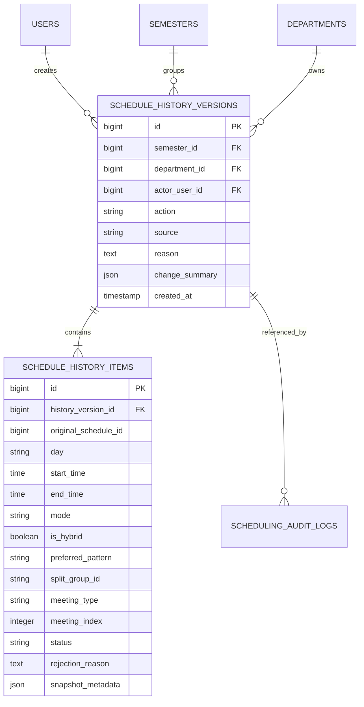

# Schedule History Implementation Workflow

## Goal

Provide an immutable, versioned history of schedule contents so authorized users can see who changed a schedule, what changed, and what the schedule looked like at that point in time.

The existing `scheduling_audit_logs` table should remain the activity/audit trail. Schedule history should add exact schedule snapshots and link the related history version through audit-log metadata.

## Proposed Workflow

```mermaid
flowchart TD
    A[User opens Schedule Builder or Approval page] --> B[Load current schedules for department and semester]
    B --> C{Requested action}

    C -->|Create, edit, archive, batch replace| D[Validate authentication, role, and department scope]
    C -->|Submit, approve, return, withdraw, finalize| D
    C -->|View history| V1[Request schedule-history versions]

    D --> E{Authorized?}
    E -->|No| E1[Return 403 and create no history]
    E -->|Yes| F[Validate payload, workflow status, and scheduling rules]

    F --> G{Valid?}
    G -->|No| G1[Return 422 with validation or conflict details]
    G -->|Yes| H[Begin database transaction]

    H --> I[Lock affected schedule scope by semester and department]
    I --> J[Read current affected schedules as before-state]
    J --> K[Apply schedule or workflow change]
    K --> L[Read affected schedules as after-state]
    L --> M[Determine action type and changed fields]
    M --> N[Create one immutable schedule_history_version]
    N --> O[Store complete schedule snapshot items for the version]
    O --> P[Write existing scheduling_audit_logs event with history_version_id in metadata]
    P --> Q{All writes succeeded?}

    Q -->|No| R[Roll back schedule, history, and audit writes]
    Q -->|Yes| S[Commit transaction]
    S --> T[Invalidate affected API caches]
    T --> U[Send existing workflow notifications]
    U --> W[Return updated schedule and version reference]

    V1 --> V2[Authorize history access by role and department]
    V2 --> V3{Authorized?}
    V3 -->|No| E1
    V3 -->|Yes| V4[Filter versions by semester, department, section, action, actor, or date]
    V4 --> V5[Show newest-first version timeline]
    V5 --> V6[User selects a version]
    V6 --> V7[Load immutable snapshot and change summary]
    V7 --> V8{Compare with another version?}
    V8 -->|Yes| V9[Display added, modified, deleted, and status-changed entries]
    V8 -->|No| V10[Display schedule snapshot]
    V9 --> V11{Restore requested?}
    V10 --> V11
    V11 -->|No| V12[Remain in read-only history view]
    V11 -->|Yes| V13[Require authorized editable workflow stage]
    V13 --> V14[Copy selected snapshot into a proposed draft]
    V14 --> F
```



## Recommended Data Ownership



`original_schedule_id` is provenance only and should not be a foreign key because the live schedule may later be deleted. Section, course, faculty, and room IDs remain inside the immutable schedule snapshot; display labels remain in `snapshot_metadata` so history does not depend on live relationships.

## Capture Rules

- Activating a different semester is an atomic transition. The system locks the old and new semesters, archives the previous semester's VPAA-approved schedules as one complete `schedule_semester_archived` snapshot, soft-deletes the previous semester's live schedule rows, resets old live schedules and sections attached to both semester records, and activates the new semester. This gives every newly activated semester an empty section workspace and prevents either side of the transition from retaining stale sections, while preserving the ended semester's schedules through immutable schedule-history snapshots. VPAA approval is represented by `approved` and its operational descendants `faculty_assignment`, `reassignment`, and `finalized`; Dean-approved, pending, draft, rejected, and revision rows are excluded. The archive is linked to the actor and the previous semester, and the transition is recorded in the scheduling audit log.
- Semester archives copy the schedule attributes and display labels for sections, courses, faculty, and rooms into the history item. Historical timetable rendering therefore remains stable after live schedules or related records change.
- The history viewer's Print Schedule action mounts the Schedule Builder's existing print component with the immutable snapshot data, preserving the builder's formatting and A4 landscape PDF output.

- Capture history only after authorization and validation pass.
- Keep the live schedule change, history version, history items, and existing audit event in the same database transaction.
- Create one version per user action or API request, not one version per changed row.
- For batch saves, replacements, approval transitions, withdrawal, and finalization, snapshot the complete affected department-and-semester schedule so each version can be rendered independently.
- Store both a concise `change_summary` and the complete snapshot. The summary supports the timeline; the snapshot supports reliable comparison and recovery.
- Never update or delete history through ordinary application endpoints.
- Do not store passwords, tokens, request headers, or other secrets in history metadata.
- Notifications and cache invalidation should occur only after the transaction commits.

## Mixed Finalized And Revision Cohorts

- Withdrawal is section-scoped. Only the selected sections may move from an approval stage to `revision`; their persisted `faculty_id` values remain unchanged unless an explicit assignment action later changes or removes them.
- Year-level schedule generation is eligible when the year level has no schedules, while all existing rows remain in the ordinary plotting statuses (`draft` or `completed`), or when every active section in that year level has been withdrawn and all of its schedule rows are in `revision`. Once any row enters `revision`, mixed plotting and revision rows are treated as a partial withdrawal and must not unlock generation. Submitted, approved, faculty-assignment, reassignment, and finalized sections remain blocked.
- Finalized and unselected approved sections retain their operational status and faculty assignments; their reviewer and approval data remain intact on the earlier `schedule_submissions` cycle. An authorized department schedule user may move a finalized section into the persisted `reassignment` status to change instructor assignments without changing the timetable placement. The section remains in `reassignment` across reloads and returns to `finalized` only after every schedule row has an instructor and finalization validation succeeds; the transition is ownership-scoped and recorded through the existing schedule history and audit log.
- A section in `reassignment` becomes withdrawal-eligible when its current schedule rows have no assigned instructors and `faculty_assignment_done` is false. Eligibility must use those current row values rather than treating the persisted reassignment label as proof of an active assignment. Reassignment sections with any instructor or a completed assignment handoff remain protected.
- After revision, submission includes all sections currently in a ready status (`completed`, `rejected`, or `rejected_by_dean`) and excludes sections already protected by submission, approval, faculty-assignment, or finalized states.
- The initial department submission remains all-or-nothing. A partial cohort is allowed only when other sections already belong to a protected approval or finalized cohort.
- Dean and VPAA decisions update only rows at their respective pending stage, so an earlier finalized cohort never re-enters approval.
- Each resubmission creates a new `schedule_submissions` revision linked to its parent and attaches only the revised cohort through `schedule_submission_sections`.
- A bulk withdrawal may span sections whose current approval state belongs to different submission revisions. Resolve each selected section to its latest `included` submission membership and update every affected submission cycle in the same transaction; do not attach the entire action only to the newest matching revision.
- Dean and VPAA queues filter normalized submission status and section membership rather than reconstructing state from timetable rows or notifications.
- Workflow audit and history metadata must include `selected_section_ids` and link to `schedule_submission_id` for partial withdrawal and resubmission actions.

## Suggested Actions

- `schedule_created`
- `schedule_updated`
- `schedule_archived`
- `schedule_batch_saved`
- `schedule_recommendation_applied`
- `schedule_submitted`
- `schedule_approved_by_dean`
- `schedule_returned_by_dean`
- `schedule_approved_by_vpaa`
- `schedule_returned_by_vpaa`
- `schedule_withdrawn`
- `instructor_assigned`
- `instructor_assignment_released`
- `schedule_finalized`
- `schedule_restored_as_draft`
- `schedule_restored`

These names should reuse the existing audit action names wherever they already exist.

## Restore Safety

History is read-only by default. A restore should never overwrite the live schedule directly. It should create a proposed draft or revision, then pass through the same department authorization, active-semester checks, workflow-stage restrictions, conflict validation, faculty-load validation, and approval process used by normal schedule changes.

## Suggested API Surface

```text
GET  /api/schedule-history
GET  /api/schedule-history/{version}
GET  /api/schedule-history/{version}/compare/{otherVersion}
POST /api/schedule-history/{version}/restore
```

The restore endpoint is optional for the first release. The minimum viable implementation is immutable capture, a paginated timeline, snapshot viewing, and version comparison.
