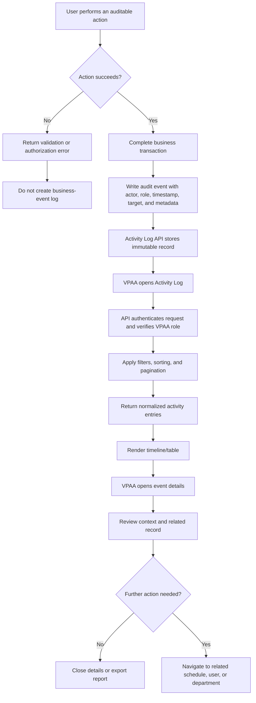

# VPAA Activity Log Workflow

## Purpose

The VPAA Activity Log provides a chronological, read-only record of important scheduling, approval, account, and security events across the institution. It supports traceability, review, dispute resolution, and operational reporting without allowing users to edit or delete audit records.

## Implementation Status

The VPAA Activity Log is implemented at `/activity-log` with a VPAA-only `GET /api/activity-log` endpoint. It uses the existing audit sources:

- `scheduling_audit_logs`: schedule recommendations and instructor-assignment events.
- `authentication_audit_logs`: login, logout, password, Google-link, and user-management events.
- Schedule workflow endpoints now emit audit records for submission, withdrawal, Dean review, and VPAA review actions.

## End-to-End Workflow



## Event Capture Rules

An event is recorded only after the related operation succeeds. The write should occur in the same database transaction as the business change wherever possible; a failed transaction must not leave a misleading success log.

| Event area | Events to expose | Actor and target |
| --- | --- | --- |
| Authentication | `login_succeeded`, `logout`, `password_reset`, `google_linked`, `google_unlinked` | Actor user; optionally the subject user, IP address, and user agent |
| User management | `user_created`, `user_updated`, `user_archived` | VPAA actor; managed account as subject |
| Schedule recommendations | `recommendation_generated`, `recommendation_selected`, `recommendation_reviewed`, `recommendation_accepted`, `recommendation_rejected`, `recommendation_auto_applied` | Scheduling actor; recommendation, term, section, and department |
| Schedule workflow | `schedule_submitted`, `schedule_approved_by_dean`, `schedule_returned_by_dean`, `schedule_approved_by_vpaa`, `schedule_returned_by_vpaa`, `schedule_withdrawn` | Actor; department, term, affected sections, count, and rejection reason where applicable |
| Faculty assignment | `instructor_assigned`, `instructor_assignment_released` | Actor; schedule/section/course, previous and new faculty IDs, and reason |

The existing `metadata` JSON field should hold contextual values such as counts, IDs, recommendation rank/score, rejection reason, withdrawal stage, and authentication method. Passwords, access tokens, and other secrets must never be stored.

## VPAA User Workflow

1. **Open the log**
   - Select **Activity Log** from the VPAA **System** menu.
   - The page requests the first page of events from the protected activity-log endpoint.
   - Show a loading state, then either the event list or an empty-state message.

2. **Review the activity list**
   - Display newest events first.
   - Each row shows timestamp, event, actor, role, department, target, and result/context summary.
   - Use server-side pagination so the VPAA view remains usable across all departments.

3. **Filter and search**
   - Filter by date range, event category, actor, department, term, and outcome.
   - Search stable identifiers and human-readable names such as username, department code, section, and recommendation ID.
   - Preserve filters in the URL/query string so the view can be refreshed or shared internally.

4. **Inspect details**
   - Selecting an event opens a detail panel or modal with the complete normalized payload.
   - Show actor identity and role, exact timestamp, source category, target IDs/names, IP/user agent for authentication events, and metadata.
   - Provide links to the related schedule, recommendation, department, section, or user when the record still exists.

5. **Export or report**
   - Allow export of the currently filtered result set in CSV/PDF only if the reporting permission is enabled.
   - Include the filter criteria and export timestamp in the generated report.
   - Export must use the same server-side authorization and filtering rules as the list endpoint.

## API Contract

Endpoint:

```text
GET /api/activity-log
```

Required authorization: authenticated user with role `vpaa`.

Suggested query parameters:

```text
page, per_page, from, to, category, event, actor_id,
department_id, term_id, outcome, search, sort
```

Suggested response shape:

```json
{
  "data": [
    {
      "id": "scheduling:123",
      "source": "scheduling",
      "event": "schedule_approved_by_vpaa",
      "occurred_at": "2026-08-23T10:15:00Z",
      "actor": { "id": 1, "name": "VPAA User", "role": "vpaa" },
      "department": { "id": 6, "code": "IT", "name": "Information Technology" },
      "term_id": 2,
      "target": { "type": "department_schedule", "id": 6 },
      "metadata": { "schedules_updated": 42 }
    }
  ],
  "meta": { "current_page": 1, "per_page": 25, "total": 1 }
}
```

The endpoint should union the two audit models, normalize their fields, apply authorization before returning records, and use a stable tie-breaker (`occurred_at`, then source and ID) for consistent pagination.

## Controls and Exceptions

- **Unauthorized access:** non-VPAA users receive HTTP 403; the UI should not expose the route in their navigation.
- **Invalid filters:** return HTTP 422 with field-level validation errors.
- **Deleted related records:** retain the audit row and display the original ID plus “record no longer available.”
- **Duplicate retries:** use an idempotency key or a transaction-level guard for actions that may be retried by the client.
- **Partial logging failure:** do not silently discard an audit write. Record an application error and alert operations; for high-risk approval actions, fail the transaction if the audit record cannot be persisted.
- **Sensitive data:** redact credentials, tokens, passwords, and full authentication headers from metadata and exports.
- **Retention:** retain logs according to institutional policy; logs are append-only and deletion is restricted to a controlled maintenance process.

## Acceptance Criteria

- A VPAA can open `/activity-log` and see a paginated, newest-first combined history.
- Every successful VPAA approval/return, schedule submission/withdrawal, recommendation transition, instructor assignment, and user/security event appears once with actor and timestamp.
- Filters and search are enforced server-side and remain stable across pagination.
- Event details expose useful metadata without secrets and link to existing related records.
- Non-VPAA users cannot read the endpoint or access the page directly.
- Failed or unauthorized actions do not appear as successful activity events.
